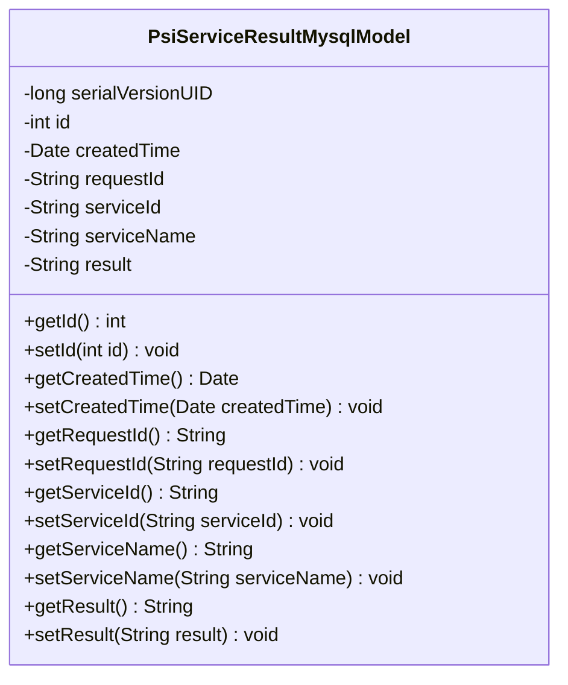

# Basic Information

|      |      |
|------|------|
| Name | PsiServiceResultMysqlModel |
| Language | .java |
| Code Path | WeFe/serving/serving-service/src/main/java/com/welab/wefe/serving/service/database/entity/PsiServiceResultMysqlModel.java |
| Package Name | com.welab.wefe.serving.service.database.entity |
| Dependencies | ['java.io.Serializable', 'java.util.Date', 'javax.persistence.Column', 'javax.persistence.Entity', 'javax.persistence.GeneratedValue', 'javax.persistence.GenerationType', 'javax.persistence.Id'] |
| Brief Description | PSI service result MySQL entity class, including ID, creation time, request ID, service ID, service name, and result fields, implementing the serializable interface. |

# Description

This is a Java entity class named PsiServiceResultMysqlModel, mapped to the database table `psi_service_result`. The class implements the `Serializable` interface and includes a serialization ID. The primary key `id` is an auto-incremented integer and cannot be updated. It includes the creation time `createdTime`, with a default value of the current time. Other fields include the request ID `requestId`, service ID `serviceId`, service name `serviceName`, and result `result`. Each field has corresponding getter and setter methods. The class is used to store PSI service result data, with each field annotated for database column mapping.

# Class Summary

| Name   | Type  | Description |
|-------|------|-------------|
| PsiServiceResultMysqlModel | class | PSI service result MySQL entity class, including ID, creation time, request ID, service ID, service name, and result fields, implementing the serializable interface. |

## Class PsiServiceResultMysqlModel

|      |      |
|------|------|
| Access Modifier | @Entity(name = "psi_service_result");public |
| Type | class |
| Name | PsiServiceResultMysqlModel |
| Description | PSI service result MySQL entity class, including ID, creation time, request ID, service ID, service name, and result fields, implementing the serializable interface. |

### UML Class Diagram

This code defines an entity class named `PsiServiceResultMysqlModel`, which maps to the database table `psi_service_result`. The class implements the `Serializable` interface and includes fields such as id, creation time, request ID, service ID, service name, and result, along with corresponding getter and setter methods. These fields are mapped to database table columns via JPA annotations, with the id field being the primary key and auto-generated. This class is primarily used for storing and manipulating PSI (Private Set Intersection) service result data.

### Internal Method Call Graph

```mermaid
graph TD
    A["Class PsiServiceResultMysqlModel"]
    B["Property: int id"]
    C["Property: Date createdTime"]
    D["Property: String requestId"]
    E["Property: String serviceId"]
    F["Property: String serviceName"]
    G["Property: String result"]
    H["Method: int getId()"]
    I["Method: void setId(int id)"]
    J["Method: Date getCreatedTime()"]
    K["Method: void setCreatedTime(Date createdTime)"]
    L["Method: String getRequestId()"]
    M["Method: void setRequestId(String requestId)"]
    N["Method: String getServiceId()"]
    O["Method: void setServiceId(String serviceId)"]
    P["Method: String getServiceName()"]
    Q["Method: void setServiceName(String serviceName)"]
    R["Method: String getResult()"]
    S["Method: void setResult(String result)"]

    A --> B
    A --> C
    A --> D
    A --> E
    A --> F
    A --> G
    A --> H
    A --> I
    A --> J
    A --> K
    A --> L
    A --> M
    A --> N
    A --> O
    A --> P
    A --> Q
    A --> R
    A --> S
```

This flowchart illustrates the complete structure of the PsiServiceResultMysqlModel class, containing 6 private properties and corresponding 12 getter/setter methods. It is a typical JPA entity class used to map the database table "psi_service_result", including fields such as ID, creation time, request ID, service ID, service name, and result. All properties are configured with database mapping relationships through annotations.

### Field List

| Name  | Type  | Description |
|-------|-------|------|
| result | String | Database table field mapping: result corresponds to the private string variable result. |
| requestId | String | Database field mapping: requestId corresponds to the table column request_id. |
| serviceName | String | Database field mapping: serviceName corresponds to the table column service_name. |
| createdTime = new Date() | Date | Database field mapping: created_time corresponds to the Date type, with the default value being the current time. |
| id | int | Entity class ID field, auto-incremented primary key, non-updatable. |
| serialVersionUID = 8408824816733245588L | long | Defined a private static constant serialVersionUID with a value of 8408824816733245588L for serial version control. |
| serviceId | String | Database field mapping: serviceId corresponds to the table column service_id. |

### Method List

| Name  | Type  | Description |
|-------|-------|------|
| getServiceId | String | This is a Java method that returns the value of the string-type member variable serviceId. |
| getRequestId | String | The method getRequestId returns the requestId value of string type. |
| getCreatedTime | Date | Methods to get the creation time, returning a Date type. |
| setCreatedTime | void | Method for setting object creation time, with the parameter being of Date type. |
| setId | void | This is a Java method used to set the ID property of an object. The method takes an integer parameter id and assigns it to the id member variable of the current object. |
| setRequestId | void | Methods for setting the request ID: Assign the input parameter `requestId` to the `requestId` property of the current object. |
| setServiceId | void | The method for setting the service ID assigns the input parameter to the serviceId member variable of the class. |
| getServiceName | String | This is a Java method that returns the value of the serviceName property as a string. |
| setServiceName | void | This is a Java method used to set the serviceName property value of a class. The method takes a string parameter serviceName and assigns it to the member variable of the same name in the class. |
| getResult | String | Methods for obtaining the result string. |
| setResult | void | Set the result variable value to the value of the input parameter result. |
| getId | int | Methods to obtain the object ID, returns an integer variable id. |

