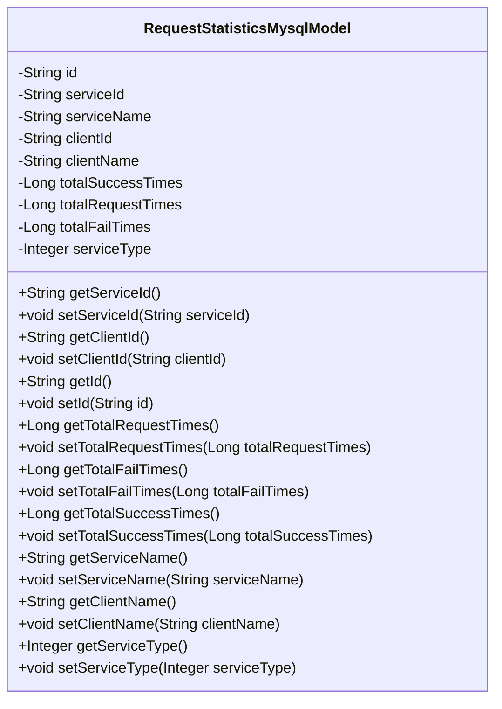

# Basic Information

|      |      |
|------|------|
| Name | RequestStatisticsMysqlModel |
| Language | .java |
| Code Path | WeFe/serving/serving-service/src/main/java/com/welab/wefe/serving/service/database/entity/RequestStatisticsMysqlModel.java |
| Package Name | com.welab.wefe.serving.service.database.entity |
| Dependencies | ['javax.persistence.Column', 'javax.persistence.Entity', 'javax.persistence.Id', 'java.util.UUID'] |
| Brief Description | MySQL request statistics entity class, containing fields such as ID, service ID/name, client ID/name, successful/failed/total call counts, service type, and corresponding getter/setter methods. |

# Description

This is a JPA entity class named RequestStatisticsMysqlModel, designed to store request statistics. It includes fields such as the primary key ID, service ID and name, client ID and name, total success count, total call count, total failure count, and service type. The class provides corresponding getter and setter methods for each field to access and modify these attribute values. This entity class is primarily used for recording and analyzing service invocation-related data.

# Class Summary

| Name   | Type  | Description |
|-------|------|-------------|
| RequestStatisticsMysqlModel | class | Request statistics MySQL entity class, including fields for ID, service ID, name, customer ID, name, success, failure, total call count, and service type. |

## Class RequestStatisticsMysqlModel

|      |      |
|------|------|
| Access Modifier | @Entity;public |
| Type | class |
| Name | RequestStatisticsMysqlModel |
| Description | Request statistics MySQL entity class, including fields for ID, service ID, name, customer ID, name, success, failure, total call count, and service type. |

### UML Class Diagram

This class diagram illustrates an entity class named RequestStatisticsMysqlModel, designed to store request statistics. The class contains multiple private fields such as service ID, client ID, success count, request count, etc., and provides public getter and setter methods for each field. This class is primarily used for persistently storing request-related statistical data, which can be utilized for analyzing and monitoring service invocation patterns.

### Internal Method Call Graph

```mermaid
graph TD
    A["Class RequestStatisticsMysqlModel"]
    B["Primary Key Attribute: @Id String id"]
    C["Attribute: String serviceId"]
    D["Attribute: String serviceName"]
    E["Attribute: String clientId"]
    F["Attribute: String clientName"]
    G["Attribute: Long totalSuccessTimes"]
    H["Attribute: Long totalRequestTimes"]
    I["Attribute: Long totalFailTimes"]
    J["Attribute: Integer serviceType"]
    K["Getter/Setter Method Group"]
    
    A --> B
    A --> C
    A --> D
    A --> E
    A --> F
    A --> G
    A --> H
    A --> I
    A --> J
    A -.-> K
    
    K --> L["getServiceId/setServiceId"]
    K --> M["getClientId/setClientId"]
    K --> N["getId/setId"]
    K --> O["getTotalRequestTimes/setTotalRequestTimes"]
    K --> P["getTotalFailTimes/setTotalFailTimes"]
    K --> Q["getTotalSuccessTimes/setTotalSuccessTimes"]
    K --> R["getServiceName/setServiceName"]
    K --> S["getClientName/setClientName"]
    K --> T["getServiceType/setServiceType"]
```

This flowchart illustrates the complete structure of the RequestStatisticsMysqlModel class, comprising 9 core attributes and corresponding 16 accessor methods. As a JPA entity class, it designates the primary key field with @Id annotation, with all attributes being privately encapsulated and exposed through Getter/Setter interfaces. The class is designed to store service invocation statistics data, containing business fields such as service/client identification information, call count metrics, and service type classification, forming a comprehensive data persistence model.

### Field List

| Name  | Type  | Description |
|-------|-------|------|
| id | String | In entity classes, the primary key field id is marked with the @Id annotation. |
| clientName | String | Declare a private string variable clientName. |
| clientId | String | The private string variable clientId is used to store the client identifier. |
| totalSuccessTimes | Long | Private long integer variable, recording the total number of successes. |
| serviceName | String | Private string variable storing the service name. |
| serviceId | String | The private string variable serviceId is used to store the service identifier. |
| serviceType | Integer | Private integer variable indicating the service type. |
| totalRequestTimes | Long | Private long integer variable, recording the total number of requests. |
| totalFailTimes | Long | Private long integer variable, recording the total number of failures. |

### Method List

| Name  | Type  | Description |
|-------|-------|------|
| setClientName | void | This is a Java method used to set the client name. The method accepts a string parameter clientName and assigns it to the class's member variable clientName. |
| getServiceName | String | The method returns the serviceName string. |
| getId | String | Public method to obtain ID, returns a string-type id. |
| getTotalSuccessTimes | Long | Method for obtaining the total count of successful attempts. |
| getServiceId | String | Obtain the public method for serviceId, which returns the serviceId as a string. |
| setId | void | Methods for setting the object ID: assign the parameter id to the id property of the object. |
| setClientId | void | The method to set the client ID involves assigning the parameter clientId to the class member variable clientId. |
| getTotalFailTimes | Long | Get the total count of failed attempts. |
| getTotalRequestTimes | Long | A public method to get the total number of requests, which returns a long integer value `totalRequestTimes`. |
| setTotalSuccessTimes | void | Java method: Set the value of the success count variable totalSuccessTimes. |
| getClientName | String | Methods to obtain the client name, returns the value of the clientName variable. |
| getClientId | String | This is a Java method that returns the value of the clientId member variable of type String. |
| getServiceType | Integer | Methods to obtain the service type, returning an integer value serviceType. |
| setServiceName | void | The method to set the service name assigns the input parameter to the member variable serviceName of the class. |
| setServiceId | void | This is a Java method used to set the serviceId property value of a class. The method takes a string parameter serviceId and assigns it to the class's member variable of the same name. |
| setServiceType | void | This is a Java method used to set the serviceType property of a class, with the parameter being of Integer type. |
| setTotalRequestTimes | void | Java method for setting the total number of requests, assigning the parameter to the class variable totalRequestTimes. |
| setTotalFailTimes | void | A public method for setting the number of failures, with a parameter of type long totalFailTimes, used to update the failure count attribute in the object. |

