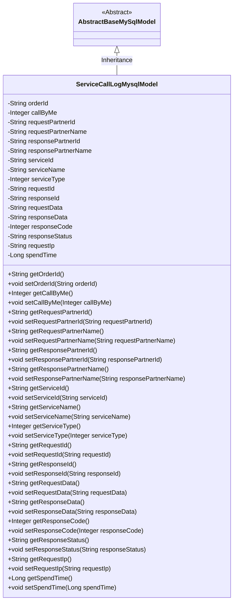

# Basic Information

|      |      |
|------|------|
| Name | ServiceCallLogMysqlModel |
| Language | .java |
| Code Path | WeFe/serving/serving-service/src/main/java/com/welab/wefe/serving/service/database/entity/ServiceCallLogMysqlModel.java |
| Package Name | com.welab.wefe.serving.service.database.entity |
| Dependencies | ['javax.persistence.Column', 'javax.persistence.Entity'] |
| Brief Description | MySQL service call log entity class, containing fields such as order ID, caller, service information, request/response data, status code, and time consumption. |

# Description

The content defines a MySQL database entity class named `service_call_log` called `ServiceCallLogMysqlModel`, which inherits from `AbstractBaseMySqlModel`. The class includes multiple fields for recording service call log information, such as order ID, caller identifier, request and response partner IDs and names, service ID, name, and type, request and response IDs and data, response status code and state, request IP, and time consumption. Each field has corresponding getter and setter methods for accessing and modifying these attributes.

# Class Summary

| Name   | Type  | Description |
|-------|------|-------------|
| ServiceCallLogMysqlModel | class | This is a MySQL entity class for recording service call logs, containing fields such as order ID, request/response data, partner information, service details, response status, and processing time. |

## Class ServiceCallLogMysqlModel

|      |      |
|------|------|
| Access Modifier | @Entity(name = "service_call_log");public |
| Type | class |
| Name | ServiceCallLogMysqlModel |
| Description | This is a MySQL entity class for recording service call logs, containing fields such as order ID, request/response data, partner information, service details, response status, and processing time. |

### UML Class Diagram

Class Diagram Description:
ServiceCallLogMysqlModel is an entity class that inherits from AbstractBaseMySqlModel, designed to record service call logs. It contains multiple private fields such as order ID, caller identifier, request and response partner information, service details, request and response data, response status code, request IP, and processing time, along with corresponding getter and setter methods. The class is annotated with JPA annotations as a database entity, mapped to a table named "service_call_log".

### Internal Method Call Graph

```mermaid
graph TD
    A["Class ServiceCallLogMysqlModel"]
    B["Inherits: AbstractBaseMySqlModel"]
    C["Property: String orderId"]
    D["Property: Integer callByMe"]
    E["Property: String requestPartnerId"]
    F["Property: String requestPartnerName"]
    G["Property: String responsePartnerId"]
    H["Property: String responsePartnerName"]
    I["Property: String serviceId"]
    J["Property: String serviceName"]
    K["Property: Integer serviceType"]
    L["Property: String requestId"]
    M["Property: String responseId"]
    N["Property: String requestData"]
    O["Property: String responseData"]
    P["Property: Integer responseCode"]
    Q["Property: String responseStatus"]
    R["Property: String requestIp"]
    S["Property: Long spendTime"]
    T["Method: getOrderId/setOrderId"]
    U["Method: getCallByMe/setCallByMe"]
    V["Method: getRequestPartnerId/setRequestPartnerId"]
    W["Method: getRequestPartnerName/setRequestPartnerName"]
    X["Method: getResponsePartnerId/setResponsePartnerId"]
    Y["Method: getResponsePartnerName/setResponsePartnerName"]
    Z["Method: getServiceId/setServiceId"]
    AA["Method: getServiceName/setServiceName"]
    AB["Method: getServiceType/setServiceType"]
    AC["Method: getRequestId/setRequestId"]
    AD["Method: getResponseId/setResponseId"]
    AE["Method: getRequestData/setRequestData"]
    AF["Method: getResponseData/setResponseData"]
    AG["Method: getResponseCode/setResponseCode"]
    AH["Method: getResponseStatus/setResponseStatus"]
    AI["Method: getRequestIp/setRequestIp"]
    AJ["Method: getSpendTime/setSpendTime"]

    A --> B
    A --> C
    A --> D
    A --> E
    A --> F
    A --> G
    A --> H
    A --> I
    A --> J
    A --> K
    A --> L
    A --> M
    A --> N
    A --> O
    A --> P
    A --> Q
    A --> R
    A --> S
    A --> T
    A --> U
    A --> V
    A --> W
    A --> X
    A --> Y
    A --> Z
    A --> AA
    A --> AB
    A --> AC
    A --> AD
    A --> AE
    A --> AF
    A --> AG
    A --> AH
    A --> AI
    A --> AJ
```

This flowchart illustrates the complete structure of the ServiceCallLogMysqlModel class, including its inheritance relationship, 16 private properties, and their corresponding getter/setter methods. This JPA entity class is designed to record service call logs, containing key fields such as order ID, caller identifier, request/response partner information, service details, request/response data, status codes, IP addresses, and time consumption. All properties are mapped to database table fields through @Column annotations, forming a comprehensive data model for service call logs.

### Field List

| Name  | Type  | Description |
|-------|-------|------|
| requestPartnerId | String | Database field mapping: requestPartnerId corresponds to the table column request_partner_id, with a type of String. |
| serviceId | String | Database field mapping: serviceId corresponds to the table column service_id, with a string type. |
| requestPartnerName | String | Database field mapping: requestPartnerName corresponds to the table column request_partner_name, with a type of String. |
| callByMe | Integer | Database field mapping, named call_by_me, with the type Integer. |
| responseData | String | Database field mapping: responseData corresponds to the table column response_data, with a type of String. |
| responseId | String | Database field mapping: responseId corresponds to the table column response_id. |
| serialVersionUID = 5160393066516857125L | long | Defined a private static constant serialVersionUID with the value 5160393066516857125L for serial version control. |
| serviceType | Integer | Database field mapping: service_type corresponds to serviceType of Integer type. |
| requestIp | String | Database field mapping: requestIp corresponds to the table column request_ip, with a string type. |
| requestId | String | Database field mapping: requestId corresponds to the table column request_id, with the type String. |
| responsePartnerId | String | Database field mapping: response_partner_id corresponds to the private string variable responsePartnerId. |
| requestData | String | Database field mapping: requestData corresponds to the table column request_data. |
| serviceName | String | Database field mapping: serviceName corresponds to the table column service_name, with the type String. |
| orderId | String | Database field mapping: orderId corresponds to the table column order_id. |
| spendTime | Long | Database field mapping: spend_time corresponds to the Long-type variable spendTime. |
| responsePartnerName | String | Database field mapping: responsePartnerName corresponds to the table column response_partner_name, with the type String. |
| responseCode | Integer | Database field mapping: responseCode corresponds to the table column response_code, with the type being integer. |
| responseStatus | String | Database field mapping: responseStatus corresponds to the table column response_status, with a type of String. |

### Method List

| Name  | Type  | Description |
|-------|-------|------|
| setRequestPartnerId | void | The method to set the request partner ID assigns the parameter value to the class member variable `requestPartnerId`. |
| setRequestId | void | This is a Java method used to set the request ID. The method takes a string parameter requestId and assigns it to the requestId property of the current object. |
| getResponsePartnerName | String | Method to obtain the response partner name, returns a string-type responsePartnerName. |
| getRequestPartnerName | String | Method to obtain the name of the requesting partner, returns a string-type requestPartnerName. |
| setResponsePartnerName | void | The method to set the response partner name assigns the input parameter to the class member variable `responsePartnerName`. |
| setCallByMe | void | Java Method: Set the callByMe property value. |
| setOrderId | void | This is a Java method used to set the order ID. The method is named setOrderId, which takes a string parameter orderId and assigns it to the orderId property of the current object. |
| setServiceType | void | Defined a public method setServiceType for setting the integer property value of serviceType in the class. |
| getServiceName | String | Methods to obtain the service name, which returns the string serviceName. |
| setServiceId | void | The method to set the service ID assigns the input parameter to the class's serviceId member variable. |
| getCallByMe | Integer | Get the integer value of callByMe. |
| getResponseData | String | Methods to obtain response data, returning a string-type variable responseData. |
| setResponseId | void | This is a Java method used to set the value of the responseId property. The method takes a string parameter responseId and assigns it to the class member variable this.responseId. |
| getOrderId | String | This is a Java method that returns the value of the string-type member variable orderId. |
| setRequestData | void | A public method `setRequestData` is defined to set the value of the class member variable `requestData`. The parameter is of string type. |
| getResponseId | String | The method returns a responseId of string type. |
| setServiceName | void | The method to set the service name assigns the input parameter to the member variable serviceName of the class. |
| getServiceId | String | Methods to obtain the serviceId, returning a string-type serviceId value. |
| setResponseData | void | The method to set the response data assigns the incoming string to the class's `responseData` member variable. |
| setRequestPartnerName | void | This is a Java method used to set the member variable for the request partner name. The method takes a string parameter and assigns it to the requestPartnerName property of the class. |
| getResponseCode | Integer | The method returns a response code. |
| setResponseCode | void | Methods for setting HTTP response status codes, assigning the incoming integer value to the class's responseCode member variable. |
| getResponseStatus | String | Methods to obtain the response status, returning the responseStatus as a string type. |
| setResponseStatus | void | A public method `setResponseStatus` is defined to set the `responseStatus` property value of the object. The parameter is of string type `responseStatus`. |
| getRequestIp | String | Methods to obtain the request IP address, returning a string-type `requestIp` value. |
| setRequestIp | void | Method for setting the request IP, which assigns the incoming requestIp to the requestIp property of the current object. |
| getSpendTime | Long | The method getSpendTime returns the long integer value of spendTime. |
| setSpendTime | void | Define the method `setSpendTime` to set the value of the `spendTime` property, with a parameter of type `Long`. |
| getResponsePartnerId | String | Method to obtain the response partner ID, returns a string-type responsePartnerId. |
| getRequestId | String | Methods to obtain the request ID, which returns a string-type requestId. |
| getRequestPartnerId | String | The method to obtain the requesting partner ID returns the `requestPartnerId` string. |
| getRequestData | String | Methods to obtain request data, returning a string type. |
| setResponsePartnerId | void | The method to set the response partner ID assigns the input parameter to the class member variable responsePartnerId. |
| getServiceType | Integer | Methods for obtaining the service type, returning an integer value serviceType. |

