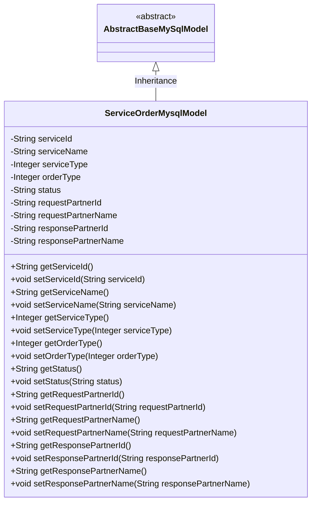

# Basic Information

|      |      |
|------|------|
| Name | ServiceOrderMysqlModel |
| Language | .java |
| Code Path | WeFe/serving/serving-service/src/main/java/com/welab/wefe/serving/service/database/entity/ServiceOrderMysqlModel.java |
| Package Name | com.welab.wefe.serving.service.database.entity |
| Dependencies | ['javax.persistence.Column', 'javax.persistence.Entity'] |
| Brief Description | Service Order MySQL Entity Class, including service ID, name, type, order type, status, and request/response partner information. |

# Description

This is a Java entity class named ServiceOrderMysqlModel, mapped to the database table service_order. It inherits from AbstractBaseMySqlModel and includes fields such as service ID, name, type, order type, status, as well as the ID and name information of the requester and responder. Each field has corresponding getter and setter methods and is mapped to database column names through annotations.

# Class Summary

| Name   | Type  | Description |
|-------|------|-------------|
| ServiceOrderMysqlModel | class | Service order entity class, including service ID, name, type, order type, status, and requester/responder information. |

## Class ServiceOrderMysqlModel

|      |      |
|------|------|
| Access Modifier | @Entity(name = "service_order");public |
| Type | class |
| Name | ServiceOrderMysqlModel |
| Description | Service order entity class, including service ID, name, type, order type, status, and requester/responder information. |

### UML Class Diagram

This code defines an entity class named ServiceOrderMysqlModel, which maps to the database table service_order. The class inherits from the abstract base class AbstractBaseMySqlModel and includes multiple private fields along with their corresponding getter and setter methods. These fields store service order-related information such as service ID, name, type, order type, status, and details of requesting and responding partners. The mapping relationship with the database table is implemented through @Entity and @Column annotations.

### Internal Method Call Graph

```mermaid
graph TD
    A["Entity Class ServiceOrderMysqlModel"]
    B["Inherits: AbstractBaseMySqlModel"]
    C["Annotation: @Entity(name='service_order')"]
    D["Field: String serviceId"]
    E["Field: String serviceName"]
    F["Field: Integer serviceType"]
    G["Field: Integer orderType"]
    H["Field: String status"]
    I["Field: String requestPartnerId"]
    J["Field: String requestPartnerName"]
    K["Field: String responsePartnerId"]
    L["Field: String responsePartnerName"]
    M["Getter/Setter Method Group (10 pairs)"]

    A --> B
    A --> C
    A --> D
    A --> E
    A --> F
    A --> G
    A --> H
    A --> I
    A --> J
    A --> K
    A --> L
    A --> M
```

This flowchart illustrates the complete structure of the ServiceOrderMysqlModel entity class, including its inheritance relationship, JPA entity annotation, 10 database-mapped fields, and corresponding Getter/Setter method groups. As a persistence model for database order services, this class maps fields to corresponding columns in the service_order table via @Column annotations while inheriting base functionalities from AbstractBaseMySqlModel. All fields are private and exposed through public access methods, complying with JPA entity specifications.

### Field List

| Name  | Type  | Description |
|-------|-------|------|
| serviceId | String | Database field mapping: serviceId corresponds to the table column service_id. |
| serialVersionUID = 5578364684919929903L | long | Declare a private static final long serialVersionUID with a value of 5578364684919929903. |
| requestPartnerId | String | Database field mapping: requestPartnerId corresponds to the table column request_partner_id, with a type of String. |
| requestPartnerName | String | Database field mapping: request_partner_name corresponds to the private string variable requestPartnerName. |
| responsePartnerName | String | Database field mapping: responsePartnerName corresponds to the table column response_partner_name, with the type String. |
| orderType | Integer | Database field mapping: order_type corresponds to orderType of Integer type. |
| status | String | Database field mapping: the status attribute corresponds to the status column in the table. |
| serviceType | Integer | The database field service_type is mapped to the Integer type serviceType. |
| serviceName | String | Database field mapping: serviceName corresponds to the table column service_name. |
| responsePartnerId | String | Database field mapping: response_partner_id corresponds to the private string variable responsePartnerId. |

### Method List

| Name  | Type  | Description |
|-------|-------|------|
| getServiceId | String | Common methods for obtaining serviceId. |
| setRequestPartnerName | void | Method to set the requesting partner name, assigning the parameter value to the class member variable requestPartnerName. |
| getStatus | String | Methods to obtain the current status value. |
| getResponsePartnerId | String | Method to obtain the response partner ID, returns a string-type responsePartnerId. |
| setServiceId | void | The method to set the service ID assigns the input parameter to the serviceId member variable of the class. |
| getResponsePartnerName | String | The method to obtain the name of the responding partner, which returns a string-type value `responsePartnerName`. |
| setOrderType | void | This is a Java method used to set the order type attribute, accepting an integer parameter orderType. |
| getServiceType | Integer | Methods for obtaining the service type, which returns an integer value serviceType. |
| getRequestPartnerId | String | The method to obtain the requesting partner ID returns the value of the requestPartnerId field. |
| setStatus | void | This is a Java method used to set the value of the object's status property. The method takes a string parameter named status and assigns it to the object's property of the same name. |
| getRequestPartnerName | String | The method to obtain the name of the requesting partner, which returns a string-type requestPartnerName. |
| setResponsePartnerName | void | The method to set the response partner name assigns the input parameter to the class member variable `responsePartnerName`. |
| getOrderType | Integer | This is a Java method that returns an integer variable named orderType. |
| setResponsePartnerId | void | The method to set the response partner ID assigns the input parameter to the class member variable `responsePartnerId`. |
| setServiceName | void | This is a Java method used to set the serviceName property value of a class. The method takes a string parameter serviceName and assigns it to the member variable of the same name in the class. |
| setServiceType | void | Defines a public method `setServiceType` for setting the value of the integer attribute `serviceType` in the class. |
| getServiceName | String | Methods to obtain the service name, returns the serviceName as a string type. |
| setRequestPartnerId | void | The method for setting the request partner ID assigns the parameter value to the class member variable requestPartnerId. |

