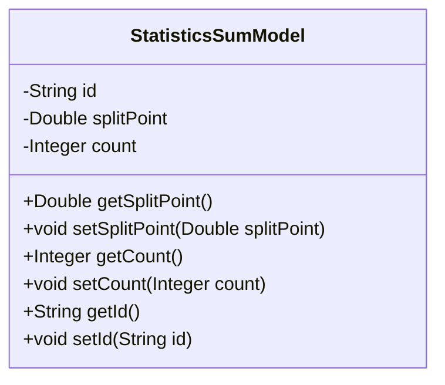
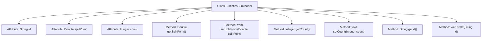

# Basic Information

|      |      |
|------|------|
| Name | StatisticsSumModel |
| Language | .java |
| Code Path | WeFe/serving/serving-service/src/main/java/com/welab/wefe/serving/service/database/entity/StatisticsSumModel.java |
| Package Name | com.welab.wefe.serving.service.database.entity |
| Dependencies | ['javax.persistence.Entity', 'javax.persistence.Id'] |
| Brief Description | Java entity class StatisticsSumModel, containing fields id, splitPoint, and count, with getter and setter methods provided for each field. |

# Description

This is a Java entity class named StatisticsSumModel, annotated with JPA as a database entity. The class contains three private fields: id as the primary key, splitPoint as a double-precision floating-point type, and count as an integer type. Each field has corresponding getter and setter methods for accessing and modifying data. This class is primarily used for storing statistical data, including split points and count values.

# Class Summary

| Name   | Type  | Description |
|-------|------|-------------|
| StatisticsSumModel | class | This is a JPA entity class named StatisticsSumModel, which includes three fields: id, splitPoint, and count, representing the unique identifier, split point, and count respectively, along with corresponding getter and setter methods. |

## Class StatisticsSumModel

|      |      |
|------|------|
| Access Modifier | @Entity;public |
| Type | class |
| Name | StatisticsSumModel |
| Description | This is a JPA entity class named StatisticsSumModel, which includes three fields: id, splitPoint, and count, representing the unique identifier, split point, and count respectively, along with corresponding getter and setter methods. |

### UML Class Diagram

This code defines an entity class named `StatisticsSumModel` for storing statistical summary data. The class contains three private fields: `id` as the primary key identifier, `splitPoint` representing the split point value, and `count` recording the statistical quantity. Public getter and setter methods are provided to access and modify these fields. This is a typical Java persistence entity class that adheres to the JavaBean specification, suitable for data modeling in database interaction scenarios when used with ORM frameworks like JPA or Hibernate.

### Internal Method Call Graph

This code defines a JPA entity class named StatisticsSumModel, containing three private attributes: id, splitPoint, and count. The class provides getter and setter methods for these attributes to access and modify their values. This entity class is primarily used to store segmented point values and count information for statistical data, marked as a persistent entity with the @Entity annotation, and the @Id annotation designates id as the primary key field. The flowchart clearly illustrates the class structure and the relationships between its methods.

### Field List

| Name  | Type  | Description |
|-------|-------|------|
| count | Integer | private int variable count |
| id | String | The primary key field of the entity class is of type String. |
| splitPoint | Double | Private double-precision floating-point variable splitPoint. |

### Method List

| Name  | Type  | Description |
|-------|-------|------|
| getCount | Integer | Methods to obtain the count value, returning an integer-type count variable. |
| setCount | void | This is a Java method used to set the value of the count attribute in a class. The method takes an Integer parameter and assigns it to the count member variable of the class. |
| setSplitPoint | void | The method for setting the split point value assigns the parameter `splitPoint` to the `splitPoint` property of the current object. |
| setId | void | This is a Java method used to set the id property of an object. The method takes a string parameter id and assigns it to the id field of the object. |
| getId | String | The method getId returns a string-type id value. |
| getSplitPoint | Double | Method to obtain the split point value, returns a Double type splitPoint value. |

