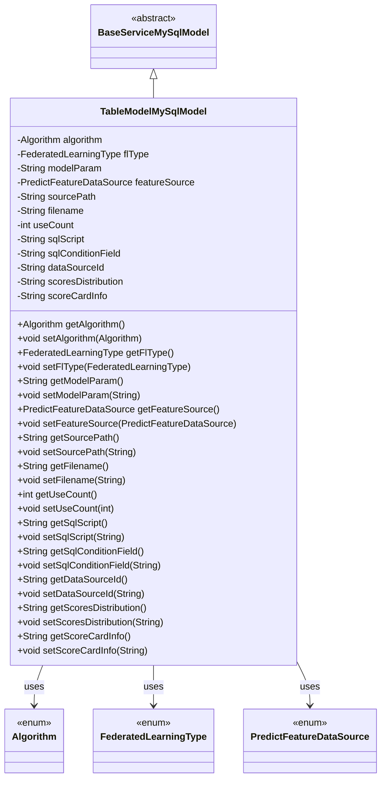

# Basic Information

|      |      |
|------|------|
| Name | TableModelMySqlModel |
| Language | .java |
| Code Path | WeFe/serving/serving-service/src/main/java/com/welab/wefe/serving/service/database/entity/TableModelMySqlModel.java |
| Package Name | com.welab.wefe.serving.service.database.entity |
| Dependencies | ['com.welab.wefe.common.wefe.enums.Algorithm', 'com.welab.wefe.common.wefe.enums.FederatedLearningType', 'com.welab.wefe.common.wefe.enums.PredictFeatureDataSource', 'javax.persistence'] |
| Brief Description | MySQL database table model class, containing fields such as algorithm type, federated learning type, model parameters, feature source, file path, usage count, SQL script, data source ID, score distribution, and scorecard information. |

# Description

This is a Java entity class named TableModelMySqlModel, which maps to the database table `table_model`. It inherits from `BaseServiceMySqlModel` and contains fields related to machine learning models and deep learning models. Key fields include algorithm type, federated learning type, model parameters, feature data source, file path, file name, usage count, SQL script, SQL condition fields, data source ID, score distribution, and scorecard information. All fields have corresponding getter and setter methods. The class uses JPA annotations for database mapping, including `@Entity`, `@Table`, and `@Column`.

# Class Summary

| Name   | Type  | Description |
|-------|------|-------------|
| TableModelMySqlModel | class | This is a Java entity class named TableModelMySqlModel, which maps to the database table table_model. It includes fields for machine learning models (algorithm type, federated learning type, model parameters, etc.) and deep learning models (file path, file name, usage count, etc.). The class inherits from BaseServiceMySqlModel and provides getter and setter methods for each field. |

## Class TableModelMySqlModel

|      |      |
|------|------|
| Access Modifier | @Entity(name = "table_model");@Table(name = "table_model");public |
| Type | class |
| Name | TableModelMySqlModel |
| Description | This is a Java entity class named TableModelMySqlModel, which maps to the database table table_model. It includes fields for machine learning models (algorithm type, federated learning type, model parameters, etc.) and deep learning models (file path, file name, usage count, etc.). The class inherits from BaseServiceMySqlModel and provides getter and setter methods for each field. |

### UML Class Diagram

This code defines an entity class named `TableModelMySqlModel`, which inherits from `BaseServiceMySqlModel` and represents a table model in the database. The class contains multiple fields such as algorithm type, federated learning type, model parameters, feature data source, etc., along with corresponding getter and setter methods. It utilizes several enum types (`Algorithm`, `FederatedLearningType`, `PredictFeatureDataSource`) to represent specific field types. The class is mapped to a database table through JPA annotations, making it a typical data persistence model class.

### Internal Method Call Graph

```mermaid
graph TD
    A["Class TableModelMySqlModel"]
    B["Inheritance: BaseServiceMySqlModel"]
    C["Annotation: @Entity/@Table"]
    D["Field: Algorithm algorithm"]
    E["Field: FederatedLearningType flType"]
    F["Field: String modelParam"]
    G["Field: PredictFeatureDataSource featureSource"]
    H["Field: String sourcePath"]
    I["Field: String filename"]
    J["Field: int useCount"]
    K["Field: String sqlScript"]
    L["Field: String sqlConditionField"]
    M["Field: String dataSourceId"]
    N["Field: String scoresDistribution"]
    O["Field: String scoreCardInfo"]
    P["Getter/Setter Method Group"]

    A --> B
    A --> C
    A --> D
    A --> E
    A --> F
    A --> G
    A --> H
    A --> I
    A --> J
    A --> K
    A --> L
    A --> M
    A --> N
    A --> O
    A --> P
    D -.-> P
    E -.-> P
    F -.-> P
    G -.-> P
    H -.-> P
    I -.-> P
    J -.-> P
    K -.-> P
    L -.-> P
    M -.-> P
    N -.-> P
    O -.-> P
```

This flowchart illustrates the complete structure of the TableModelMySqlModel class, including inheritance relationships, class annotations, 14 field definitions, and their corresponding Getter/Setter method groups. As a JPA entity class, it handles enum-type fields through @Enumerated, customizes database column names using @Column, and primarily stores metadata such as machine learning model parameters, file paths, and SQL scripts. All fields are exposed through standard accessor methods, complying with JavaBean specifications, and inheriting from the BaseServiceMySqlModel superclass.

### Field List

| Name  | Type  | Description |
|-------|-------|------|
| featureSource = PredictFeatureDataSource.code | PredictFeatureDataSource | Enum type field `featureSource`, database column name `feature_source`, default value `code`, uses string storage for enum values. |
| flType | FederatedLearningType | Use the @Enumerated annotation to store the enum type FederatedLearningType as a string in the fl_type column of the database table. |
| sqlConditionField | String | Database field mapping: sql_condition_field corresponds to a String type variable sqlConditionField. |
| sourcePath | String | Database field mapping: sourcePath corresponds to the table column source_path, which stores the file path. |
| serialVersionUID = -1320731560182386318L | long | Declare a private static final long serialVersionUID with a value of -1320731560182386318. |
| modelParam | String | Database field mapping: modelParam corresponds to the table column model_param, with a type of String. |
| useCount | int | Database field mapping: use_count corresponds to useCount, with an integer type, recording the usage count. |
| scoresDistribution | String | Database field mapping: scoresDistribution corresponds to the table column scores_distribution, storing score distribution data. |
| filename | String | Declare a string variable filename |
| sqlScript | String | Database field mapping: sqlScript corresponds to the table column sql_script. |
| algorithm | Algorithm | The enumeration type field algorithm stores values in string format. |
| dataSourceId | String | Define a private String variable dataSourceId, corresponding to the database column name data_source_id. |
| scoreCardInfo | String | Database field mapping, named `score_card_info`, corresponds to the private string variable `scoreCardInfo`. |

### Method List

| Name  | Type  | Description |
|-------|-------|------|
| setSqlConditionField | void | Java Method: Set SQL Condition Field Property Value. |
| getFilename | String | The method returns a filename string. |
| setSourcePath | void | The method to set the source path assigns the input parameter to the `sourcePath` member variable of the class. |
| getScoresDistribution | String | Method to obtain score distribution, returns the scoresDistribution string. |
| getFeatureSource | PredictFeatureDataSource | Methods for obtaining feature data sources, returns a PredictFeatureDataSource object. |
| getFlType | FederatedLearningType | This is a Java method that returns an object of type FederatedLearningType named flType. |
| setAlgorithm | void | Set the algorithm properties of the current object to the specified algorithm instance. |
| setScoresDistribution | void | The method to set the score distribution assigns the input string to the class variable scoresDistribution. |
| getAlgorithm | Algorithm | Methods to obtain the current algorithm instance. |
| setModelParam | void | Defined a public method `setModelParam` for setting the value of the class member variable `modelParam`. The parameter is of string type `modelParam`. |
| getModelParam | String | Get the string method of model parameters. |
| getSourcePath | String | This is a Java method that returns the value of the string-type variable sourcePath. |
| getDataSourceId | String | Methods to obtain the data source ID, returns the data source ID of string type. |
| setFeatureSource | void | The method for setting the feature data source assigns the input parameter to the class member variable featureSource. |
| setUseCount | void | Java method: Set the value of the useCount variable to the input parameter. |
| getScoreCardInfo | String | Method to obtain scorecard information, returns a string-type variable `scoreCardInfo`. |
| setScoreCardInfo | void | This is a Java method used to set the value of the scoreCardInfo variable. The method takes a string parameter and assigns it to the class member variable scoreCardInfo. |
| getSqlConditionField | String | This is a Java method that returns the string-type value of the sqlConditionField. |
| setFilename | void | Methods for setting the filename, assigning the input parameter to the filename member variable of the class. |
| setDataSourceId | void | The method to set the data source ID assigns the input parameter to the class member variable dataSourceId. |
| setSqlScript | void | Java Method: Set SQL Script String. |
| getSqlScript | String | The method returns the sqlScript property value of string type. |
| getUseCount | int | Method to get the usage count as an integer, returns the value of the variable useCount. |
| setFlType | void | The method for setting the federated learning type assigns the parameter flType to the class member variable flType. |

