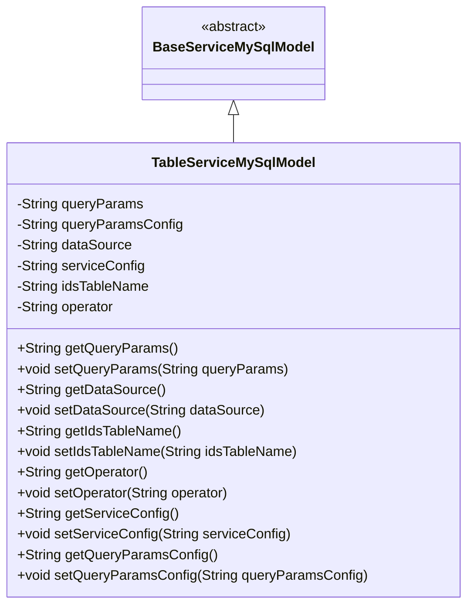

# Basic Information

|      |      |
|------|------|
| Name | TableServiceMySqlModel |
| Language | .java |
| Code Path | WeFe/serving/serving-service/src/main/java/com/welab/wefe/serving/service/database/entity/TableServiceMySqlModel.java |
| Package Name | com.welab.wefe.serving.service.database.entity |
| Dependencies | ['javax.persistence.Column', 'javax.persistence.Entity', 'javax.persistence.Table'] |
| Brief Description | MySQL model class for table services, containing fields such as query parameters, data sources, and service configurations, used to store JSON-formatted configuration information and operator data. |

# Description

This is a Java entity class named TableServiceMySqlModel, which maps to the database table `table_service`. It inherits from `BaseServiceMySqlModel` and contains six main fields: `queryParams` stores query parameter configurations, `queryParamsConfig` stores query configuration descriptions, `dataSource` and `serviceConfig` store SQL configurations in JSON format, `idsTableName` records the associated table name, and `operator` stores operator information. All fields have corresponding getter and setter methods and are annotated with database column mapping relationships.

# Class Summary

| Name   | Type  | Description |
|-------|------|-------------|
| TableServiceMySqlModel | class | MySQL table service entity class, containing fields such as query parameter configuration, SQL configuration, and operator, used for storing JSON-format data source and service configuration information. |

## Class TableServiceMySqlModel

|      |      |
|------|------|
| Access Modifier | @Entity(name = "table_service");@Table(name = "table_service");public |
| Type | class |
| Name | TableServiceMySqlModel |
| Description | MySQL table service entity class, containing fields such as query parameter configuration, SQL configuration, and operator, used for storing JSON-format data source and service configuration information. |

### UML Class Diagram

This code describes an entity class named TableServiceMySqlModel, which inherits from the base class BaseServiceMySqlModel. The class is primarily used to store and manipulate configuration information related to database table services, including fields such as query parameters, data source configuration, and service configuration, each with corresponding getter and setter methods. The class is annotated with JPA's @Entity and @Table annotations, indicating it is a database entity class mapped to a database table named "table_service". All fields are mapped to database table columns via the @Column annotation, including fields storing data in JSON format.

### Internal Method Call Graph

```mermaid
graph TD
    A["Class TableServiceMySqlModel"]
    B["Inherits: BaseServiceMySqlModel"]
    C["Property: String queryParams"]
    D["Property: String queryParamsConfig"]
    E["Property: String dataSource"]
    F["Property: String serviceConfig"]
    G["Property: String idsTableName"]
    H["Property: String operator"]
    I["Method: getQueryParams()"]
    J["Method: setQueryParams(String)"]
    K["Method: getDataSource()"]
    L["Method: setDataSource(String)"]
    M["Method: getIdsTableName()"]
    N["Method: setIdsTableName(String)"]
    O["Method: getOperator()"]
    P["Method: setOperator(String)"]
    Q["Method: getServiceConfig()"]
    R["Method: setServiceConfig(String)"]
    S["Method: getQueryParamsConfig()"]
    T["Method: setQueryParamsConfig(String)"]

    A --> B
    A --> C
    A --> D
    A --> E
    A --> F
    A --> G
    A --> H
    A --> I
    A --> J
    A --> K
    A --> L
    A --> M
    A --> N
    A --> O
    A --> P
    A --> Q
    A --> R
    A --> S
    A --> T
```

This code defines an entity class named TableServiceMySqlModel, which inherits from BaseServiceMySqlModel and is primarily used for mapping the database table `table_service`. The class contains 7 private properties corresponding to the columns in the database table, each with its respective getter and setter methods. These properties include query parameters configuration (queryParams), query configuration parameters description (queryParamsConfig), data source configuration (dataSource), service configuration (serviceConfig), ID table name (idsTableName), and operator (operator). All properties are mapped to database table fields through JPA annotations.

### Field List

| Name  | Type  | Description |
|-------|-------|------|
| operator | String | Database field mapping: the operator attribute corresponds to the operator column in the table. |
| serialVersionUID = -151994449884740867L | long | Defined a private static final serial version ID with a value of -151994449884740867L. |
| dataSource | String | Define a private string variable dataSource, mapping to the database column name data_source. |
| queryParamsConfig | String | Database field mapping, a private variable of string type for storing query parameter configurations. |
| queryParams | String | Database field mapping: queryParams corresponds to the table column query_params, with the type String. |
| idsTableName | String | Database field mapping: The private string variable `idsTableName` corresponds to the table column name `ids_table_name`. |
| serviceConfig | String | Database field mapping: serviceConfig corresponds to the table column service_config, with the type String. |

### Method List

| Name  | Type  | Description |
|-------|-------|------|
| setIdsTableName | void | The method to set the ID table name assigns the parameter value to the class member variable `idsTableName`. |
| setDataSource | void | Define the method setDataSource to set the value of the class member variable dataSource. |
| setQueryParams | void | This is a Java method used to set the value of the class's queryParams member variable. The method accepts a string parameter and assigns it to the queryParams property of the class. |
| getIdsTableName | String | Method to obtain idsTableName, returns a string-type table name. |
| getOperator | String | Methods to obtain the operator, returning the operator string. |
| getDataSource | String | Methods for obtaining data sources, returning data source variables of string type. |
| getQueryParams | String | Methods to obtain query parameter strings. |
| setOperator | void | This is a Java method used to set the value of the operator variable. The method accepts a string parameter named operator and assigns it to the class member variable this.operator. |
| getServiceConfig | String | Methods for obtaining service configuration strings. |
| setServiceConfig | void | This is a Java method used to set the serviceConfig property value of a class. The method takes a string parameter and assigns it to the member variable of the class. |
| getQueryParamsConfig | String | Methods to obtain query parameter configuration, returning a string-type queryParamsConfig. |
| setQueryParamsConfig | void | This is a Java method used to set the string value of query parameter configuration. The method is named setQueryParamsConfig, which takes a string parameter queryParamsConfig and assigns it to the class member variable of the same name. |

