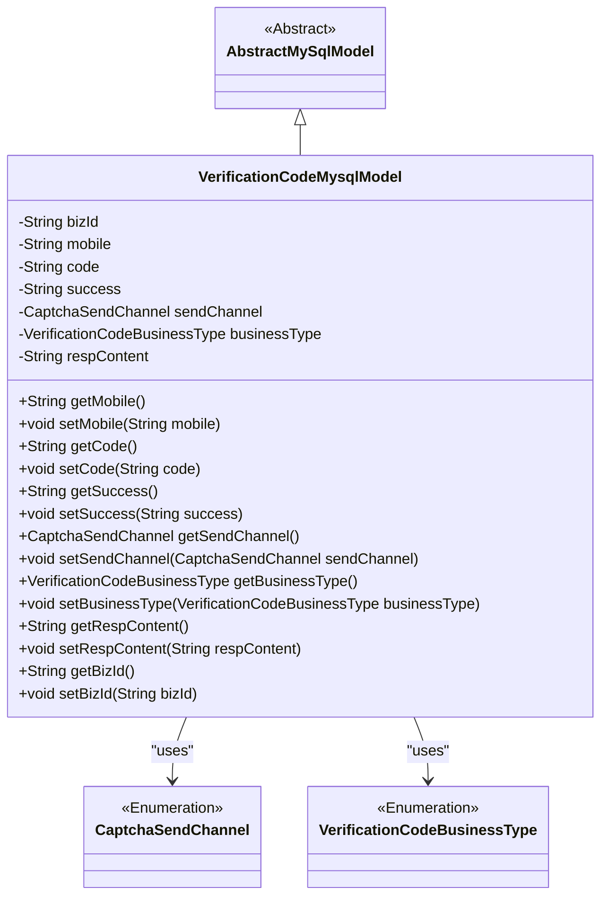

# Basic Information

|      |      |
|------|------|
| Name | VerificationCodeMysqlModel |
| Language | .java |
| Code Path | WeFe/serving/serving-service/src/main/java/com/welab/wefe/serving/service/database/entity/VerificationCodeMysqlModel.java |
| Package Name | com.welab.wefe.serving.service.database.entity |
| Dependencies | ['com.welab.wefe.common.verification.code.common.CaptchaSendChannel', 'com.welab.wefe.common.verification.code.common.VerificationCodeBusinessType', 'javax.persistence.Entity', 'javax.persistence.EnumType', 'javax.persistence.Enumerated'] |
| Brief Description | This is a verification code entity class, containing fields such as business ID, mobile number, verification code, sending status, sending channel, business type, and response content, used for storing and managing verification code-related information. |

# Description

The content defines a JPA entity class named VerificationCodeMysqlModel, which is used to store verification code-related information. The entity includes fields such as business ID, mobile number, verification code, sending status, sending channel, business type, and response content. Among these, the sending channel and business type are stored using enumeration types. The class provides getter and setter methods for each field and inherits from the AbstractMySqlModel base class. This entity is mapped to the database table verification_code.

# Class Summary

| Name   | Type  | Description |
|-------|------|-------------|
| VerificationCodeMysqlModel | class | Verification code entity class, containing fields such as business ID, mobile number, verification code, sending status, sending channel, business type, and response content. |

## Class VerificationCodeMysqlModel

|      |      |
|------|------|
| Access Modifier | @Entity(name = "verification_code");public |
| Type | class |
| Name | VerificationCodeMysqlModel |
| Description | Verification code entity class, containing fields such as business ID, mobile number, verification code, sending status, sending channel, business type, and response content. |

### UML Class Diagram

This code defines an entity class named VerificationCodeMysqlModel for storing verification code-related information, which inherits from the abstract class AbstractMySqlModel. The class contains multiple fields such as business ID, mobile number, verification code, sending status, etc., and provides corresponding getter and setter methods. The sendChannel and businessType are enumeration-type fields, representing the verification code sending channel and business type respectively. The class is marked as a database entity through JPA annotations for persisting verification code data.

### Internal Method Call Graph

```mermaid
graph TD
    A["Class VerificationCodeMysqlModel"]
    B["Inherits: AbstractMySqlModel"]
    C["Property: String bizId"]
    D["Property: String mobile"]
    E["Property: String code"]
    F["Property: String success"]
    G["Property: CaptchaSendChannel sendChannel"]
    H["Property: VerificationCodeBusinessType businessType"]
    I["Property: String respContent"]
    J["Method: getMobile/setMobile"]
    K["Method: getCode/setCode"]
    L["Method: getSuccess/setSuccess"]
    M["Method: getSendChannel/setSendChannel"]
    N["Method: getBusinessType/setBusinessType"]
    O["Method: getRespContent/setRespContent"]
    P["Method: getBizId/setBizId"]

    A --> B
    A --> C
    A --> D
    A --> E
    A --> F
    A --> G
    A --> H
    A --> I
    A --> J
    A --> K
    A --> L
    A --> M
    A --> N
    A --> O
    A --> P
```

This code defines an entity class named VerificationCodeMysqlModel for storing verification code related information. The class inherits from AbstractMySqlModel and contains multiple properties such as bizId, mobile, code, etc., along with corresponding getter and setter methods. The sendChannel and businessType are enumeration type properties, representing the verification code sending channel and business type respectively. This class is primarily used for persisting verification code data to a MySQL database, providing a complete data access interface.

### Field List

| Name  | Type  | Description |
|-------|-------|------|
| respContent | String | Private string variable respContent. |
| serialVersionUID = -2617756476649365818L | long | Declare a private static final long serialVersionUID. |
| bizId | String | Private string type variable bizId |
| businessType | VerificationCodeBusinessType | Define an enumeration type field businessType, using string values for storage. |
| sendChannel | CaptchaSendChannel | The enumeration type field sendChannel stores enumeration values in string format. |
| success | String | Private string variable success |
| code | String | Private string variable code. |
| mobile | String | Declare a private string variable named mobile. |

### Method List

| Name  | Type  | Description |
|-------|-------|------|
| getCode | String | This is a Java method that returns the value of the string-type variable code. |
| setRespContent | void | Methods for setting response content: assign the parameter `respContent` to the class's member variable `respContent`. |
| setSendChannel | void | Set the method for sending verification codes, with the parameter being the type of sending channel. |
| getRespContent | String | Common methods for obtaining response content, returning a string-type variable `respContent`. |
| setBusinessType | void | The method for setting the business type, with the parameter of type VerificationCodeBusinessType, assigns the value to the businessType property of the current object. |
| getSendChannel | CaptchaSendChannel | Methods for obtaining verification code delivery channels. |
| setSuccess | void | Defined a public method `setSuccess` for setting the value of the string-type `success` property. |
| getSuccess | String | Methods to obtain the success status, returning a string-type success value. |
| getMobile | String | Methods to obtain the phone number, returning a string-type variable named mobile. |
| getBusinessType | VerificationCodeBusinessType | Method to obtain the business type, returns a VerificationCodeBusinessType object. |
| setCode | void | Set the string-type code value. |
| setMobile | void | Defined a public method setMobile for setting the value of the mobile property. |
| getBizId | String | The method returns the value of the string-type variable bizId. |
| setBizId | void | The method to set the business ID assigns the parameter bizId to the bizId field of the current object. |

