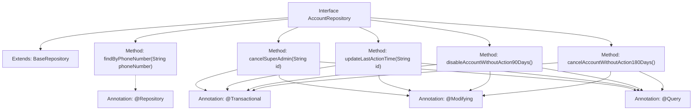

# Basic Information

|      |      |
|------|------|
| Name | AccountRepository |
| Language | .java |
| Code Path | WeFe/serving/serving-service/src/main/java/com/welab/wefe/serving/service/database/repository/AccountRepository.java |
| Package Name | com.welab.wefe.serving.service.database.repository |
| Dependencies | ['org.springframework.data.jpa.repository.Modifying', 'org.springframework.data.jpa.repository.Query', 'org.springframework.stereotype.Repository', 'org.springframework.transaction.annotation.Transactional', 'com.welab.wefe.serving.service.database.entity.AccountMySqlModel', 'com.welab.wefe.serving.service.database.repository.base.BaseRepository'] |
| Brief Description | The AccountRepository interface extends BaseRepository, providing functionalities to query accounts by mobile number, revoke super administrator privileges, update the last operation time, disable accounts inactive for 90 days, and deactivate accounts inactive for 180 days. |

# Description

The `AccountRepository` is an interface that extends `BaseRepository` and encompasses multiple account management operations. It provides functionality to query accounts by mobile number, supports revoking super administrator privileges, and updates the last operation time. Additionally, it includes scheduled task methods: automatically disabling accounts inactive for 90 days (marked as disabled with an audit note) and automatically deregistering accounts inactive for 180 days (marked as deregistered with an audit note). All update operations are managed with transactions and automatically clear the cache.

# Class Summary

| Name   | Type  | Description |
|-------|------|-------------|
| AccountRepository | interface | The AccountRepository interface extends BaseRepository, providing functionalities to query accounts by mobile number, revoke super administrator privileges, update the last operation time, disable accounts inactive for 90 days, and delete accounts inactive for 180 days. |


## Class AccountRepository

|      |      |
|------|------|
| Access Modifier | @Repository;public |
| Type | interface |
| Name | AccountRepository |
| Description | The AccountRepository interface extends BaseRepository, providing functionalities to query accounts by mobile number, revoke super administrator privileges, update the last operation time, disable accounts inactive for 90 days, and delete accounts inactive for 180 days. |


### UML Class Diagram

```mermaid
classDiagram
    class BaseRepository~T, ID~ {
        <<Interface>>
    }

    class AccountRepository {
        <<Interface>>
        +AccountMySqlModel findByPhoneNumber(String phoneNumber)
        +void cancelSuperAdmin(String id)
        +void updateLastActionTime(String id)
        +int disableAccountWithoutAction90Days()
        +int cancelAccountWithoutAction180Days()
    }

    BaseRepository <|-- AccountRepository : Extends
    // The AccountRepository interface extends BaseRepository, providing database operations for account management
    // Includes functionalities like query by phone number, revoke admin privileges, update last action time, and auto-disable/cancel inactive accounts
```

Class Diagram Description: This diagram illustrates the inheritance relationship where the AccountRepository interface extends the generic BaseRepository interface. As a data access layer interface, AccountRepository offers five core methods: querying accounts by phone number, revoking super admin privileges, updating last action time, automatically disabling accounts inactive for 90 days, and automatically canceling accounts inactive for 180 days. All methods involve database modification operations, with transaction management and custom SQL statements implemented through annotations.


### Internal Method Call Graph



This flowchart illustrates the structure and functionality of the AccountRepository interface. The interface extends BaseRepository and contains five core methods: querying accounts by phone number, revoking super admin privileges, updating last action time, disabling inactive accounts for 90 days, and terminating inactive accounts for 180 days. Each database modification operation is annotated with @Transactional, @Modifying, and @Query, demonstrating Spring Data JPA's declarative transaction management features. The flowchart clearly presents the interface's inheritance relationships, method definitions, and annotation applications, particularly highlighting scheduled task methods involving account status changes.

### Field List

| Name  | Type  | Description |
|-------|-------|------|

### Method List

| Name  | Type  | Description |
|-------|-------|------|
| cancelAccountWithoutAction180Days | int | Update inactive accounts using native SQL, mark them as canceled with an audit note, and return the number of affected rows. |
| findByPhoneNumber | AccountMySqlModel | MySQL model method for querying account information via mobile phone number. |
| updateLastActionTime | void | Update the last operation time of accounts using native SQL, automatically clear the cache, and support transactions. |
| disableAccountWithoutAction90Days | int | Update inactive accounts with no operations for 90 days using native SQL, set enable to false and add an audit_comment tag, then automatically clear the cache. |
| cancelSuperAdmin | void | Revoke the super admin and admin roles of the account with the specified ID. Use transaction annotations to ensure atomicity of the operation and automatically clear the cache. |


