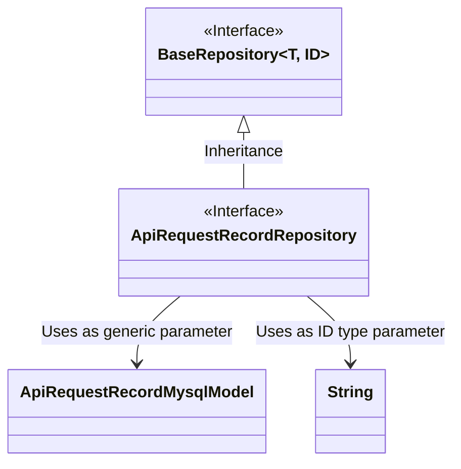
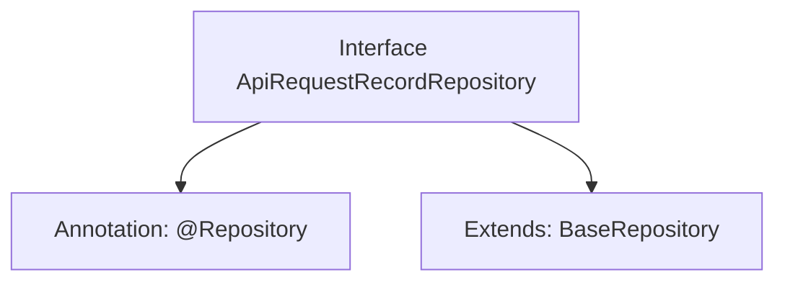

# Basic Information

|      |      |
|------|------|
| Name | ApiRequestRecordRepository |
| Language | .java |
| Code Path | WeFe/serving/serving-service/src/main/java/com/welab/wefe/serving/service/database/repository/ApiRequestRecordRepository.java |
| Package Name | com.welab.wefe.serving.service.database.repository |
| Dependencies | ['com.welab.wefe.serving.service.database.entity.ApiRequestRecordMysqlModel', 'com.welab.wefe.serving.service.database.repository.base.BaseRepository', 'org.springframework.stereotype.Repository'] |
| Brief Description | The interface ApiRequestRecordRepository extends BaseRepository and is used to operate ApiRequestRecordMysqlModel data, with the primary key type being String. |

# Description

The content defines a Spring Data repository interface named `ApiRequestRecordRepository`, identified by the `@Repository` annotation. This interface extends the generic base class `BaseRepository`, specifying the entity type as `ApiRequestRecordMysqlModel` and the primary key type as `String`. This indicates that it is a foundational data access layer component for operating database tables, specifically designed for handling persistence operations of `ApiRequestRecordMysqlModel` type data.

# Class Summary

| Name   | Type  | Description |
|-------|------|-------------|
| ApiRequestRecordRepository | interface | The interface ApiRequestRecordRepository extends BaseRepository and is used to operate ApiRequestRecordMysqlModel data, with the primary key type being String. |

## Class ApiRequestRecordRepository

|      |      |
|------|------|
| Access Modifier | @Repository;public |
| Type | interface |
| Name | ApiRequestRecordRepository |
| Description | The interface ApiRequestRecordRepository extends BaseRepository and is used to operate ApiRequestRecordMysqlModel data, with the primary key type being String. |

### UML Class Diagram

This class diagram illustrates the relationship where the ApiRequestRecordRepository interface inherits from the generic BaseRepository interface. BaseRepository is an interface with two generic parameters (T and ID), and ApiRequestRecordRepository concretizes it by specifying T as ApiRequestRecordMysqlModel and ID as String. The diagram clearly presents the inheritance between interfaces and the binding of generic parameter types, reflecting the typical design pattern of Repository interfaces in Spring Data JPA.

### Internal Method Call Graph

This code defines a Spring Data JPA Repository interface for operating on the ApiRequestRecordMysqlModel entity in the database. The interface is marked as a Spring-managed component via the @Repository annotation and inherits from the BaseRepository interface, thereby acquiring basic CRUD operation methods. The generic parameters of BaseRepository specify the entity type as ApiRequestRecordMysqlModel and the primary key type as String. This design follows Spring Data specifications, enabling standard database operations without requiring concrete method implementations.

### Field List

| Name  | Type  | Description |
|-------|-------|------|

### Method List

| Name  | Type  | Description |
|-------|-------|------|

