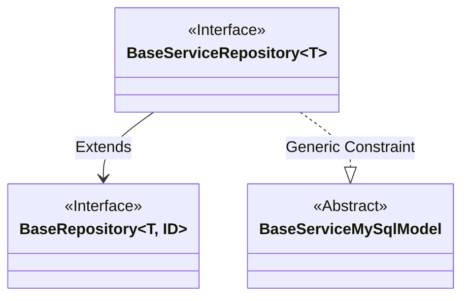
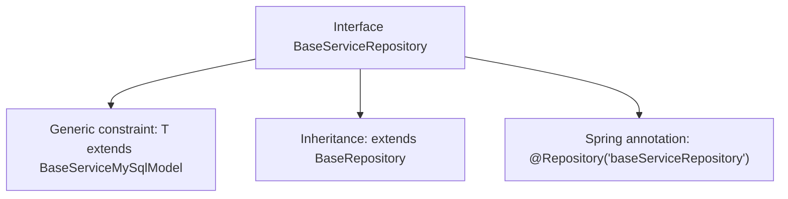

# Basic Information

|      |      |
|------|------|
| Name | BaseServiceRepository |
| Language | .java |
| Code Path | WeFe/serving/serving-service/src/main/java/com/welab/wefe/serving/service/database/repository/BaseServiceRepository.java |
| Package Name | com.welab.wefe.serving.service.database.repository |
| Dependencies | ['org.springframework.stereotype.Repository', 'com.welab.wefe.serving.service.database.entity.BaseServiceMySqlModel', 'com.welab.wefe.serving.service.database.repository.base.BaseRepository'] |
| Brief Description | The interface BaseServiceRepository extends BaseRepository, with the generic type T required to extend BaseServiceMySqlModel, annotated with @Repository for naming. |

# Description

The content defines a Java interface named `BaseServiceRepository`, marked as a Spring repository component with the `@Repository` annotation and assigned the component name "baseServiceRepository". This interface extends the generic `BaseRepository` interface, constraining the generic type `T` to inherit from the `BaseServiceMySqlModel` class while specifying the primary key type as `String`. This is a typical Spring Data repository interface definition for database operations.

# Class Summary

| Name   | Type  | Description |
|-------|------|-------------|
| BaseServiceRepository | interface | The interface BaseServiceRepository extends BaseRepository, with the generic type T required to extend BaseServiceMySqlModel, and is annotated with @Repository under the name baseServiceRepository. |

## Class BaseServiceRepository

|      |      |
|------|------|
| Access Modifier | @Repository("baseServiceRepository");public |
| Type | interface |
| Name | BaseServiceRepository |
| Description | The interface BaseServiceRepository extends BaseRepository, with the generic type T required to extend BaseServiceMySqlModel, and is annotated with @Repository under the name baseServiceRepository. |

### UML Class Diagram

This class diagram illustrates that the BaseServiceRepository interface extends the BaseRepository interface, with the generic constraint that type T must inherit from BaseServiceMySqlModel. BaseRepository is a generic interface accepting type parameters T and ID, while BaseServiceRepository is marked as a Spring repository component via the @Repository annotation. The diagram clearly depicts the inheritance relationship between interfaces and the generic constraint, where BaseServiceMySqlModel serves as an abstract base class to constrain the type scope of generic parameter T.

### Internal Method Call Graph

This flowchart illustrates the structure of the BaseServiceRepository interface, which is a Spring Data repository interface with generic parameters. Declared as a Spring component via the @Repository annotation, it inherits from the BaseRepository base class, where the generic type T is constrained to be a subclass of BaseServiceMySqlModel, with the primary key type fixed as String. This design is commonly used to implement generic database operation templates based on Spring Data.

### Field List

| Name  | Type  | Description |
|-------|-------|------|

### Method List

| Name  | Type  | Description |
|-------|-------|------|

