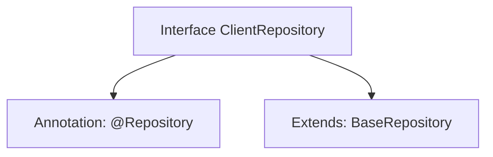

# Basic Information

|      |      |
|------|------|
| Name | ClientRepository |
| Language | .java |
| Code Path | WeFe/serving/serving-service/src/main/java/com/welab/wefe/serving/service/database/repository/ClientRepository.java |
| Package Name | com.welab.wefe.serving.service.database.repository |
| Dependencies | ['com.welab.wefe.serving.service.database.entity.ClientMysqlModel', 'com.welab.wefe.serving.service.database.repository.base.BaseRepository', 'org.springframework.stereotype.Repository'] |
| Brief Description | Client repository interface, inherits from the base repository class, operates on the ClientMysqlModel entity, with the primary key type being String. |

# Description

The content defines a Spring Data repository interface named `ClientRepository`, marked with the `@Repository` annotation. This interface extends the generic base class `BaseRepository`, specifying the entity type as `ClientMysqlModel` and the primary key type as `String`. This indicates it is a persistence-layer component for operating on `ClientMysqlModel` entity data, adhering to the Spring Data repository pattern design.

# Class Summary

| Name   | Type  | Description |
|-------|------|-------------|
| ClientRepository | interface | Client-side data repository interface, inherits from the base repository class, operates on the ClientMysqlModel entity, with the primary key type being String. |


## Class ClientRepository

|      |      |
|------|------|
| Access Modifier | @Repository;public |
| Type | interface |
| Name | ClientRepository |
| Description | Client-side data repository interface, inherits from the base repository class, operates on the ClientMysqlModel entity, with the primary key type being String. |


### UML Class Diagram

```mermaid
classDiagram
    class BaseRepository~T, ID~ {
        <<Interface>>
    }
    class ClientRepository {
        <<Interface>>
    }
    BaseRepository <|-- ClientRepository : Extends
    // ClientRepository inherits from the generic interface BaseRepository, specifying ClientMysqlModel and String as type parameters
```

This class diagram illustrates the inheritance relationship where the ClientRepository interface extends the generic BaseRepository interface. BaseRepository is a generic interface with two type parameters T and ID, while ClientRepository specializes it by using ClientMysqlModel and String as concrete type parameters through inheritance. This design allows ClientRepository to reuse the generic data access methods defined in BaseRepository while maintaining type safety.


### Internal Method Call Graph



This flowchart illustrates a typical Repository interface definition in Spring Data JPA. The ClientRepository is marked as a persistence layer component via the @Repository annotation and inherits basic CRUD operation capabilities by extending BaseRepository, with generic parameters specifying the entity type as ClientMysqlModel and the primary key type as String. This design follows Spring Data's "interface-as-implementation" paradigm, automatically generating database operation logic without requiring manual implementation classes.

### Field List

| Name  | Type  | Description |
|-------|-------|------|

### Method List

| Name  | Type  | Description |
|-------|-------|------|


