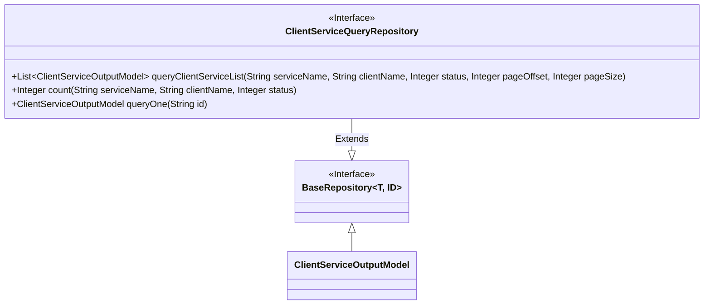
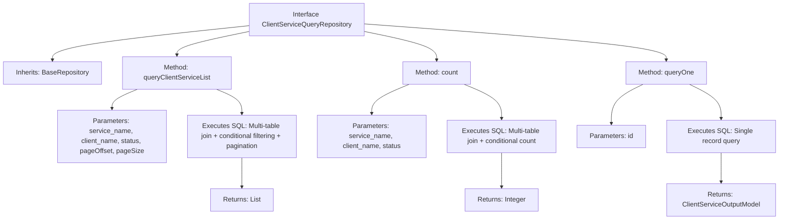

# Basic Information

|      |      |
|------|------|
| Name | ClientServiceQueryRepository |
| Language | .java |
| Code Path | WeFe/serving/serving-service/src/main/java/com/welab/wefe/serving/service/database/repository/ClientServiceQueryRepository.java |
| Package Name | com.welab.wefe.serving.service.database.repository |
| Dependencies | ['com.welab.wefe.serving.service.database.entity.ClientServiceOutputModel', 'com.welab.wefe.serving.service.database.repository.base.BaseRepository', 'org.springframework.data.jpa.repository.Query', 'org.springframework.data.repository.query.Param', 'org.springframework.stereotype.Repository', 'java.util.List'] |
| Brief Description | The ClientServiceQueryRepository interface provides customer service data query functionality, including three methods: paginated query list, total count statistics, and detail query by ID. It utilizes native SQL to implement multi-table joint queries and conditional filtering. |

# Description

The code defines a Spring Data JPA repository interface named `ClientServiceQueryRepository`, which extends `BaseRepository`. The interface includes three main methods: `queryClientServiceList` for paginated queries of client service lists with filtering by service name, client name, and status; the `count` method for calculating the total number of records matching the filter criteria; and `queryOne` for retrieving detailed information of a single client service by ID. All methods use native SQL queries involving joins across the `client_service`, `service`, `client`, and `fee_config` tables, returning data of type `ClientServiceOutputModel`.

# Class Summary

| Name   | Type  | Description |
|-------|------|-------------|
| ClientServiceQueryRepository | interface | The ClientServiceQueryRepository interface provides customer service data query functionalities, including three methods: paginated query list, total count statistics, and querying details by ID. It utilizes native SQL to implement multi-table joins and conditional filtering. |

## Class ClientServiceQueryRepository

|      |      |
|------|------|
| Access Modifier | @Repository;public |
| Type | interface |
| Name | ClientServiceQueryRepository |
| Description | The ClientServiceQueryRepository interface provides customer service data query functionalities, including three methods: paginated query list, total count statistics, and querying details by ID. It utilizes native SQL to implement multi-table joins and conditional filtering. |

### UML Class Diagram

This code illustrates a Spring Data JPA `ClientServiceQueryRepository` interface that extends the `BaseRepository` interface and provides three custom query methods. The class diagram clearly depicts the inheritance relationship between interfaces, where `ClientServiceQueryRepository` acquires basic CRUD operations by extending `BaseRepository` while adding three native SQL query methods: paginated query for client service list `queryClientServiceList`, count query `count`, and single-record query `queryOne`. All methods utilize `@Query` annotations to directly define SQL statements with `@Param` for parameter binding, demonstrating JPA's capability to support complex queries.

### Internal Method Call Graph

This flowchart illustrates the structure and functionality of the ClientServiceQueryRepository interface. The interface inherits from BaseRepository and contains three core methods: queryClientServiceList implements multi-table join queries, conditional filtering, and pagination; the count method provides statistics on the number of qualifying records; queryOne retrieves a single record by ID. Each method clearly specifies input parameters, SQL operation types, and return results, fully presenting the query capabilities of this data access layer.

### Field List

| Name  | Type  | Description |
|-------|-------|------|

### Method List

| Name  | Type  | Description |
|-------|-------|------|
| count | Integer | Count the number of customer service records that meet the specified conditions in SQL queries, supporting filtering by service name, customer name, and status. |
| queryClientServiceList | List<ClientServiceOutputModel> | SQL statement for querying the customer service list, supporting filtering by service name, customer name, and status, with pagination and sorted results returned. |
| queryOne | ClientServiceOutputModel | SQL query retrieves client service information by ID, including service name, client name, status, type, IP, and URL. It uses a LEFT JOIN to associate the service and client tables. |

