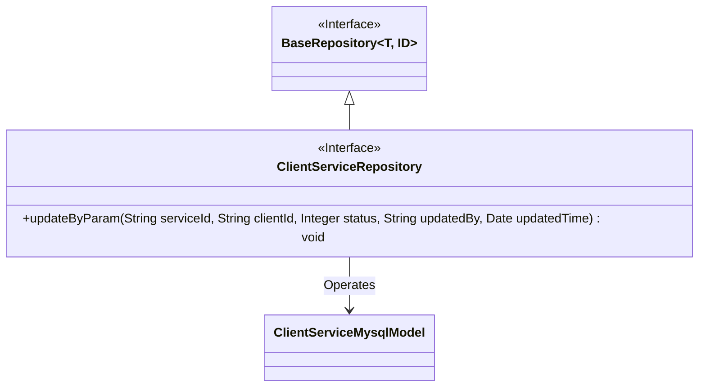
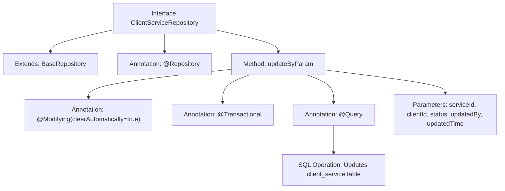

# Basic Information

|      |      |
|------|------|
| Name | ClientServiceRepository |
| Language | .java |
| Code Path | WeFe/serving/serving-service/src/main/java/com/welab/wefe/serving/service/database/repository/ClientServiceRepository.java |
| Package Name | com.welab.wefe.serving.service.database.repository |
| Dependencies | ['com.welab.wefe.serving.service.database.entity.ClientServiceMysqlModel', 'com.welab.wefe.serving.service.database.repository.base.BaseRepository', 'org.springframework.data.jpa.repository.Modifying', 'org.springframework.data.jpa.repository.Query', 'org.springframework.data.repository.query.Param', 'org.springframework.stereotype.Repository', 'org.springframework.transaction.annotation.Transactional', 'java.util.Date'] |
| Brief Description | Client Service Repository Interface, extending the base repository, provides native SQL methods for updating status, modifier, and timestamp based on service ID and client ID. |

# Description

The code defines a Spring Data JPA repository interface named `ClientServiceRepository`, which extends `BaseRepository` and operates on the `ClientServiceMysqlModel` entity class with a primary key type of `String`. The interface includes a native SQL update method `updateByParam` for updating the `status`, `updatedBy`, and `updatedTime` fields of a record based on `serviceId` and `clientId`. The method is annotated with `@Modifying` and `@Transactional` to ensure transactional operations and automatically clear the persistence context. Parameters are bound to named parameters in the SQL statement via the `@Param` annotation.

# Class Summary

| Name   | Type  | Description |
|-------|------|-------------|
| ClientServiceRepository | interface | Client service repository interface, inherits from the base repository, provides native SQL update methods to update status, modifier, and timestamp through parameters such as service ID and client ID. |

## Class ClientServiceRepository

|      |      |
|------|------|
| Access Modifier | @Repository;public |
| Type | interface |
| Name | ClientServiceRepository |
| Description | Client service repository interface, inherits from the base repository, provides native SQL update methods to update status, modifier, and timestamp through parameters such as service ID and client ID. |

### UML Class Diagram

Class Diagram Description: This diagram illustrates a ClientServiceRepository interface that inherits from the generic BaseRepository interface, where BaseRepository has two generic parameters T and ID. The ClientServiceRepository interface defines an updateByParam method for updating the status information of ClientServiceMysqlModel entities. The arrow indicates that ClientServiceRepository depends on the ClientServiceMysqlModel entity class for operations.

### Internal Method Call Graph

This flowchart illustrates the structure of the `ClientServiceRepository` interface and the execution logic of its key method `updateByParam`. The interface extends `BaseRepository` and defines a native SQL update operation via the `@Query` annotation, incorporating transaction management and automatic cache clearance configuration. The method accepts 5 parameters and updates specified fields in the `client_service` table based on conditions. The entire process demonstrates Spring Data JPA's declarative database operation features.

### Field List

| Name  | Type  | Description |
|-------|-------|------|

### Method List

| Name  | Type  | Description |
|-------|-------|------|
| updateByParam | void | Update the record with the specified serviceId and clientId in the client_service table, setting the status, updatedBy, and updatedTime fields. Use native SQL with support for transactions and automatic cache clearing. |

