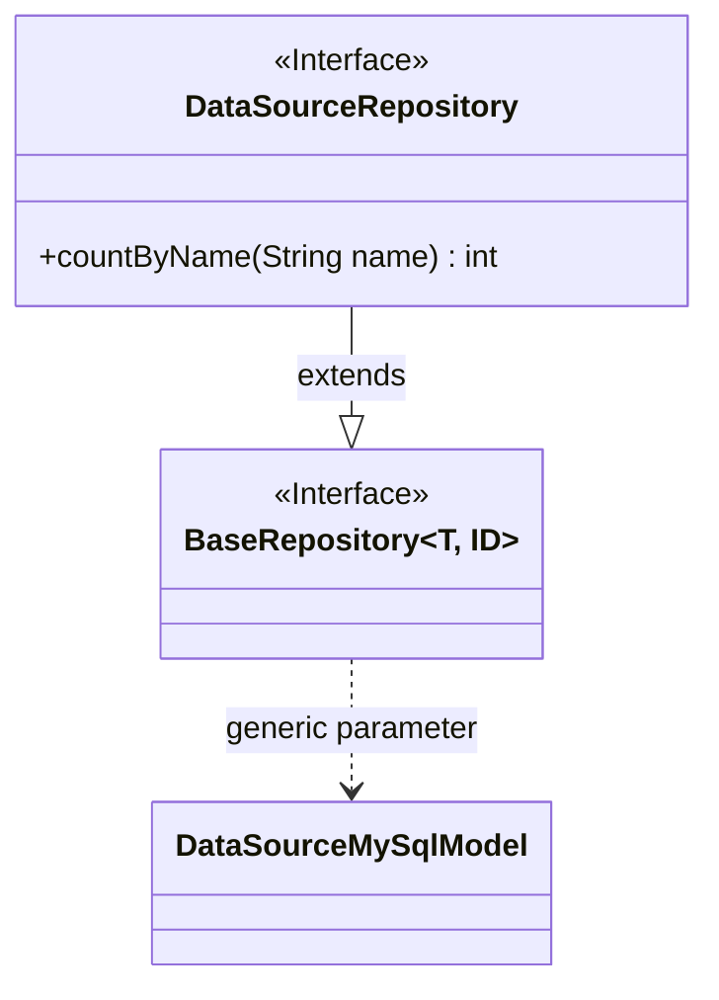
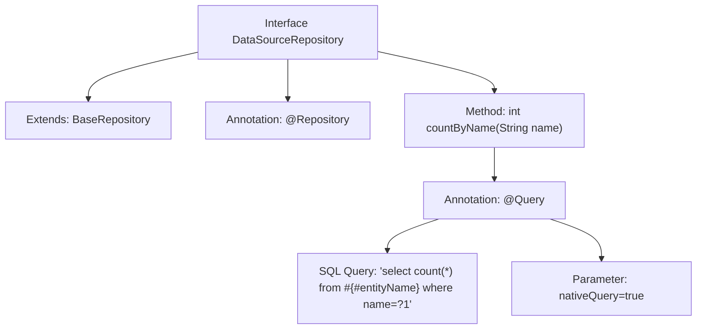

# Basic Information

|      |      |
|------|------|
| Name | DataSourceRepository |
| Language | .java |
| Code Path | WeFe/serving/serving-service/src/main/java/com/welab/wefe/serving/service/database/repository/DataSourceRepository.java |
| Package Name | com.welab.wefe.serving.service.database.repository |
| Dependencies | ['org.springframework.data.jpa.repository.Query', 'org.springframework.stereotype.Repository', 'com.welab.wefe.serving.service.database.entity.DataSourceMySqlModel', 'com.welab.wefe.serving.service.database.repository.base.BaseRepository'] |
| Brief Description | The DataSourceRepository interface extends BaseRepository and provides the countByName method for counting by name, using native SQL queries. |

# Description

This is a Spring Data JPA repository interface named DataSourceRepository, which extends BaseRepository with generic parameters specifying the entity type as DataSourceMySqlModel and the primary key type as String. The interface defines a statistical method countByName, using the @Query annotation to specify a native SQL query that counts the total number of records in the table where the name field matches the input parameter. The method accepts a String parameter name and returns the statistical result as an integer value. The interface is marked with the @Repository annotation, indicating it is a Spring-managed persistence layer component.

# Class Summary

| Name   | Type  | Description |
|-------|------|-------------|
| DataSourceRepository | interface | The DataSourceRepository interface extends BaseRepository and implements a native SQL query method countByName for counting by name through the @Query annotation. |

## Class DataSourceRepository

|      |      |
|------|------|
| Access Modifier | @Repository;public |
| Type | interface |
| Name | DataSourceRepository |
| Description | The DataSourceRepository interface extends BaseRepository and implements a native SQL query method countByName for counting by name through the @Query annotation. |

### UML Class Diagram

This code demonstrates a Spring Data JPA repository interface design. The DataSourceRepository interface extends the generic BaseRepository interface, specifying the entity type DataSourceMySqlModel and primary key type String. The interface defines a custom native SQL query method countByName to count records with a specified name. The class diagram clearly illustrates the interface inheritance relationship and generic parameter binding, reflecting the typical repository pattern design of Spring Data JPA.

### Internal Method Call Graph

This code defines a Spring Data JPA Repository interface named DataSourceRepository, which extends BaseRepository with specified entity and primary key types. The interface is marked as a Spring component via the @Repository annotation and contains a custom query method countByName annotated with @Query. This method executes a native SQL query to count records with the specified name. The flowchart illustrates the inheritance relationship, annotation configurations, and the definition logic of the query method.

### Field List

| Name  | Type  | Description |
|-------|-------|------|

### Method List

| Name  | Type  | Description |
|-------|-------|------|
| countByName | int | Query method: Count the number of records with a specified name using native SQL queries. |

