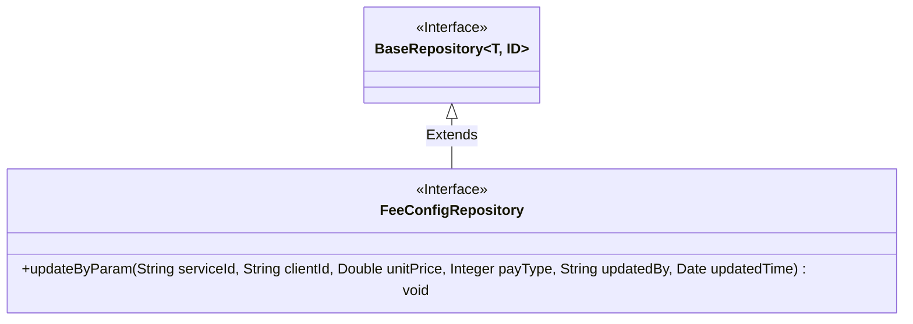
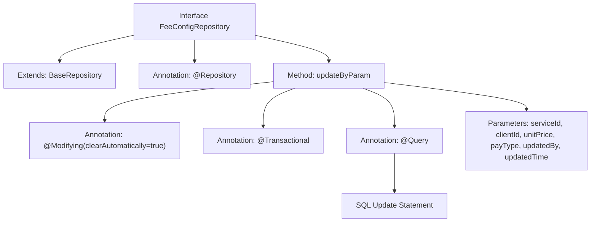

# Basic Information

|      |      |
|------|------|
| Name | FeeConfigRepository |
| Language | .java |
| Code Path | WeFe/serving/serving-service/src/main/java/com/welab/wefe/serving/service/database/repository/FeeConfigRepository.java |
| Package Name | com.welab.wefe.serving.service.database.repository |
| Dependencies | ['com.welab.wefe.serving.service.database.entity.FeeConfigMysqlModel', 'com.welab.wefe.serving.service.database.repository.base.BaseRepository', 'org.springframework.data.jpa.repository.Modifying', 'org.springframework.data.jpa.repository.Query', 'org.springframework.data.repository.query.Param', 'org.springframework.stereotype.Repository', 'org.springframework.transaction.annotation.Transactional', 'java.util.Date'] |
| Brief Description | The FeeConfigRepository interface extends BaseRepository, providing native SQL methods to update fields such as unitPrice and payType via serviceId and clientId, with support for automatic cache clearance and transaction management. |

# Description

FeeConfigRepository is a Spring Data JPA interface that extends BaseRepository, designed to operate on the FeeConfigMysqlModel entity. It includes a native SQL update method named updateByParam, which updates the unitPrice, payType, updatedBy, and updatedTime fields using serviceId and clientId as conditions. The method is annotated with @Modifying and @Transactional to ensure transactional operations and automatically clear the persistence context. Parameters are bound to named parameters in the SQL statement via the @Param annotation.

# Class Summary

| Name   | Type  | Description |
|-------|------|-------------|
| FeeConfigRepository | interface | The FeeConfigRepository interface extends BaseRepository, providing native SQL methods to update fields such as unitPrice and payType via serviceId and clientId, with support for automatic cache clearing and transaction management. |

## Class FeeConfigRepository

|      |      |
|------|------|
| Access Modifier | @Repository;public |
| Type | interface |
| Name | FeeConfigRepository |
| Description | The FeeConfigRepository interface extends BaseRepository, providing native SQL methods to update fields such as unitPrice and payType via serviceId and clientId, with support for automatic cache clearing and transaction management. |

### UML Class Diagram

Class Diagram Description: This diagram illustrates a Spring Data JPA repository interface design. The FeeConfigRepository interface extends the generic BaseRepository interface and adds a specific update method updateByParam. It is annotated with @Repository and @Modifying to denote its repository characteristics, utilizing native SQL queries to implement parameterized update operations. The diagram clearly demonstrates the interface inheritance relationship and the definition of specific business methods.

### Internal Method Call Graph

This code defines a Spring Data JPA Repository interface named FeeConfigRepository for operating on the FeeConfigMysqlModel entity. The interface extends BaseRepository, providing basic CRUD operations. It includes an updateByParam method annotated with @Modifying and @Transactional to mark it as an update operation, and specifies a native SQL update statement via the @Query annotation. The method accepts six parameters corresponding to variables in the SQL statement, used to update fields like unitPrice and payType based on serviceId and clientId. The entire flow demonstrates the complete mapping relationship from interface definition to concrete SQL operations.

### Field List

| Name  | Type  | Description |
|-------|-------|------|

### Method List

| Name  | Type  | Description |
|-------|-------|------|
| updateByParam | void | Update the fee_config table records, modify the unitPrice, payType, updatedBy, and updatedTime fields based on serviceId and clientId. Use native SQL with transaction handling and automatic cache clearing. |

