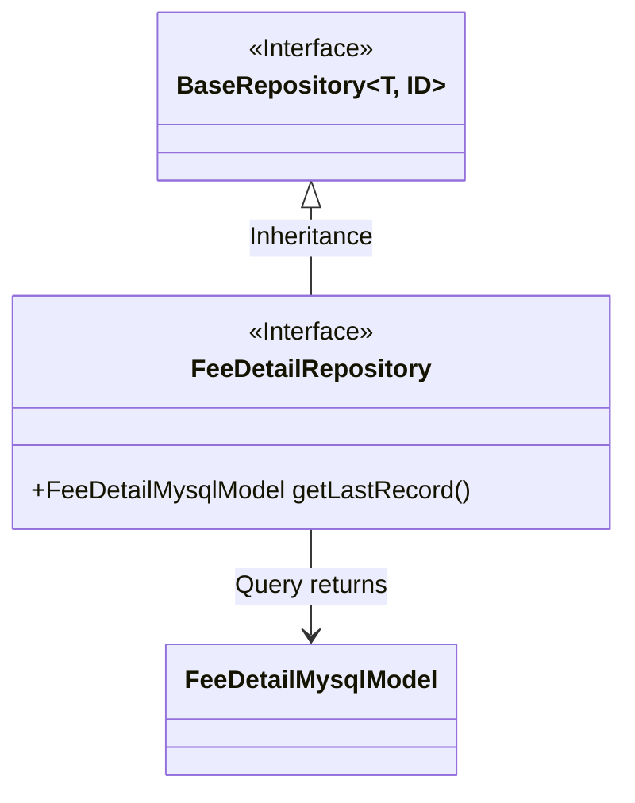
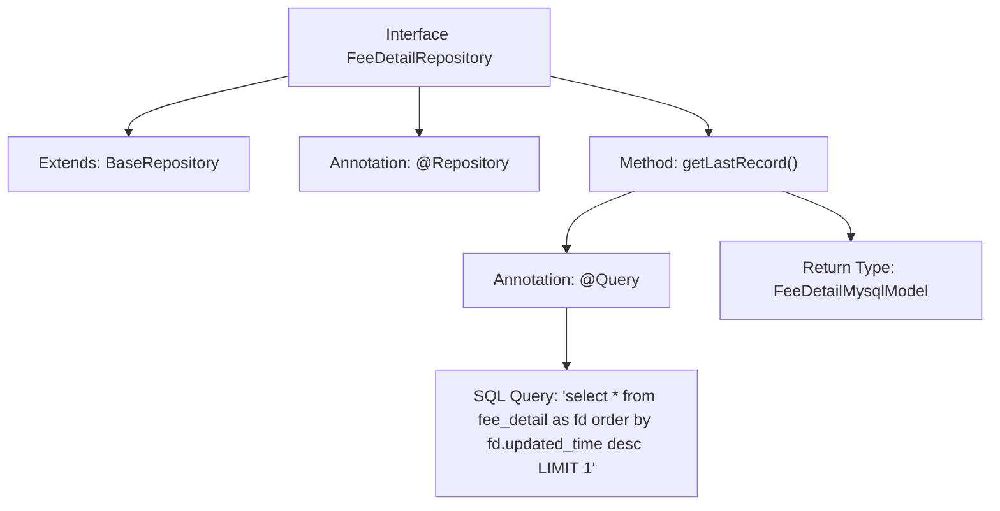

# Basic Information

|      |      |
|------|------|
| Name | FeeDetailRepository |
| Language | .java |
| Code Path | WeFe/serving/serving-service/src/main/java/com/welab/wefe/serving/service/database/repository/FeeDetailRepository.java |
| Package Name | com.welab.wefe.serving.service.database.repository |
| Dependencies | ['com.welab.wefe.serving.service.database.entity.FeeDetailMysqlModel', 'com.welab.wefe.serving.service.database.repository.base.BaseRepository', 'org.springframework.data.jpa.repository.Query', 'org.springframework.stereotype.Repository'] |
| Brief Description | The FeeDetailRepository interface extends BaseRepository and is used to operate on FeeDetailMysqlModel data. It includes the native SQL query method getLastRecord, which retrieves the last record from the fee_detail table sorted by updated_time in descending order. |

# Description

The FeeDetailRepository is a Spring Data repository interface that extends BaseRepository, designed to operate on the FeeDetailMysqlModel entity class with a primary key of type String. This interface includes a native SQL query method named getLastRecord, which sorts records in descending order by updated_time and limits the result to 1 record, used to retrieve the last entry from the fee_detail table. The method is annotated with @Query to specify the SQL statement and sets nativeQuery to true to indicate the use of native SQL.

# Class Summary

| Name   | Type  | Description |
|-------|------|-------------|
| FeeDetailRepository | interface | The FeeDetailRepository interface extends BaseRepository and retrieves the last record from the fee_detail table sorted by updated_time in descending order through native SQL queries. |

## Class FeeDetailRepository

|      |      |
|------|------|
| Access Modifier | @Repository;public |
| Type | interface |
| Name | FeeDetailRepository |
| Description | The FeeDetailRepository interface extends BaseRepository and retrieves the last record from the fee_detail table sorted by updated_time in descending order through native SQL queries. |

### UML Class Diagram

This class diagram illustrates the inheritance relationship of a Spring Data JPA repository interface. The FeeDetailRepository interface extends the generic BaseRepository interface, specifying FeeDetailMysqlModel as the entity type and String as the ID type. The interface defines a native SQL query method getLastRecord() to retrieve the last record from the fee_detail table sorted by update time in descending order. The diagram clearly demonstrates the interface inheritance and entity type dependency, conforming to the standard design pattern of JPA repositories.

### Internal Method Call Graph

This flowchart illustrates the structure and functionality of the FeeDetailRepository interface. The interface extends BaseRepository, is annotated with @Repository, and contains a method getLastRecord() defined by @Query annotation. This method executes a native SQL query to retrieve the last record from the fee_detail table sorted by updated_time in descending order, returning a FeeDetailMysqlModel object. The entire process clearly demonstrates the interface's inheritance relationship, annotation usage, and implementation approach of the core query method.

### Field List

| Name  | Type  | Description |
|-------|-------|------|

### Method List

| Name  | Type  | Description |
|-------|-------|------|
| getLastRecord | FeeDetailMysqlModel | Query the first record from the fee_detail table sorted in descending order by update time. |

