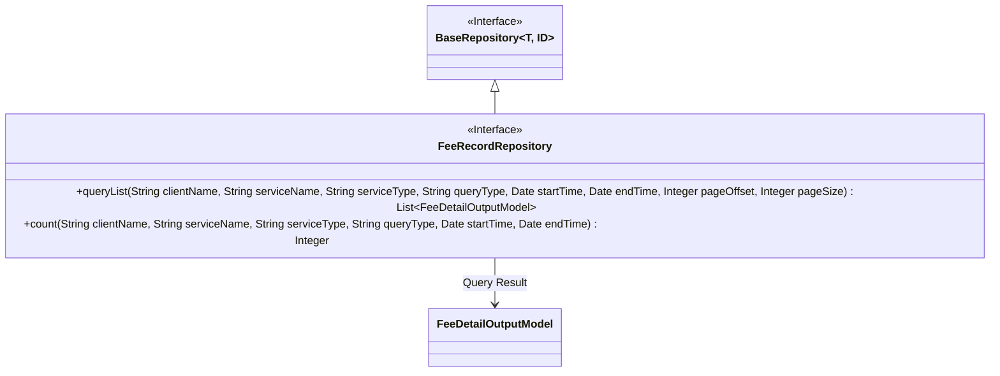
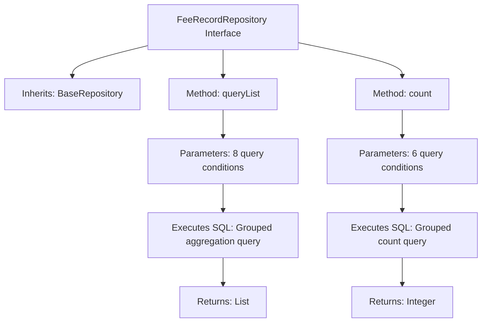

# Basic Information

|      |      |
|------|------|
| Name | FeeRecordRepository |
| Language | .java |
| Code Path | WeFe/serving/serving-service/src/main/java/com/welab/wefe/serving/service/database/repository/FeeRecordRepository.java |
| Package Name | com.welab.wefe.serving.service.database.repository |
| Dependencies | ['com.welab.wefe.serving.service.database.entity.FeeDetailOutputModel', 'com.welab.wefe.serving.service.database.repository.base.BaseRepository', 'org.springframework.data.jpa.repository.Query', 'org.springframework.data.repository.query.Param', 'org.springframework.stereotype.Repository', 'java.util.Date', 'java.util.List'] |
| Brief Description | The FeeRecordRepository interface extends BaseRepository, providing native SQL methods for querying fee detail lists and counting, supporting multi-criteria filtering and pagination. |

# Description

The FeeRecordRepository is a Spring Data repository interface that extends BaseRepository, designed for managing data of type FeeDetailOutputModel. It provides two core methods: the `queryList` method retrieves a paginated list of billing details through complex SQL queries, supporting filtering by customer name, service name, and service type, with options to specify time ranges and query granularity, while sorting results in descending chronological order; the `count` method calculates the total number of records meeting the same criteria. Both methods are implemented using native SQL and include dynamic condition handling logic. Notably, the `queryList` method performs grouped aggregation calculations on the results, incorporating summary statistics for key fields such as service ID and customer ID.

# Class Summary

| Name   | Type  | Description |
|-------|------|-------------|
| FeeRecordRepository | interface | The FeeRecordRepository interface extends BaseRepository, providing native SQL methods for querying fee detail lists and counting, with support for filtering and pagination based on criteria such as customer name, service name, type, time range, etc. |

## Class FeeRecordRepository

|      |      |
|------|------|
| Access Modifier | @Repository;public |
| Type | interface |
| Name | FeeRecordRepository |
| Description | The FeeRecordRepository interface extends BaseRepository, providing native SQL methods for querying fee detail lists and counting, with support for filtering and pagination based on criteria such as customer name, service name, type, time range, etc. |

### UML Class Diagram

This code defines a FeeRecordRepository interface that extends the generic BaseRepository interface, primarily used for querying billing detail data. The interface contains two core methods: queryList for paginated retrieval of qualified billing detail lists, and count for tallying the total number of matching records. It leverages native SQL statements via @Query annotations to implement complex query logic, supporting multi-criteria filtering by service name, client name, service type, etc., as well as aggregated statistics based on time ranges and grouping conditions. The interface is marked with @Repository, indicating it is a data access layer component.

### Internal Method Call Graph

This flowchart illustrates the structure and functionality of the FeeRecordRepository interface. The interface inherits from BaseRepository and contains two core methods: queryList for executing paginated grouped aggregation queries with 8 parameters that returns a list of fee details, and count for calculating the total number of matching records with 6 parameters that returns a count value. Both methods implement complex query logic using native SQL, involving conditional filtering, date range processing, fuzzy search, and grouped statistics.

### Field List

| Name  | Type  | Description |
|-------|-------|------|

### Method List

| Name  | Type  | Description |
|-------|-------|------|
| count | Integer | Query the fee_detail table to count records based on specified conditions, supporting filtering by service name, customer name, service type, and time range, and grouping by service ID, customer ID, fee configuration ID, and creation time. |
| queryList | List<FeeDetailOutputModel> | SQL query summarizes expense details by service, customer, configuration, and time, supporting conditional filtering and pagination. Returns aggregated data such as total request count and total cost. |

