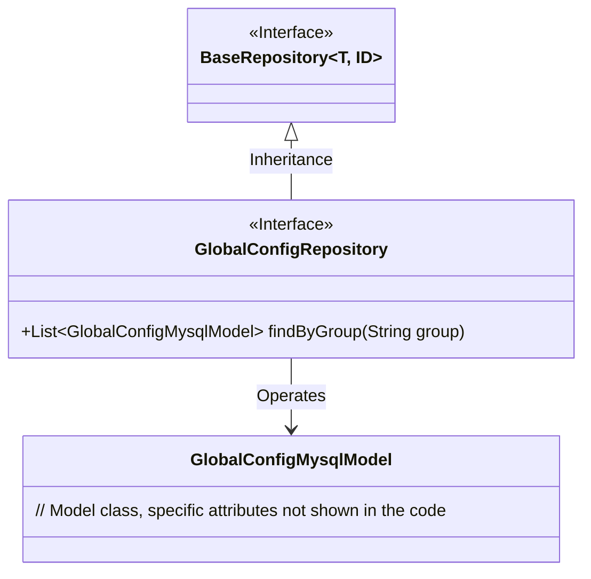
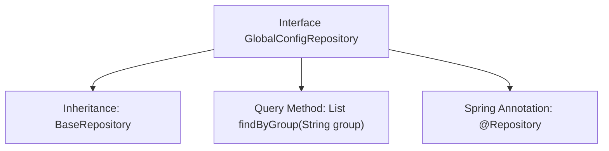

# Basic Information

|      |      |
|------|------|
| Name | GlobalConfigRepository |
| Language | .java |
| Code Path | WeFe/serving/serving-service/src/main/java/com/welab/wefe/serving/service/database/repository/GlobalConfigRepository.java |
| Package Name | com.welab.wefe.serving.service.database.repository |
| Dependencies | ['com.welab.wefe.serving.service.database.entity.GlobalConfigMysqlModel', 'com.welab.wefe.serving.service.database.repository.base.BaseRepository', 'org.springframework.stereotype.Repository', 'java.util.List'] |
| Brief Description | This is a Spring Data JPA repository interface that extends the base repository and defines query methods by group. |

# Description

This code snippet defines a Spring Data repository interface named `GlobalConfigRepository`, which extends the base class `BaseRepository`. The interface is annotated with `@Repository` to identify it as a Spring-managed repository component, operating on the data model `GlobalConfigMysqlModel` with a primary key type of `String`. It declares a custom query method `findByGroup` to retrieve and return a list of matching `GlobalConfigMysqlModel` objects based on the `group` field.

# Class Summary

| Name   | Type  | Description |
|-------|------|-------------|
| GlobalConfigRepository | interface | This is a Spring Repository interface, extending from BaseRepository, used for operating on GlobalConfigMysqlModel data, providing query functionality by the group field. |

## Class GlobalConfigRepository

|      |      |
|------|------|
| Access Modifier | @Repository;public |
| Type | interface |
| Name | GlobalConfigRepository |
| Description | This is a Spring Repository interface, extending from BaseRepository, used for operating on GlobalConfigMysqlModel data, providing query functionality by the group field. |

### UML Class Diagram

This class diagram illustrates the repository interface design in Spring Data JPA. The GlobalConfigRepository interface inherits from the generic BaseRepository interface, specifying the entity type GlobalConfigMysqlModel and primary key type String. The interface customizes a findByGroup method for querying by the group field, adhering to Spring Data's query derivation rules. The diagram clearly presents the interface inheritance relationship, generic parameter binding, and the operational dependency between the repository and entity model, reflecting the standard structure of the JPA repository pattern.

### Internal Method Call Graph

This code defines a Spring Data JPA repository interface GlobalConfigRepository, which extends BaseRepository with specified entity type GlobalConfigMysqlModel and primary key type String. The interface is marked as a Spring-managed component via the @Repository annotation and declares a custom query method findByGroup for retrieving configuration lists by the group field. The flowchart clearly illustrates the interface's inheritance relationship, core methods, and hierarchical structure of Spring annotations.

### Field List

| Name  | Type  | Description |
|-------|-------|------|

### Method List

| Name  | Type  | Description |
|-------|-------|------|
| findByGroup | List<GlobalConfigMysqlModel> | Query the global configuration MySQL model list by group name. |

