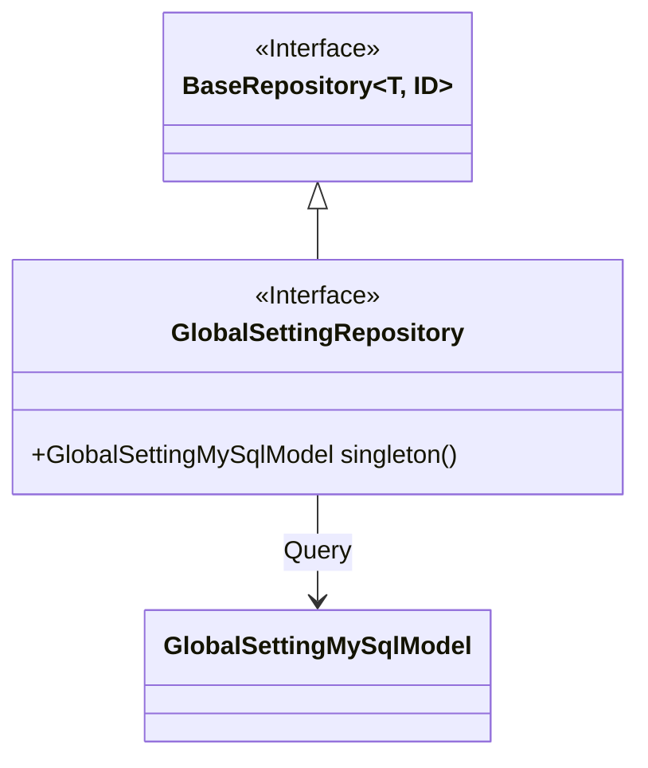
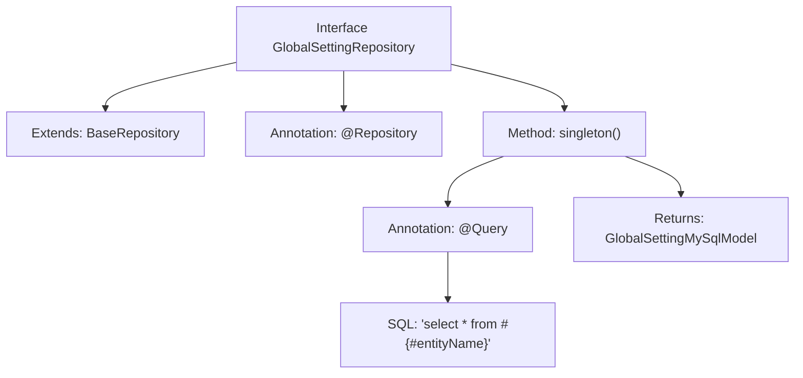

# Basic Information

|      |      |
|------|------|
| Name | GlobalSettingRepository |
| Language | .java |
| Code Path | WeFe/serving/serving-service/src/main/java/com/welab/wefe/serving/service/database/repository/GlobalSettingRepository.java |
| Package Name | com.welab.wefe.serving.service.database.repository |
| Dependencies | ['com.welab.wefe.serving.service.database.entity.GlobalSettingMySqlModel', 'com.welab.wefe.serving.service.database.repository.base.BaseRepository', 'org.springframework.data.jpa.repository.Query', 'org.springframework.stereotype.Repository'] |
| Brief Description | The GlobalSettingRepository interface extends BaseRepository and implements the singleton query method singleton() via the @Query annotation, returning a GlobalSettingMySqlModel. |

# Description

This is a Spring Data JPA repository interface named GlobalSettingRepository, marked with the @Repository annotation. It extends BaseRepository, with generic parameters specifying the entity type as GlobalSettingMySqlModel and the primary key type as String. The interface defines a query method named singleton, which uses the @Query annotation to specify a native SQL query statement "select * from #{#entityName}" for retrieving global setting data in singleton mode. The method returns a GlobalSettingMySqlModel entity object. The comment indicates that this method is used to find the singleton record.

# Class Summary

| Name   | Type  | Description |
|-------|------|-------------|
| GlobalSettingRepository | interface | The GlobalSettingRepository interface extends BaseRepository and implements singleton queries through the @Query annotation, returning a GlobalSettingMySqlModel. |

## Class GlobalSettingRepository

|      |      |
|------|------|
| Access Modifier | @Repository;public |
| Type | interface |
| Name | GlobalSettingRepository |
| Description | The GlobalSettingRepository interface extends BaseRepository and implements singleton queries through the @Query annotation, returning a GlobalSettingMySqlModel. |

### UML Class Diagram

This class diagram illustrates that the GlobalSettingRepository interface inherits from the generic BaseRepository interface and defines a method for querying singleton data. GlobalSettingRepository implements native SQL queries through JPA annotations, returning a GlobalSettingMySqlModel entity object. As the parent interface, BaseRepository provides basic CRUD operations, forming a clear hierarchical relationship between the two interfaces that reflects the Repository design pattern of Spring Data JPA.

### Internal Method Call Graph

This code defines a Spring Data JPA Repository interface GlobalSettingRepository, which extends BaseRepository and is annotated with @Repository. The core functionality is a native SQL query method singleton() defined via @Query annotation, used to query and return a singleton GlobalSettingMySqlModel entity. The flowchart illustrates the interface's inheritance relationship, method definition, and complete annotation configuration structure, particularly highlighting the implementation approach of custom native SQL queries.

### Field List

| Name  | Type  | Description |
|-------|-------|------|

### Method List

| Name  | Type  | Description |
|-------|-------|------|
| singleton | GlobalSettingMySqlModel | Query all records in the database table and return a singleton entity object. |

