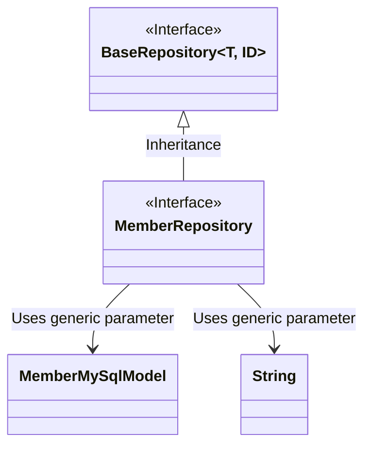
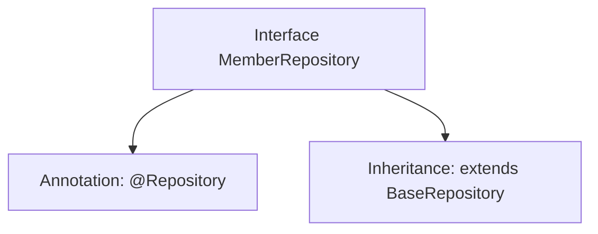

# Basic Information

|      |      |
|------|------|
| Name | MemberRepository |
| Language | .java |
| Code Path | WeFe/serving/serving-service/src/main/java/com/welab/wefe/serving/service/database/repository/MemberRepository.java |
| Package Name | com.welab.wefe.serving.service.database.repository |
| Dependencies | ['com.welab.wefe.serving.service.database.entity.MemberMySqlModel', 'com.welab.wefe.serving.service.database.repository.base.BaseRepository', 'org.springframework.stereotype.Repository'] |
| Brief Description | The member repository interface inherits from the base repository and operates on data of type MemberMySqlModel, with the primary key being of type String. |

# Description

This code snippet defines a Spring Data repository interface named `MemberRepository`, identified by the `@Repository` annotation. The interface extends the generic base class `BaseRepository`, specifying the entity type as `MemberMySqlModel` and the primary key type as `String`. This indicates that the repository is designed to manipulate data entities of type `MemberMySqlModel` and provides basic CRUD operation functionalities.

# Class Summary

| Name   | Type  | Description |
|-------|------|-------------|
| MemberRepository | interface | This is a Spring Data JPA MemberRepository interface that extends BaseRepository, designed to operate on MemberMySqlModel type data with a primary key of type String. |

## Class MemberRepository

|      |      |
|------|------|
| Access Modifier | @Repository;public |
| Type | interface |
| Name | MemberRepository |
| Description | This is a Spring Data JPA MemberRepository interface that extends BaseRepository, designed to operate on MemberMySqlModel type data with a primary key of type String. |

### UML Class Diagram

This class diagram illustrates the relationship where the MemberRepository interface inherits from the generic BaseRepository interface. BaseRepository is an interface with two generic parameters (T and ID), and MemberRepository specializes it through inheritance to a concrete implementation that uses MemberMySqlModel as the entity type and String as the ID type. MemberMySqlModel is a plain data model class associated with MemberRepository via generic parameters. The entire structure embodies a common repository interface design pattern in Spring Data JPA.

### Internal Method Call Graph

This flowchart illustrates the structure of the MemberRepository interface. The interface is annotated with @Repository, indicating it is a Spring Data Access Layer component. It also extends the generic BaseRepository interface, specifying the entity type as MemberMySqlModel and the primary key type as String. This design pattern is a typical usage of Spring Data JPA, where inheriting from a base repository interface automatically provides CRUD operation capabilities without requiring manual implementation of basic data access methods.

### Field List

| Name  | Type  | Description |
|-------|-------|------|

### Method List

| Name  | Type  | Description |
|-------|-------|------|

