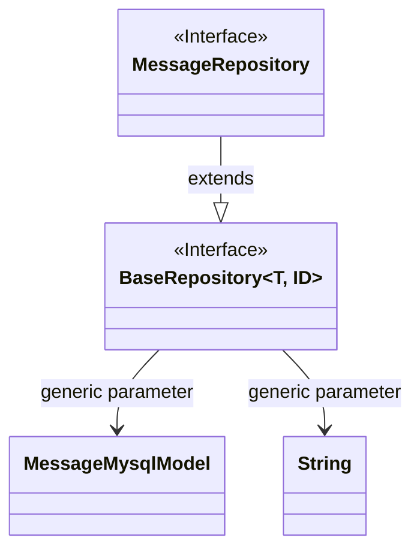
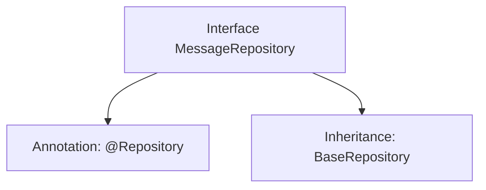

# Basic Information

|      |      |
|------|------|
| Name | MessageRepository |
| Language | .java |
| Code Path | WeFe/serving/serving-service/src/main/java/com/welab/wefe/serving/service/database/repository/MessageRepository.java |
| Package Name | com.welab.wefe.serving.service.database.repository |
| Dependencies | ['org.springframework.stereotype.Repository', 'com.welab.wefe.serving.service.database.entity.MessageMysqlModel', 'com.welab.wefe.serving.service.database.repository.base.BaseRepository'] |
| Brief Description | The message repository interface inherits from the base repository, operating on the message model with a string-type primary key. |

# Description

The content defines a Spring Data repository interface named `MessageRepository`, marked with the `@Repository` annotation. This interface extends the generic base class `BaseRepository`, specifying the entity type as `MessageMysqlModel` and the primary key type as `String`. This indicates it is a persistence layer component for operating on `MessageMysqlModel` entity data, following the repository pattern design of Spring Data.

# Class Summary

| Name   | Type  | Description |
|-------|------|-------------|
| MessageRepository | interface | Message repository interface, inherits from the base repository class, operates on the message model, with the primary key type as string. |

## Class MessageRepository

|      |      |
|------|------|
| Access Modifier | @Repository;public |
| Type | interface |
| Name | MessageRepository |
| Description | Message repository interface, inherits from the base repository class, operates on the message model, with the primary key type as string. |

### UML Class Diagram

This class diagram illustrates a Spring Data JPA repository interface design. The MessageRepository interface inherits from the generic BaseRepository interface, specifying MessageMysqlModel as the entity type and String as the ID type. BaseRepository is marked as an interface containing standard CRUD operations, while MessageRepository serves as a concrete repository interface that acquires basic database operation capabilities through inheritance. This design adheres to Spring Data's Repository pattern, achieving abstraction in the data access layer.

### Internal Method Call Graph

This code defines a Spring Data repository interface named MessageRepository, annotated with @Repository to mark it as a persistence layer component. The interface extends the generic BaseRepository interface, specifying the entity type as MessageMysqlModel and the primary key type as String. The flowchart clearly illustrates the annotation and inheritance relationships of the interface, demonstrating the typical pattern in Spring Data JPA for rapidly implementing CRUD operations by extending base repository interfaces.

### Field List

| Name  | Type  | Description |
|-------|-------|------|

### Method List

| Name  | Type  | Description |
|-------|-------|------|

