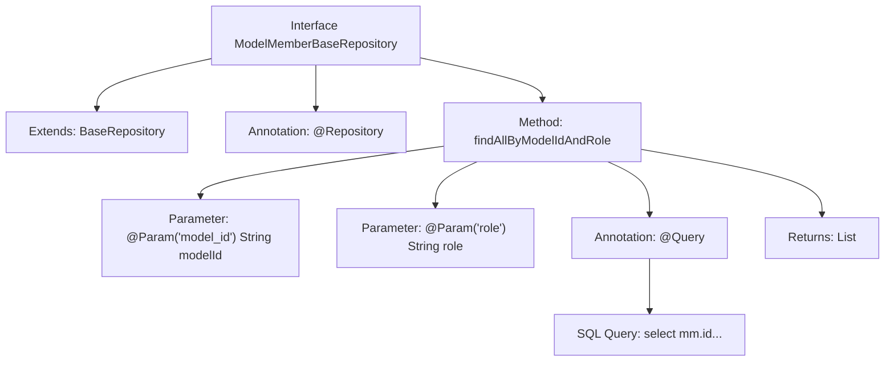

# Basic Information

|      |      |
|------|------|
| Name | ModelMemberBaseRepository |
| Language | .java |
| Code Path | WeFe/serving/serving-service/src/main/java/com/welab/wefe/serving/service/database/repository/ModelMemberBaseRepository.java |
| Package Name | com.welab.wefe.serving.service.database.repository |
| Dependencies | ['com.welab.wefe.serving.service.database.entity.ModelMemberBaseModel', 'com.welab.wefe.serving.service.database.repository.base.BaseRepository', 'org.springframework.data.jpa.repository.Query', 'org.springframework.data.repository.query.Param', 'org.springframework.stereotype.Repository', 'java.util.List'] |
| Brief Description | The ModelMemberBaseRepository interface extends BaseRepository, providing native SQL methods for querying ModelMemberBaseModel lists by modelId and role. |

# Description

This is a Spring Data JPA repository interface named `ModelMemberBaseRepository`, which extends `BaseRepository` and is used to manipulate data of type `ModelMemberBaseModel` with a primary key of type `String`. The interface defines a native SQL query method `findAllByModelIdAndRole` to retrieve data by model ID and role. The query returns a result list containing the fields `id`, `model_id`, `member_id`, `role`, and `api`, with data sourced from the `model_member` table left-joined with the `member` table, where the conditions are that `model_id` and `role` match the specified parameters. The method uses the `@Query` annotation to configure the SQL statement and binds parameters via `@Param`.

# Class Summary

| Name   | Type  | Description |
|-------|------|-------------|
| ModelMemberBaseRepository | interface | The code defines a Spring Data JPA repository interface for querying model member data. Using a native SQL query, it filters results based on model ID and role, returning a list containing member IDs, model IDs, roles, and API information. |


## Class ModelMemberBaseRepository

|      |      |
|------|------|
| Access Modifier | @Repository;public |
| Type | interface |
| Name | ModelMemberBaseRepository |
| Description | The code defines a Spring Data JPA repository interface for querying model member data. Using a native SQL query, it filters results based on model ID and role, returning a list containing member IDs, model IDs, roles, and API information. |


### UML Class Diagram

```mermaid
classDiagram
    class BaseRepository~T, ID~ {
        <<Interface>>
    }

    class ModelMemberBaseRepository {
        <<Interface>>
        +List~ModelMemberBaseModel~ findAllByModelIdAndRole(String modelId, String role)
    }

    BaseRepository <|-- ModelMemberBaseRepository
    // ModelMemberBaseRepository inherits from generic interface BaseRepository
    // Provides method to query ModelMemberBaseModel list by modelId and role
```

This code demonstrates a Spring Data JPA repository interface ModelMemberBaseRepository, which extends the generic base interface BaseRepository, specifically handling ModelMemberBaseModel type data. The interface defines a native SQL query method findAllByModelIdAndRole that performs joint queries of model member information through model ID and role, and associates with the member table to retrieve API fields. This design reflects the data access layer abstraction of the JPA repository pattern, implementing complex queries through annotation configuration.


### Internal Method Call Graph



This code snippet illustrates a Spring Data JPA repository interface ModelMemberBaseRepository, which extends BaseRepository and is annotated with @Repository. Its core functionality involves executing a native SQL query (defined via @Query annotation) to join the model_member and member tables based on model_id and role parameters, returning a List<ModelMemberBaseModel>. The flowchart clearly presents the interface's inheritance relationship, method definition, parameter annotations, and the logical association with the SQL query.

### Field List

| Name  | Type  | Description |
|-------|-------|------|

### Method List

| Name  | Type  | Description |
|-------|-------|------|
| findAllByModelIdAndRole | List<ModelMemberBaseModel> | Query model member information, filter by model ID and role, and return the fields of ID, model ID, member ID, role, and API. |


