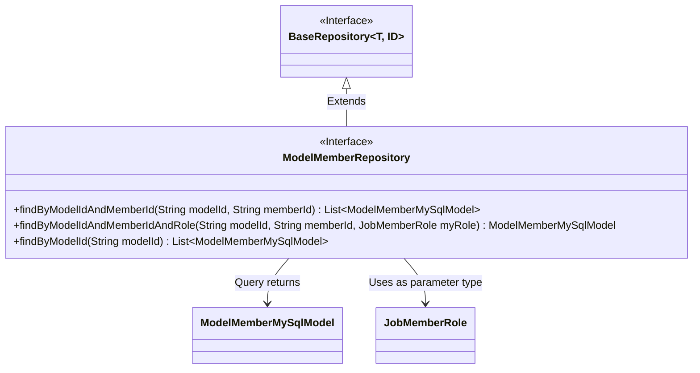
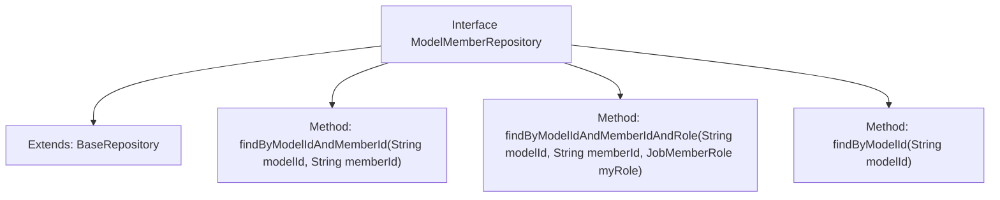

# Basic Information

|      |      |
|------|------|
| Name | ModelMemberRepository |
| Language | .java |
| Code Path | WeFe/serving/serving-service/src/main/java/com/welab/wefe/serving/service/database/repository/ModelMemberRepository.java |
| Package Name | com.welab.wefe.serving.service.database.repository |
| Dependencies | ['com.welab.wefe.common.wefe.enums.JobMemberRole', 'com.welab.wefe.serving.service.database.entity.ModelMemberMySqlModel', 'com.welab.wefe.serving.service.database.repository.base.BaseRepository', 'org.springframework.stereotype.Repository', 'java.util.List'] |
| Brief Description | The ModelMemberRepository interface extends BaseRepository, providing methods to query ModelMemberMySqlModel by modelId, memberId, and role. |

# Description

This is a Spring Data repository interface named ModelMemberRepository, which extends BaseRepository and operates on the ModelMemberMySqlModel entity class with a primary key type of String. The interface provides three query methods: 1) Query a list of ModelMemberMySqlModel that match the given modelId and memberId; 2) Query a single ModelMemberMySqlModel based on modelId, memberId, and role myRole; 3) Query a list of ModelMemberMySqlModel by modelId. All methods automatically generate query logic through method naming conventions.

# Class Summary

| Name   | Type  | Description |
|-------|------|-------------|
| ModelMemberRepository | interface | The ModelMemberRepository interface extends BaseRepository, providing methods to query ModelMemberMySqlModel by modelId, memberId, and role. |

## Class ModelMemberRepository

|      |      |
|------|------|
| Access Modifier | @Repository;public |
| Type | interface |
| Name | ModelMemberRepository |
| Description | The ModelMemberRepository interface extends BaseRepository, providing methods to query ModelMemberMySqlModel by modelId, memberId, and role. |

### UML Class Diagram

This code demonstrates a Spring Data JPA repository interface `ModelMemberRepository`, which extends the generic `BaseRepository` interface, specifically designed for operating on the `ModelMemberMySqlModel` entity class. The interface defines three query methods: a combined query by model ID and member ID, a triple-condition query by model ID/member ID/role, and a query solely by model ID. The class diagram clearly illustrates the interface inheritance relationship, return type dependency, and parameter type dependency, showcasing Spring Data JPA's feature of automatically generating queries based on method naming conventions. Here, `ModelMemberMySqlModel` is the persistence entity, and `JobMemberRole` is an enum-type parameter.

### Internal Method Call Graph

This code defines a Spring Data JPA Repository interface named ModelMemberRepository, which extends the BaseRepository interface with generic types specified as ModelMemberMySqlModel and String. The interface declares three query methods: finding multiple records by modelId and memberId, finding a single record by modelId, memberId and role, and finding multiple records by modelId. These methods will be automatically implemented by Spring Data JPA for querying the ModelMemberMySqlModel entity in the database.

### Field List

| Name  | Type  | Description |
|-------|-------|------|

### Method List

| Name  | Type  | Description |
|-------|-------|------|
| findByModelIdAndMemberId | List<ModelMemberMySqlModel> | Query the member list based on the model ID and member ID. |
| findByModelIdAndMemberIdAndRole | ModelMemberMySqlModel | Query member information based on model ID, member ID, and role. |
| findByModelId | List<ModelMemberMySqlModel> | Method to query member list based on model ID. |

