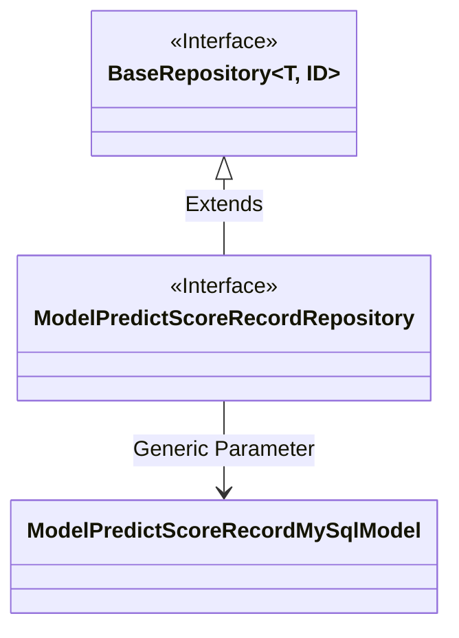
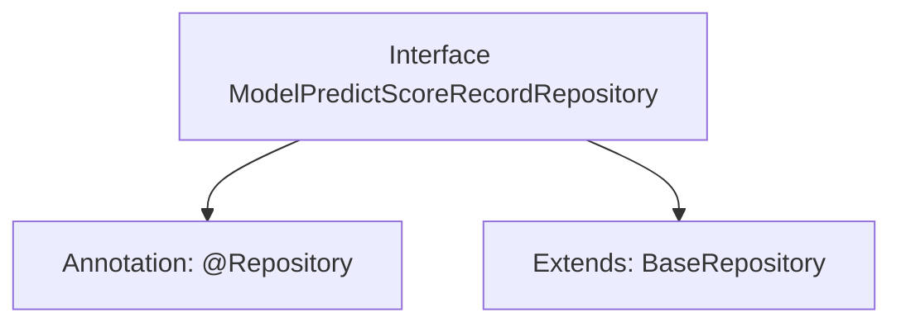

# Basic Information

|      |      |
|------|------|
| Name | ModelPredictScoreRecordRepository |
| Language | .java |
| Code Path | WeFe/serving/serving-service/src/main/java/com/welab/wefe/serving/service/database/repository/ModelPredictScoreRecordRepository.java |
| Package Name | com.welab.wefe.serving.service.database.repository |
| Dependencies | ['com.welab.wefe.serving.service.database.entity.ModelPredictScoreRecordMySqlModel', 'com.welab.wefe.serving.service.database.repository.base.BaseRepository', 'org.springframework.stereotype.Repository'] |
| Brief Description | This is a Spring Data repository interface that extends the base repository class for operating on the ModelPredictScoreRecordMySqlModel entity, with the primary key type being String. |

# Description

The content describes a Spring Data repository interface named ModelPredictScoreRecordRepository, marked with the @Repository annotation. This interface extends the generic base class BaseRepository, specifying the entity type as ModelPredictScoreRecordMySqlModel and the primary key type as String. This indicates it is a persistence layer component for operating database records of model prediction scores.

# Class Summary

| Name   | Type  | Description |
|-------|------|-------------|
| ModelPredictScoreRecordRepository | interface | This is a Spring Data JPA repository interface for operating the ModelPredictScoreRecordMySqlModel entity, which extends BaseRepository with a primary key type of String. |

## Class ModelPredictScoreRecordRepository

|      |      |
|------|------|
| Access Modifier | @Repository;public |
| Type | interface |
| Name | ModelPredictScoreRecordRepository |
| Description | This is a Spring Data JPA repository interface for operating the ModelPredictScoreRecordMySqlModel entity, which extends BaseRepository with a primary key type of String. |

### UML Class Diagram

This code snippet illustrates a Spring Data JPA repository interface `ModelPredictScoreRecordRepository`, which extends the generic interface `BaseRepository` with the entity type specified as `ModelPredictScoreRecordMySqlModel` and the primary key type as `String`. The class diagram clearly depicts the interface inheritance relationship and generic parameter binding, where `BaseRepository` serves as the parent interface with generic parameters, and the child interface implements domain-specific persistence operations by inheriting and specifying concrete type parameters.

### Internal Method Call Graph

This code defines a Spring Data JPA repository interface ModelPredictScoreRecordRepository, which is managed by Spring via the @Repository annotation and extends the BaseRepository interface, specifying the entity type as ModelPredictScoreRecordMySqlModel and the primary key type as String. This design pattern is a standard practice in Spring Data JPA for simplifying database operations.

### Field List

| Name  | Type  | Description |
|-------|-------|------|

### Method List

| Name  | Type  | Description |
|-------|-------|------|

