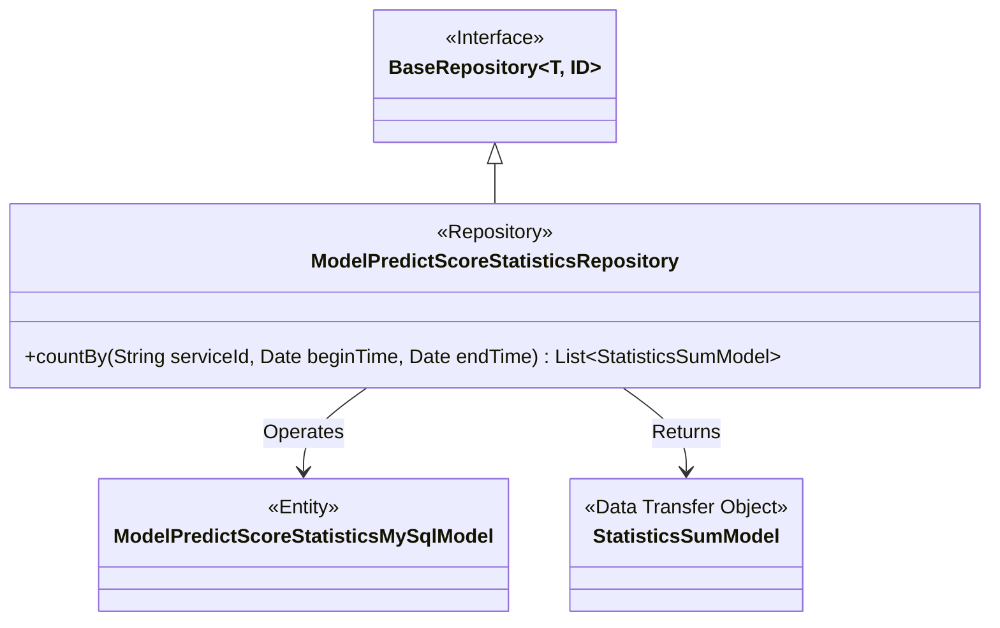
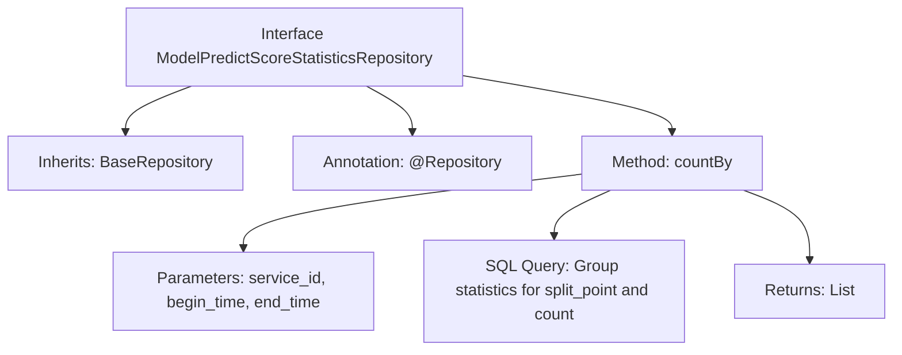

# Basic Information

|      |      |
|------|------|
| Name | ModelPredictScoreStatisticsRepository |
| Language | .java |
| Code Path | WeFe/serving/serving-service/src/main/java/com/welab/wefe/serving/service/database/repository/ModelPredictScoreStatisticsRepository.java |
| Package Name | com.welab.wefe.serving.service.database.repository |
| Dependencies | ['com.welab.wefe.serving.service.database.entity.ModelPredictScoreStatisticsMySqlModel', 'com.welab.wefe.serving.service.database.entity.StatisticsSumModel', 'com.welab.wefe.serving.service.database.repository.base.BaseRepository', 'org.springframework.data.jpa.repository.Query', 'org.springframework.data.repository.query.Param', 'org.springframework.stereotype.Repository', 'java.util.Date', 'java.util.List', 'java.util.Map'] |
| Brief Description | The code defines a Spring Data JPA repository interface for querying model prediction score statistics. It uses native SQL to group and count by `split_point`, supporting filtering by service ID and time range. Returns a list of statistical results. |

# Description

The code defines a Spring Data JPA repository interface named `ModelPredictScoreStatisticsRepository`, which extends `BaseRepository`. The interface includes a native SQL query method `countBy` for counting the distribution of model prediction scores within a specified time range for a given service ID. The query groups by `split_point`, calculates the sum of counts for each group, and returns a list of `StatisticsSumModel` objects containing `splitPoint` and `count`. The time range parameters support default value handling: if no start time is provided, it defaults to 1900, and if no end time is provided, it defaults to the current time.

# Class Summary

| Name   | Type  | Description |
|-------|------|-------------|
| ModelPredictScoreStatisticsRepository | interface | The interface defines a query method for counting the distribution of model prediction scores within a specified service ID and time range, grouping by bin points and calculating the total count. |

## Class ModelPredictScoreStatisticsRepository

|      |      |
|------|------|
| Access Modifier | @Repository;public |
| Type | interface |
| Name | ModelPredictScoreStatisticsRepository |
| Description | The interface defines a query method for counting the distribution of model prediction scores within a specified service ID and time range, grouping by bin points and calculating the total count. |

### UML Class Diagram

This class diagram illustrates the structure of a Spring Data JPA repository interface. The ModelPredictScoreStatisticsRepository extends the generic BaseRepository interface, operates on the ModelPredictScoreStatisticsMySqlModel entity class, and returns StatisticsSumModel statistical result objects through native SQL queries. The interface is annotated with @Repository and contains a parameter-bound countBy method for statistical analysis of prediction score distribution by service ID and time range.

### Internal Method Call Graph

This flowchart illustrates the structure of a Spring Data JPA repository interface, primarily consisting of inheritance relationships, annotation declarations, and core query methods. The interface is marked as a persistence layer component via the @Repository annotation, inherits BaseRepository to obtain basic CRUD capabilities, and defines a native SQL query method countBy. This method accepts service ID and time range parameters, groups records by split_point for statistical counting, and returns a list of statistical results. The query logic includes dynamic time range handling (null value defaults) and conditional filtering.

### Field List

| Name  | Type  | Description |
|-------|-------|------|

### Method List

| Name  | Type  | Description |
|-------|-------|------|
| countBy | List<StatisticsSumModel> | Query the distribution of model prediction scores for a specified service ID within a given time range, grouped by split_point and calculate the total count. |

