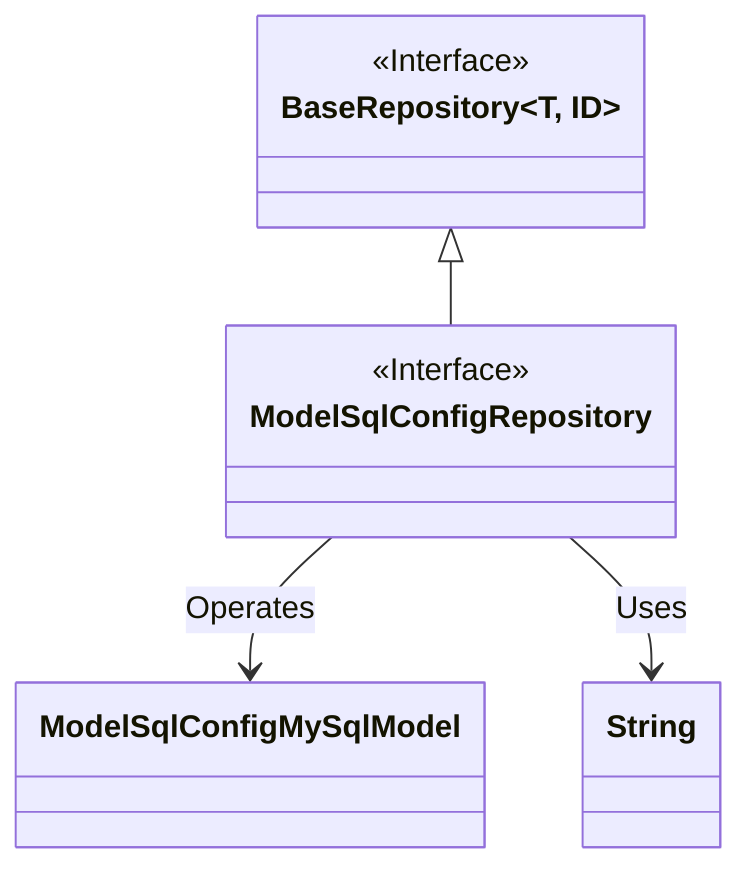
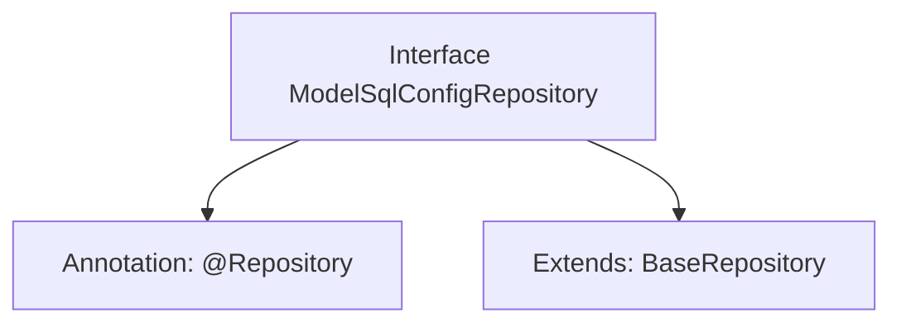

# Basic Information

|      |      |
|------|------|
| Name | ModelSqlConfigRepository |
| Language | .java |
| Code Path | WeFe/serving/serving-service/src/main/java/com/welab/wefe/serving/service/database/repository/ModelSqlConfigRepository.java |
| Package Name | com.welab.wefe.serving.service.database.repository |
| Dependencies | ['com.welab.wefe.serving.service.database.entity.ModelSqlConfigMySqlModel', 'com.welab.wefe.serving.service.database.repository.base.BaseRepository', 'org.springframework.stereotype.Repository'] |
| Brief Description | The interface ModelSqlConfigRepository extends BaseRepository, operates on data of type ModelSqlConfigMySqlModel, with the primary key being String. |

# Description

The content defines a Spring Data repository interface named `ModelSqlConfigRepository`, identified by the `@Repository` annotation. This interface extends the generic base class `BaseRepository`, specifying the entity type as `ModelSqlConfigMySqlModel` and the primary key type as `String`. This indicates that the repository is used to manipulate data entities of type `ModelSqlConfigMySqlModel` and provides basic CRUD operation functionalities.

# Class Summary

| Name   | Type  | Description |
|-------|------|-------------|
| ModelSqlConfigRepository | interface | The interface ModelSqlConfigRepository extends BaseRepository and is used to operate on ModelSqlConfigMySqlModel data, with the primary key type being String. |

## Class ModelSqlConfigRepository

|      |      |
|------|------|
| Access Modifier | @Repository;public |
| Type | interface |
| Name | ModelSqlConfigRepository |
| Description | The interface ModelSqlConfigRepository extends BaseRepository and is used to operate on ModelSqlConfigMySqlModel data, with the primary key type being String. |

### UML Class Diagram

This code illustrates a Spring Data JPA repository interface structure. The `ModelSqlConfigRepository` interface extends the generic `BaseRepository` interface, specifying the entity type as `ModelSqlConfigMySqlModel` and the ID type as `String`. The class diagram clearly demonstrates the interface inheritance relationship and the use of generic parameters, where `BaseRepository` serves as the generic base interface, `ModelSqlConfigRepository` acts as the concrete implementation interface, and forms an operational relationship with the entity class `ModelSqlConfigMySqlModel`. This structure represents a typical data access layer design pattern.

### Internal Method Call Graph

This flowchart illustrates the structure of the ModelSqlConfigRepository interface, which is a Spring Data repository interface annotated with @Repository. It extends the generic base class BaseRepository, specifying the entity type ModelSqlConfigMySqlModel and primary key type String. This design is used to implement basic CRUD operations for database interactions, adhering to the standard patterns of Spring Data JPA.

### Field List

| Name  | Type  | Description |
|-------|-------|------|

### Method List

| Name  | Type  | Description |
|-------|-------|------|

