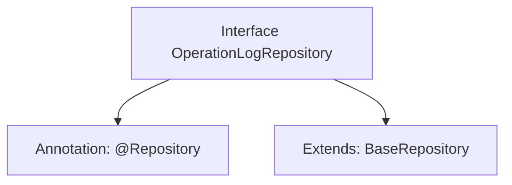

# Basic Information

|      |      |
|------|------|
| Name | OperationLogRepository |
| Language | .java |
| Code Path | WeFe/serving/serving-service/src/main/java/com/welab/wefe/serving/service/database/repository/OperationLogRepository.java |
| Package Name | com.welab.wefe.serving.service.database.repository |
| Dependencies | ['org.springframework.stereotype.Repository', 'com.welab.wefe.serving.service.database.entity.OperationLogMysqlModel', 'com.welab.wefe.serving.service.database.repository.base.BaseRepository'] |
| Brief Description | This is a Spring Data repository interface for operation logs, which extends the base repository class and is used for MySQL model data access of operation logs. |

# Description

This is a Spring Data repository interface named OperationLogRepository, annotated with @Repository to identify it as a persistence layer component. The interface inherits from the generic base class BaseRepository, specifying the entity type as OperationLogMysqlModel and the primary key type as String. This design indicates that the system uses MySQL database to store operation logs, and by inheriting the base repository interface, it directly obtains standard CRUD operation capabilities without requiring manual implementation of basic methods.

# Class Summary

| Name   | Type  | Description |
|-------|------|-------------|
| OperationLogRepository | interface | This is a Spring Data repository interface for operation logs, which extends the base repository class and is used for MySQL model data access of operation logs. |


## Class OperationLogRepository

|      |      |
|------|------|
| Access Modifier | @Repository;public |
| Type | interface |
| Name | OperationLogRepository |
| Description | This is a Spring Data repository interface for operation logs, which extends the base repository class and is used for MySQL model data access of operation logs. |


### UML Class Diagram

```mermaid
classDiagram
    class OperationLogRepository {
        <<Interface>>
    }
    class BaseRepository~T, ID~ {
        <<Interface>>
    }
    OperationLogRepository --|> BaseRepository : extends
    // The OperationLogRepository interface extends the generic BaseRepository interface, with generic parameters specified as OperationLogMysqlModel and String
```

This class diagram illustrates a Spring data access layer interface design. The OperationLogRepository, as a repository interface, inherits basic CRUD operation capabilities by extending the generic BaseRepository interface, where the generic parameter T is concretized as the OperationLogMysqlModel entity class and the ID type is String. This design adheres to Spring Data JPA specifications, avoiding code duplication through generic inheritance while maintaining type safety. The @Repository annotation on the interface indicates its role as a data access component managed by Spring.


### Internal Method Call Graph



This flowchart illustrates the structure of the OperationLogRepository interface, which is a Spring Data interface annotated with @Repository and extends the generic base class BaseRepository. By inheriting, the interface acquires CRUD operations for the OperationLogMysqlModel entity class, with the primary key type being String. This design adheres to the Spring Data JPA specification, achieving decoupling of the data access layer and standardized operations.

### Field List

| Name  | Type  | Description |
|-------|-------|------|

### Method List

| Name  | Type  | Description |
|-------|-------|------|


