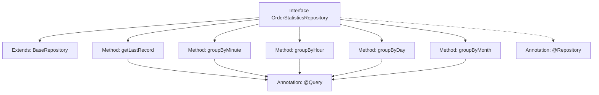

# Basic Information

|      |      |
|------|------|
| Name | OrderStatisticsRepository |
| Language | .java |
| Code Path | WeFe/serving/serving-service/src/main/java/com/welab/wefe/serving/service/database/repository/OrderStatisticsRepository.java |
| Package Name | com.welab.wefe.serving.service.database.repository |
| Dependencies | ['com.welab.wefe.serving.service.database.entity.OrderStatisticsMysqlModel', 'com.welab.wefe.serving.service.database.repository.base.BaseRepository', 'org.springframework.data.jpa.repository.Query', 'org.springframework.data.repository.query.Param', 'org.springframework.stereotype.Repository', 'java.util.Date', 'java.util.List', 'java.util.Map'] |
| Brief Description | The OrderStatisticsRepository interface provides order statistics functionality, including methods for retrieving the latest records and aggregating order data by minute, hour, day, and month granularities, with support for multi-criteria filtering. |

# Description

The `OrderStatisticsRepository` is a Spring Data JPA repository interface that extends `BaseRepository` and is used to operate on the `OrderStatisticsMysqlModel` entity. This interface provides four core methods: `getLastRecord` queries the latest record; `groupByMinute` aggregates order data at a minute granularity with support for multi-condition filtering; `groupByHour` aggregates at an hourly granularity; `groupByDay` aggregates at a daily granularity; and `groupByMonth` aggregates at a monthly granularity. The latter four methods all support filtering by conditions such as service ID, name, requester/responder ID, and name, and group the results by time range to summarize call counts, success counts, and failure counts, with results sorted in descending order by time. All queries are implemented using native SQL.

# Class Summary

| Name   | Type  | Description |
|-------|------|-------------|
| OrderStatisticsRepository | interface | The OrderStatisticsRepository interface provides order statistics functionality, including methods for retrieving the latest records and aggregating order data by minute, hour, day, and month granularities, with support for multi-criteria filtering. |


## Class OrderStatisticsRepository

|      |      |
|------|------|
| Access Modifier | @Repository;public |
| Type | interface |
| Name | OrderStatisticsRepository |
| Description | The OrderStatisticsRepository interface provides order statistics functionality, including methods for retrieving the latest records and aggregating order data by minute, hour, day, and month granularities, with support for multi-criteria filtering. |


### UML Class Diagram

```mermaid
classDiagram
    class BaseRepository~T, ID~ {
        <<Interface>>
    }

    class OrderStatisticsRepository {
        <<Interface>>
        +OrderStatisticsMysqlModel getLastRecord()
        +List~Map~String, Object~~ groupByMinute(String serviceId, String serviceName, String requestPartnerId, String requestPartnerName, String responsePartnerId, String responsePartnerName, Date startTime, Date endTime)
        +List~Map~String, Object~~ groupByHour(String serviceId, String serviceName, String requestPartnerId, String requestPartnerName, String responsePartnerId, String responsePartnerName, Date startTime, Date endTime)
        +List~Map~String, Object~~ groupByDay(String serviceId, String serviceName, String requestPartnerId, String requestPartnerName, String responsePartnerId, String responsePartnerName, Date startTime, Date endTime)
        +List~Map~String, Object~~ groupByMonth(String serviceId, String serviceName, String requestPartnerId, String requestPartnerName, String responsePartnerId, String responsePartnerName, Date startTime, Date endTime)
    }

    OrderStatisticsRepository --|> BaseRepository : extends
    // BaseRepository is a generic interface, OrderStatisticsRepository implements it with specified type parameters OrderStatisticsMysqlModel and String
```

This class diagram illustrates the structure where the OrderStatisticsRepository interface extends the generic BaseRepository interface. OrderStatisticsRepository defines four core aggregation query methods (grouping order data by minute/hour/day/month granularity) and one method for retrieving the latest record. All methods utilize @Query annotations to execute native SQL queries directly, returning statistical results through conditional filtering and group aggregation. As a data access layer component, this interface specifically handles complex aggregation query requirements for the order_statistics table.


### Internal Method Call Graph



This code defines a Spring Data JPA Repository interface for handling database operations related to order statistics. The interface provides five main methods: retrieving the latest record (getLastRecord), and grouping order statistics by minute (groupByMinute), hour (groupByHour), day (groupByDay), and month (groupByMonth) granularity. Each method uses the @Query annotation to define native SQL queries, supporting filtering by service ID, name, partner information, and other criteria, while also filtering results by time range. The interface extends BaseRepository, inheriting basic CRUD functionality, and is marked as a Spring-managed component via the @Repository annotation.

### Field List

| Name  | Type  | Description |
|-------|-------|------|

### Method List

| Name  | Type  | Description |
|-------|-------|------|
| groupByMinute | List<Map<String, Object>> | SQL query to statistically analyze order data, grouping and summarizing call, success, and failure counts by minute. Supports multi-condition filtering, including service ID/name, requester/responder ID/name, and time range. Results are sorted in descending order by time. |
| groupByDay | List<Map<String, Object>> | SQL query groups and counts order data by date, service ID, requester ID, and responder ID, supports multi-condition filtering, and returns results in descending date order. |
| groupByMonth | List<Map<String, Object>> | SQL query groups and counts order data by month, including call counts, success/failure counts, service and partner information, supports multi-condition filtering, and sorts in descending order by month. |
| groupByHour | List<Map<String, Object>> | SQL query groups order data by hour, aggregates the number of calls, successful and failed attempts, supports multi-condition filtering, and sorts in descending order by hour. |
| getLastRecord | OrderStatisticsMysqlModel | Query the first record from the order_statistics table sorted in descending order by update time. |


