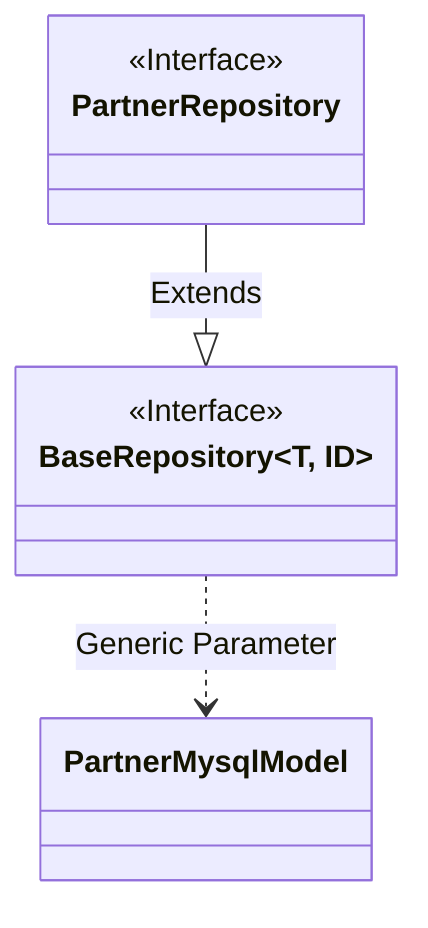
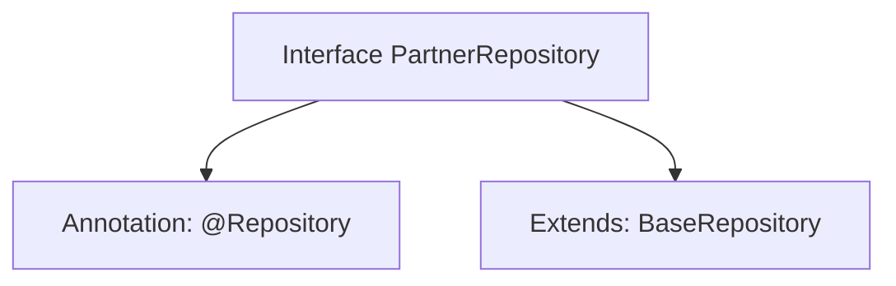

# Basic Information

|      |      |
|------|------|
| Name | PartnerRepository |
| Language | .java |
| Code Path | WeFe/serving/serving-service/src/main/java/com/welab/wefe/serving/service/database/repository/PartnerRepository.java |
| Package Name | com.welab.wefe.serving.service.database.repository |
| Dependencies | ['org.springframework.stereotype.Repository', 'com.welab.wefe.serving.service.database.entity.PartnerMysqlModel', 'com.welab.wefe.serving.service.database.repository.base.BaseRepository'] |
| Brief Description | Partner repository interface, inherits from the base repository, operates on PartnerMysqlModel type data, with the primary key being of string type. |

# Description

The content describes a Java interface named PartnerRepository, annotated with @Repository, indicating it is a Spring data access layer component. This interface extends the generic base class BaseRepository, specifying the entity type as PartnerMysqlModel and the primary key type as String. This signifies that the repository is used to manipulate data entities of type PartnerMysqlModel and provides basic CRUD operations. The entire definition is concise and clear, conforming to the standard repository interface specifications of Spring Data JPA.

# Class Summary

| Name   | Type  | Description |
|-------|------|-------------|
| PartnerRepository | interface | The interface PartnerRepository extends BaseRepository, operates on data of type PartnerMysqlModel with a primary key of String type, and is annotated as a persistence layer component. |

## Class PartnerRepository

|      |      |
|------|------|
| Access Modifier | @Repository;public |
| Type | interface |
| Name | PartnerRepository |
| Description | The interface PartnerRepository extends BaseRepository, operates on data of type PartnerMysqlModel with a primary key of String type, and is annotated as a persistence layer component. |

### UML Class Diagram

This code describes a Spring Data JPA repository interface `PartnerRepository`, which inherits from the generic interface `BaseRepository`. `BaseRepository` is a generic repository interface that accepts two type parameters: entity type `T` and ID type. `PartnerRepository` is specialized to operate on the `PartnerMysqlModel` entity class, using `String` as the primary key. The class diagram clearly illustrates the inheritance relationship between interfaces and the binding of generic parameters, reflecting Spring Data's design of the generic repository pattern. `PartnerMysqlModel`, as a persistent entity, will undergo CRUD operations by `PartnerRepository`.

### Internal Method Call Graph

This code illustrates the definition of a Spring Data JPA Repository interface. The PartnerRepository interface is marked as a data access component via the @Repository annotation, and extends the generic BaseRepository interface with specified entity type PartnerMysqlModel and primary key type String. This design follows Spring Data's Repository pattern, automatically inheriting CRUD operation capabilities from the base interface without requiring manual implementation of basic data access logic.

### Field List

| Name  | Type  | Description |
|-------|-------|------|

### Method List

| Name  | Type  | Description |
|-------|-------|------|

