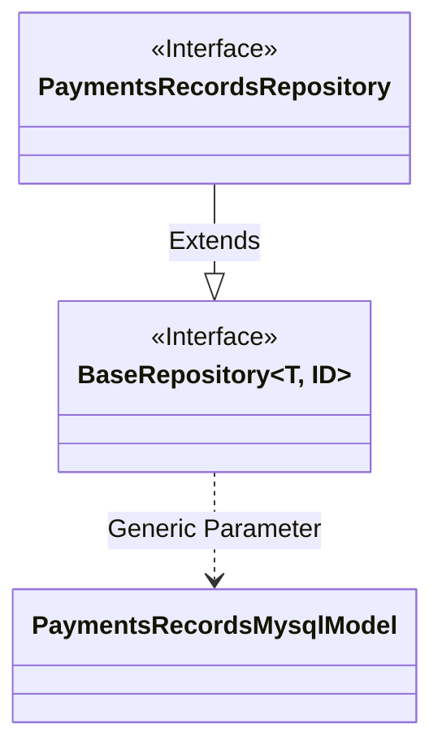
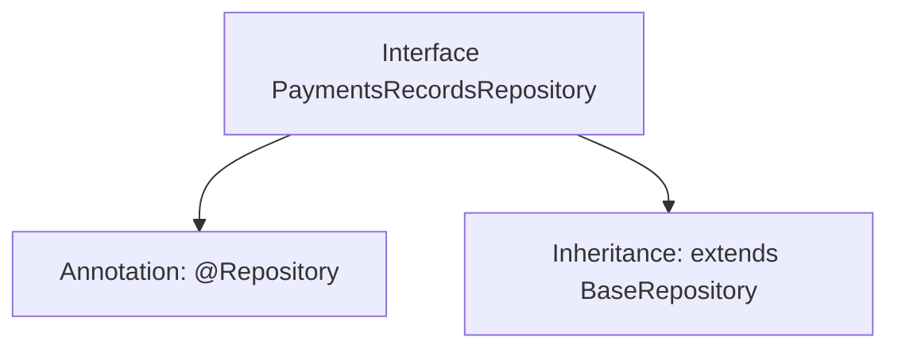

# Basic Information

|      |      |
|------|------|
| Name | PaymentsRecordsRepository |
| Language | .java |
| Code Path | WeFe/serving/serving-service/src/main/java/com/welab/wefe/serving/service/database/repository/PaymentsRecordsRepository.java |
| Package Name | com.welab.wefe.serving.service.database.repository |
| Dependencies | ['com.welab.wefe.serving.service.database.entity.PaymentsRecordsMysqlModel', 'com.welab.wefe.serving.service.database.repository.base.BaseRepository', 'org.springframework.stereotype.Repository'] |
| Brief Description | Payment record repository interface, inherits from the base repository class, operates on the payment record MySQL model, with the primary key type as string. |

# Description

The content defines a Spring Data repository interface named `PaymentsRecordsRepository`, marked with the `@Repository` annotation. This interface extends the generic base class `BaseRepository`, specifying `PaymentsRecordsMysqlModel` as the entity type and `String` as the primary key type. The interface body is empty, indicating complete reliance on the standard CRUD operations provided by the base class. This design follows the conventional pattern of Spring Data JPA, automatically acquiring basic database operation capabilities by inheriting the base repository interface without requiring manual implementation.

# Class Summary

| Name   | Type  | Description |
|-------|------|-------------|
| PaymentsRecordsRepository | interface | Payment record repository interface, inherits the base repository, operates the payment record MySQL model, with the primary key type as string. |

## Class PaymentsRecordsRepository

|      |      |
|------|------|
| Access Modifier | @Repository;public |
| Type | interface |
| Name | PaymentsRecordsRepository |
| Description | Payment record repository interface, inherits the base repository, operates the payment record MySQL model, with the primary key type as string. |

### UML Class Diagram

This class diagram illustrates the relationship where the PaymentsRecordsRepository interface extends the generic BaseRepository interface. BaseRepository defines two generic parameters, T and ID, with T being concretized as the PaymentsRecordsMysqlModel entity class and ID as String type. As a Spring Data access layer interface (annotated with @Repository), PaymentsRecordsRepository inherits basic CRUD operation capabilities and is specifically designed for persisting PaymentsRecordsMysqlModel-type data. The diagram clearly demonstrates the generic specialization and hierarchical relationships between interfaces.

### Internal Method Call Graph

This flowchart illustrates the structure of the PaymentsRecordsRepository interface. The interface is marked with Spring's @Repository annotation, indicating it is a data access layer component. It also extends the BaseRepository generic interface, specifying the entity type as PaymentsRecordsMysqlModel and the primary key type as String. This design pattern is a typical implementation of Spring Data JPA, which automatically provides CRUD operation capabilities by inheriting from the base repository interface, eliminating the need for manual implementation of basic data access methods.

### Field List

| Name  | Type  | Description |
|-------|-------|------|

### Method List

| Name  | Type  | Description |
|-------|-------|------|

