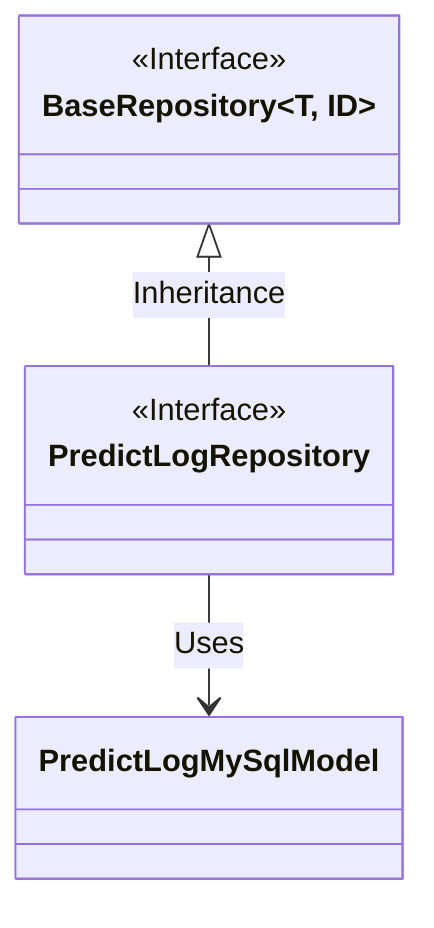
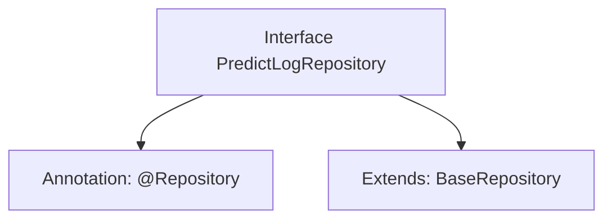

# Basic Information

|      |      |
|------|------|
| Name | PredictLogRepository |
| Language | .java |
| Code Path | WeFe/serving/serving-service/src/main/java/com/welab/wefe/serving/service/database/repository/PredictLogRepository.java |
| Package Name | com.welab.wefe.serving.service.database.repository |
| Dependencies | ['com.welab.wefe.serving.service.database.entity.PredictLogMySqlModel', 'com.welab.wefe.serving.service.database.repository.base.BaseRepository', 'org.springframework.stereotype.Repository'] |
| Brief Description | This is a Spring repository interface that extends the base repository class, used for operating on PredictLogMySqlModel type data with a primary key of String type. |

# Description

The content defines a Spring Data repository interface named `PredictLogRepository`, marked with the `@Repository` annotation. This interface extends the generic `BaseRepository` interface, specifying the entity type as `PredictLogMySqlModel` and the primary key type as `String`. This indicates that the repository is used for operating on `PredictLog` entity data in a MySQL database, providing basic CRUD operations. The entire definition is concise and clear, conforming to the standard design of Spring Data JPA.

# Class Summary

| Name   | Type  | Description |
|-------|------|-------------|
| PredictLogRepository | interface | This is a Spring repository interface that extends the base repository class, designed for operating on data of type PredictLogMySqlModel with a primary key of String type. |

## Class PredictLogRepository

|      |      |
|------|------|
| Access Modifier | @Repository;public |
| Type | interface |
| Name | PredictLogRepository |
| Description | This is a Spring repository interface that extends the base repository class, designed for operating on data of type PredictLogMySqlModel with a primary key of String type. |

### UML Class Diagram

This class diagram illustrates the relationship where the PredictLogRepository interface inherits from the generic BaseRepository interface. BaseRepository is a generic interface accepting type parameters T and ID, while PredictLogRepository is specialized to operate on the PredictLogMySqlModel entity class with a primary key type of String. The design follows Spring Data JPA's repository pattern, implementing basic CRUD operations through interface inheritance while maintaining type safety.

### Internal Method Call Graph

This code defines a Spring Data JPA repository interface PredictLogRepository, marked as a persistence layer component with the @Repository annotation. The interface extends the generic BaseRepository interface, specifying the entity type as PredictLogMySqlModel and the primary key type as String. Through inheritance, this interface automatically acquires basic CRUD operations without manual implementation. This design adheres to Spring Data specifications, achieving abstraction for database table operations.

### Field List

| Name  | Type  | Description |
|-------|-------|------|

### Method List

| Name  | Type  | Description |
|-------|-------|------|

