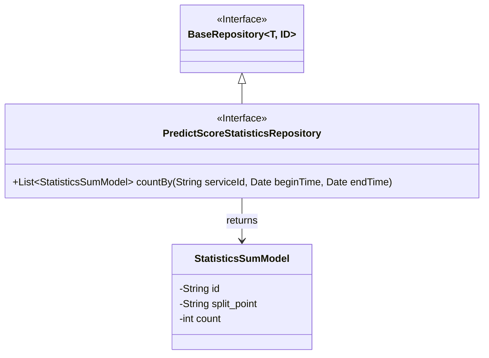
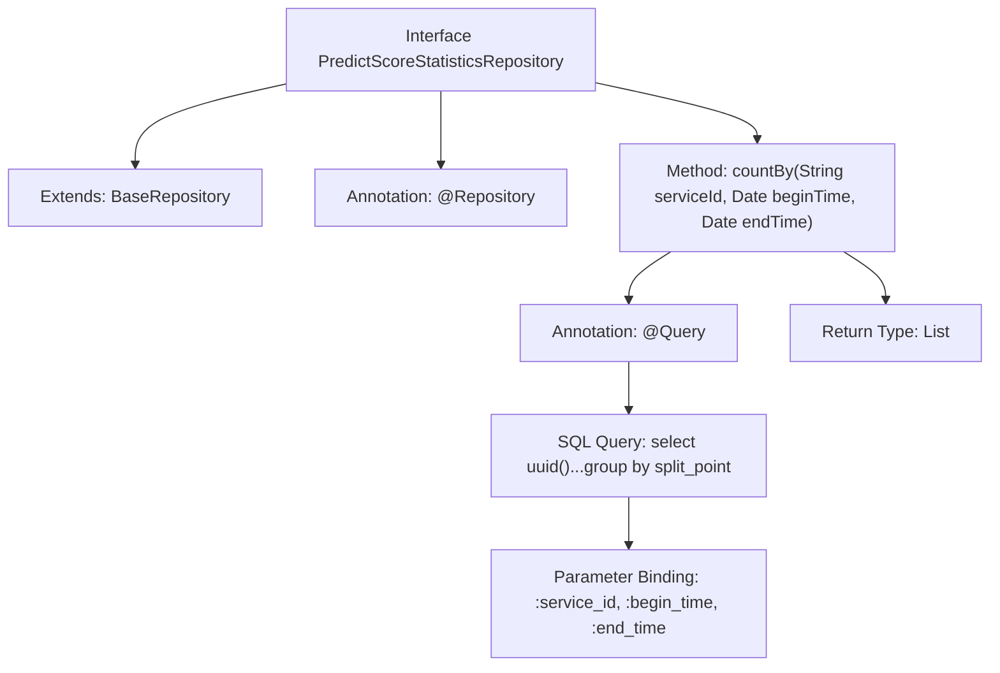

# Basic Information

|      |      |
|------|------|
| Name | PredictScoreStatisticsRepository |
| Language | .java |
| Code Path | WeFe/serving/serving-service/src/main/java/com/welab/wefe/serving/service/database/repository/PredictScoreStatisticsRepository.java |
| Package Name | com.welab.wefe.serving.service.database.repository |
| Dependencies | ['com.welab.wefe.serving.service.database.entity.StatisticsSumModel', 'com.welab.wefe.serving.service.database.repository.base.BaseRepository', 'org.springframework.data.jpa.repository.Query', 'org.springframework.data.repository.query.Param', 'org.springframework.stereotype.Repository', 'java.util.Date', 'java.util.List'] |
| Brief Description | Define the PredictScoreStatisticsRepository interface, extending BaseRepository, using native SQL queries to group statistics by split_point and calculate the total sum of data for a specified service ID within a given time range. |

# Description

The code defines a Spring Data JPA repository interface named `PredictScoreStatisticsRepository`, which extends `BaseRepository` and operates on the `StatisticsSumModel` entity class with a primary key type of `String`. The interface includes a native SQL query method `countBy` for counting the distribution of model prediction scores within a specified time range for a given service ID. The query groups results by `split_point` using `group by`, calculates the sum of `count` for each group, and dynamically handles the time range parameters (defaulting to `1900-01-01` or the current time if not provided). The results are returned as a list of `StatisticsSumModel`, containing a generated UUID as `id`, the `split_point` field, and the aggregated `count` value.

# Class Summary

| Name   | Type  | Description |
|-------|------|-------------|
| PredictScoreStatisticsRepository | interface | Define the PredictScoreStatisticsRepository interface, extending BaseRepository, using native SQL queries to group statistics by split_point and calculate the total sum of data for a specified service ID within a given time range. |

## Class PredictScoreStatisticsRepository

|      |      |
|------|------|
| Access Modifier | @Repository;public |
| Type | interface |
| Name | PredictScoreStatisticsRepository |
| Description | Define the PredictScoreStatisticsRepository interface, extending BaseRepository, using native SQL queries to group statistics by split_point and calculate the total sum of data for a specified service ID within a given time range. |

### UML Class Diagram

This code demonstrates a Spring Data JPA repository interface `PredictScoreStatisticsRepository`, which extends the generic interface `BaseRepository` and operates on the `StatisticsSumModel` entity. The interface defines a native SQL query method `countBy` for counting predicted score distributions by service ID and time range. The class diagram clearly presents the interface inheritance relationship, method signature, and returned entity type, reflecting the typical association pattern between interfaces and entities in the JPA repository model.

### Internal Method Call Graph

This code describes a Spring Data JPA repository interface that extends a base repository and defines a native SQL query method. The flowchart illustrates the interface's inheritance relationship, key annotation configurations, and the detailed structure of the query method, including parameter binding and return type. The method aggregates binned point data associated with a service ID under dynamic time range conditions, using UUID to generate IDs and counting aggregated results.

### Field List

| Name  | Type  | Description |
|-------|-------|------|

### Method List

| Name  | Type  | Description |
|-------|-------|------|
| countBy | List<StatisticsSumModel> | Query the statistical model prediction scores for a service ID within a specified time range, grouped and aggregated by split_point with count values. If no time is specified, the default range is from 1900 or up to the current time. |

