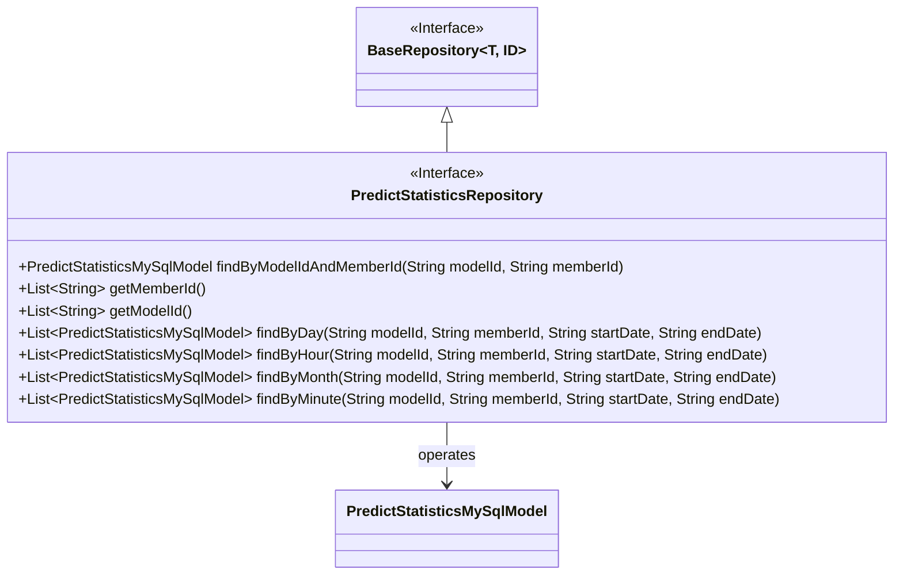
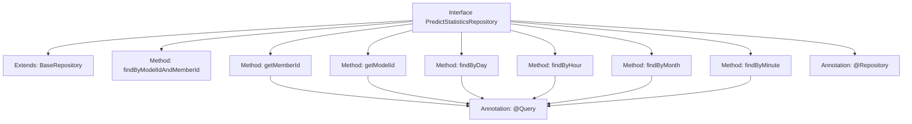

# Basic Information

|      |      |
|------|------|
| Name | PredictStatisticsRepository |
| Language | .java |
| Code Path | WeFe/serving/serving-service/src/main/java/com/welab/wefe/serving/service/database/repository/PredictStatisticsRepository.java |
| Package Name | com.welab.wefe.serving.service.database.repository |
| Dependencies | ['com.welab.wefe.serving.service.database.entity.PredictStatisticsMySqlModel', 'com.welab.wefe.serving.service.database.repository.base.BaseRepository', 'org.springframework.data.jpa.repository.Query', 'org.springframework.data.repository.query.Param', 'org.springframework.stereotype.Repository', 'java.util.List'] |
| Brief Description | The PredictStatisticsRepository interface extends BaseRepository, providing methods to query by model ID and member ID, retrieve all member IDs and model IDs, as well as query predictive statistics grouped by day, hour, month, and minute. |

# Description

The `PredictStatisticsRepository` is a Spring Data repository interface that extends `BaseRepository` and operates on the `PredictStatisticsMySqlModel` entity. It provides various query methods: finding a single record by `modelId` and `memberId`; retrieving grouped lists of all `memberId` and `modelId`; and querying statistical data grouped by day, hour, month, and minute. These grouped queries support filtering based on `modelId`, `memberId`, and date ranges, returning aggregated statistical results including fields such as total count, success count, and failure count. All grouped queries are implemented using native SQL and include conditional logic.

# Class Summary

| Name   | Type  | Description |
|-------|------|-------------|
| PredictStatisticsRepository | interface | The PredictStatisticsRepository interface provides functionality for querying data by model ID and member ID, retrieving all member IDs and model IDs, as well as querying statistical information grouped by day, hour, month, and minute. |

## Class PredictStatisticsRepository

|      |      |
|------|------|
| Access Modifier | @Repository;public |
| Type | interface |
| Name | PredictStatisticsRepository |
| Description | The PredictStatisticsRepository interface provides functionality for querying data by model ID and member ID, retrieving all member IDs and model IDs, as well as querying statistical information grouped by day, hour, month, and minute. |

### UML Class Diagram

This code illustrates a Spring Data JPA repository interface `PredictStatisticsRepository`, which extends the generic interface `BaseRepository` and is specifically designed to operate on the `PredictStatisticsMySqlModel` entity class. The interface provides various query methods, including lookup by model ID and member ID, retrieval of all member IDs and model IDs, as well as grouped statistical analysis of prediction data by different time granularities (day, hour, month, minute). All query methods are implemented using native SQL, defined via `@Query` annotations, supporting conditional filtering and grouped aggregation operations.

### Internal Method Call Graph

This code defines a Spring Data JPA Repository interface primarily used for various query operations on predictive statistics data. The interface extends BaseRepository to provide basic CRUD functionality and adds multiple custom query methods. These methods include querying by model ID and member ID, retrieving all member IDs and model ID lists, as well as querying statistical data grouped by different time granularities (day, hour, month, minute). Each query method is annotated with @Query to specify native SQL queries, supporting conditional filtering and grouped aggregation operations.

### Field List

| Name  | Type  | Description |
|-------|-------|------|

### Method List

| Name  | Type  | Description |
|-------|-------|------|
| getModelId | List<String> | Query the predict_log table and group by model_id, returning a list of all model_ids. |
| getMemberId | List<String> | Query all unique member IDs. |
| findByHour | List<PredictStatisticsMySqlModel> | Query predictive statistics, grouped by hour, supports filtering by model ID, member ID, and time range, and returns the maximum and sum of each field. |
| findByDay | List<PredictStatisticsMySqlModel> | SQL query groups and aggregates forecast data by day, filters by model ID, member ID, and date range, and returns the maximum values of each field along with summary totals. |
| findByModelIdAndMemberId | PredictStatisticsMySqlModel | Query prediction statistics based on model ID and member ID. |
| findByMonth | List<PredictStatisticsMySqlModel> | SQL query groups and counts forecast data by month, filters by model ID, member ID, and date range, and returns fields such as maximum ID, member ID, along with the total counts of successes and failures. |
| findByMinute | List<PredictStatisticsMySqlModel> | Query prediction statistics, grouped by minute, supports filtering by model ID, member ID, and start/end time, and returns the maximum values of each field along with the total counts of successes and failures. |

