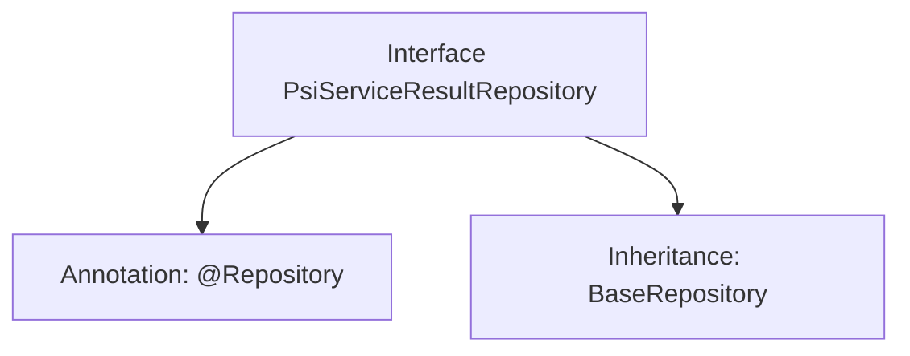

# Basic Information

|      |      |
|------|------|
| Name | PsiServiceResultRepository |
| Language | .java |
| Code Path | WeFe/serving/serving-service/src/main/java/com/welab/wefe/serving/service/database/repository/PsiServiceResultRepository.java |
| Package Name | com.welab.wefe.serving.service.database.repository |
| Dependencies | ['org.springframework.stereotype.Repository', 'com.welab.wefe.serving.service.database.entity.PsiServiceResultMysqlModel', 'com.welab.wefe.serving.service.database.repository.base.BaseRepository'] |
| Brief Description | This is a Spring repository interface named PsiServiceResultRepository, which extends BaseRepository and is used to manipulate data of type PsiServiceResultMysqlModel with a primary key type of String. |

# Description

The content defines a Spring Data repository interface named `PsiServiceResultRepository`, identified by the `@Repository` annotation. This interface extends the generic base class `BaseRepository`, specifying the entity type as `PsiServiceResultMysqlModel` and the primary key type as `String`. This indicates that the repository is used to manipulate `PsiServiceResultMysqlModel` entity data in the database, providing basic CRUD operation functionalities.

# Class Summary

| Name   | Type  | Description |
|-------|------|-------------|
| PsiServiceResultRepository | interface | This is a Spring repository interface named PsiServiceResultRepository, which extends BaseRepository and operates on data of type PsiServiceResultMysqlModel with a primary key of type String. |


## Class PsiServiceResultRepository

|      |      |
|------|------|
| Access Modifier | @Repository;public |
| Type | interface |
| Name | PsiServiceResultRepository |
| Description | This is a Spring repository interface named PsiServiceResultRepository, which extends BaseRepository and operates on data of type PsiServiceResultMysqlModel with a primary key of type String. |


### UML Class Diagram

```mermaid
classDiagram
    class BaseRepository~T, ID~ {
        <<Interface>>
    }
    
    class PsiServiceResultMysqlModel {
    }
    
    class PsiServiceResultRepository {
        <<Interface>>
    }
    
    BaseRepository <|-- PsiServiceResultRepository : Inheritance
    // PsiServiceResultRepository uses PsiServiceResultMysqlModel as generic parameter
    PsiServiceResultRepository --> PsiServiceResultMysqlModel : Generic Association
```

This class diagram illustrates the interface hierarchy of the PSI service result repository. PsiServiceResultRepository is a Spring Data interface annotated with @Repository, which inherits from the generic BaseRepository interface. The generic parameter T is specified as the PsiServiceResultMysqlModel entity class, with ID type being String. This design follows Spring Data JPA's Repository pattern, obtaining basic CRUD operation capabilities through inheritance of the base interface while maintaining type safety. The inheritance relationship between interfaces reflects the standard implementation approach of JPA repositories, allowing concrete implementations to be automatically handled by the Spring framework.


### Internal Method Call Graph



This code defines a Spring Data repository interface named PsiServiceResultRepository, marked as a persistence layer component with the @Repository annotation. The interface extends the generic BaseRepository interface, specifying the entity type as PsiServiceResultMysqlModel and the primary key type as String. The flowchart illustrates the core structure of the interface, including class-level annotations and inheritance relationships, demonstrating the typical design pattern in Spring Data JPA that simplifies database operations by automatically inheriting basic CRUD operations from the base repository interface.

### Field List

| Name  | Type  | Description |
|-------|-------|------|

### Method List

| Name  | Type  | Description |
|-------|-------|------|


