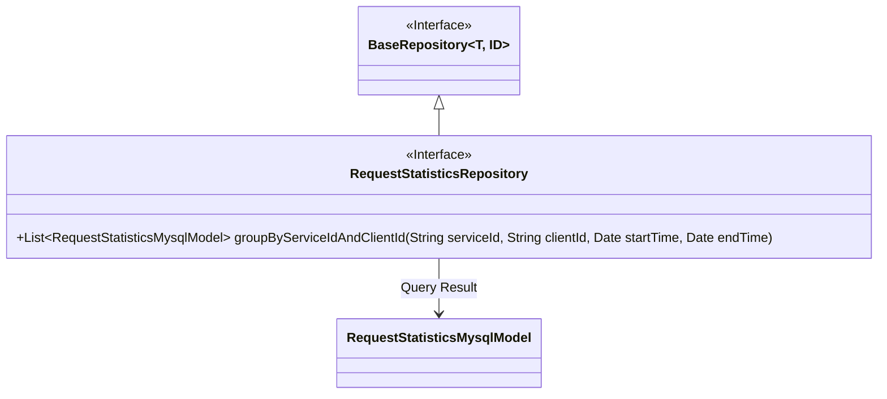
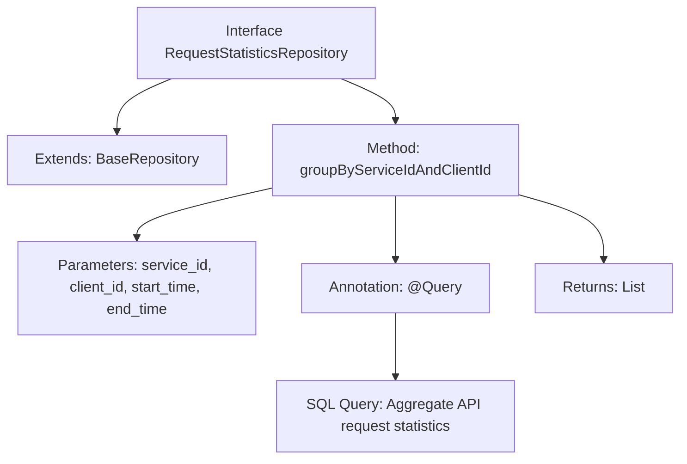

# Basic Information

|      |      |
|------|------|
| Name | RequestStatisticsRepository |
| Language | .java |
| Code Path | WeFe/serving/serving-service/src/main/java/com/welab/wefe/serving/service/database/repository/RequestStatisticsRepository.java |
| Package Name | com.welab.wefe.serving.service.database.repository |
| Dependencies | ['com.welab.wefe.serving.service.database.entity.RequestStatisticsMysqlModel', 'com.welab.wefe.serving.service.database.repository.base.BaseRepository', 'org.springframework.data.jpa.repository.Query', 'org.springframework.data.repository.query.Param', 'org.springframework.stereotype.Repository', 'java.util.Date', 'java.util.List'] |
| Brief Description | The RequestStatisticsRepository interface extends BaseRepository, querying interface request statistics grouped by service ID and client ID through native SQL, including counts of successful, failed, and total requests. |

# Description

The code defines a Spring Data repository interface named `RequestStatisticsRepository`, which extends `BaseRepository` and operates on the `RequestStatisticsMysqlModel` entity class. The interface includes a native SQL query method `groupByServiceIdAndClientId` that retrieves API request statistics using parameters `serviceId`, `clientId`, `startTime`, and `endTime`. The query aggregates successful request counts, total request counts, and failed request counts, grouping the results by `serviceId` and `clientId`. The query conditions support default handling when parameters are null, with the time range defaulting to `1900-01-01` to the current time.

# Class Summary

| Name   | Type  | Description |
|-------|------|-------------|
| RequestStatisticsRepository | interface | Define the RequestStatisticsRepository interface, extending BaseRepository, containing native SQL query methods for grouping and counting API request results by service ID, client ID, and time range. |

## Class RequestStatisticsRepository

|      |      |
|------|------|
| Access Modifier | @Repository;public |
| Type | interface |
| Name | RequestStatisticsRepository |
| Description | Define the RequestStatisticsRepository interface, extending BaseRepository, containing native SQL query methods for grouping and counting API request results by service ID, client ID, and time range. |

### UML Class Diagram

This code describes a Spring Data JPA repository interface `RequestStatisticsRepository`, which extends the generic interface `BaseRepository` and operates on the entity class `RequestStatisticsMysqlModel`. The interface defines a native SQL query method `groupByServiceIdAndClientId` that aggregates API request records by service ID, client ID, and time range, returning the results grouped by service ID and client ID. The class diagram clearly illustrates the interface inheritance relationship and entity class dependency, reflecting the design structure of the JPA repository pattern.

### Internal Method Call Graph

This code defines a Spring Data JPA repository interface for querying API request statistics. The flowchart illustrates that the interface extends BaseRepository and contains an aggregate query method annotated with @Query, which accepts 4 parameters and returns a list of statistical results. The core functionality involves performing multi-condition filtering and grouped aggregation on the api_request_record table through native SQL, calculating metrics such as successful/failed request counts.

### Field List

| Name  | Type  | Description |
|-------|-------|------|

### Method List

| Name  | Type  | Description |
|-------|-------|------|
| groupByServiceIdAndClientId | List<RequestStatisticsMysqlModel> | SQL query to count API request records, grouped by service ID and client ID, returning success/failure counts and details, with support for filtering by time, service ID, and client ID. |

