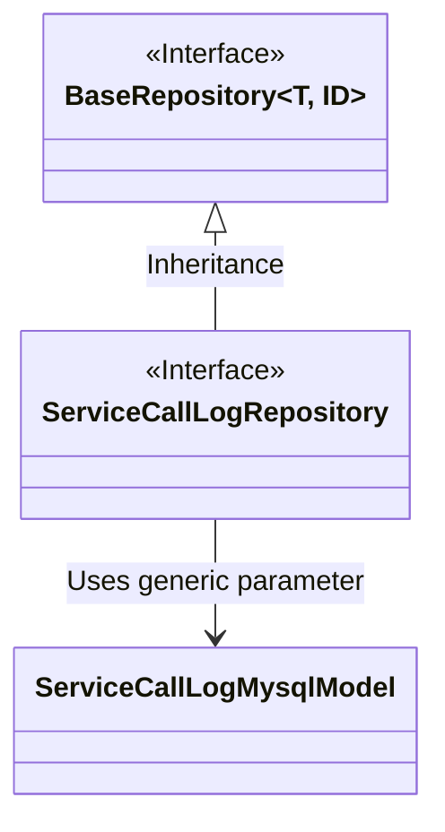
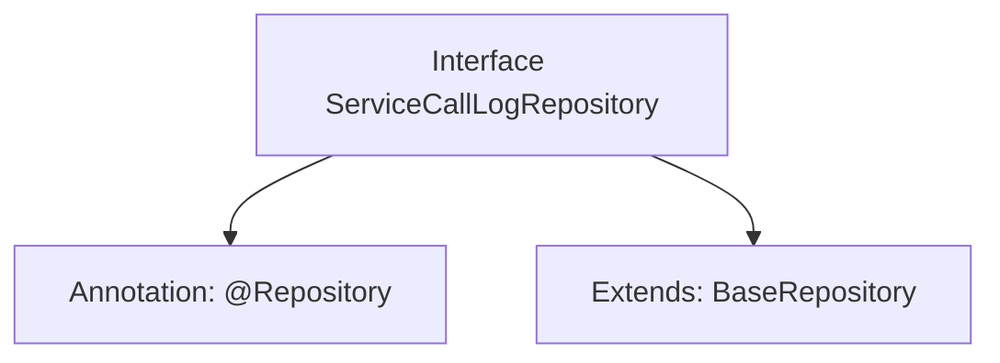

# Basic Information

|      |      |
|------|------|
| Name | ServiceCallLogRepository |
| Language | .java |
| Code Path | WeFe/serving/serving-service/src/main/java/com/welab/wefe/serving/service/database/repository/ServiceCallLogRepository.java |
| Package Name | com.welab.wefe.serving.service.database.repository |
| Dependencies | ['com.welab.wefe.serving.service.database.entity.ServiceCallLogMysqlModel', 'com.welab.wefe.serving.service.database.repository.base.BaseRepository', 'org.springframework.stereotype.Repository'] |
| Brief Description | The interface ServiceCallLogRepository extends BaseRepository and is used to operate on ServiceCallLogMysqlModel data, with the primary key type being String. |

# Description

This is a Spring Data repository interface named ServiceCallLogRepository, annotated with @Repository. It extends the generic BaseRepository interface, specifying the entity type as ServiceCallLogMysqlModel and the primary key type as String. Primarily used for database operations, it does not define additional methods and likely only utilizes the CRUD functionality provided by the base class.

# Class Summary

| Name   | Type  | Description |
|-------|------|-------------|
| ServiceCallLogRepository | interface | This is a Spring Repository interface that extends BaseRepository, designed for operating on data of type ServiceCallLogMysqlModel with a primary key type of String. |

## Class ServiceCallLogRepository

|      |      |
|------|------|
| Access Modifier | @Repository;public |
| Type | interface |
| Name | ServiceCallLogRepository |
| Description | This is a Spring Repository interface that extends BaseRepository, designed for operating on data of type ServiceCallLogMysqlModel with a primary key type of String. |

### UML Class Diagram

This class diagram illustrates the inheritance relationship of repository interfaces in Spring Data JPA. ServiceCallLogRepository is an interface annotated with @Repository, which extends the generic interface BaseRepository, where T is specified as the ServiceCallLogMysqlModel entity class and ID type as String. BaseRepository is a generic interface defining basic CRUD operations, while ServiceCallLogRepository inherits these capabilities and is specifically designed to operate on ServiceCallLogMysqlModel data entities. This design follows Spring Data's repository pattern, achieving abstraction in the data access layer.

### Internal Method Call Graph

This flowchart illustrates a typical data access layer interface definition in Spring Data JPA. The ServiceCallLogRepository is marked as a Spring-managed Bean via the @Repository annotation and inherits basic CRUD operations from BaseRepository, with generic parameters specifying the entity type ServiceCallLogMysqlModel and primary key type String. This design follows JPA's "interface-as-implementation" paradigm, automatically generating database operation logic without requiring concrete implementation.

### Field List

| Name  | Type  | Description |
|-------|-------|------|

### Method List

| Name  | Type  | Description |
|-------|-------|------|

