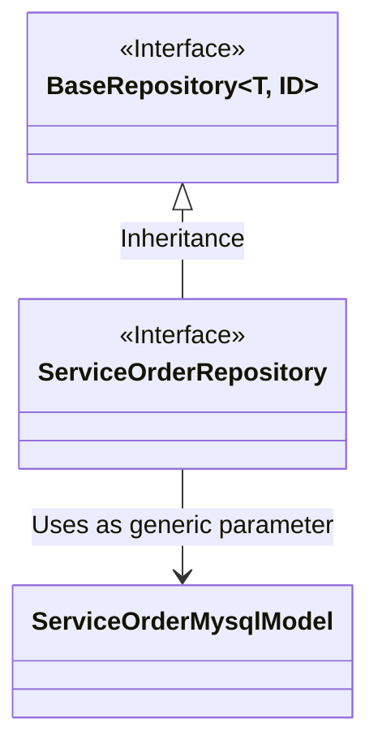
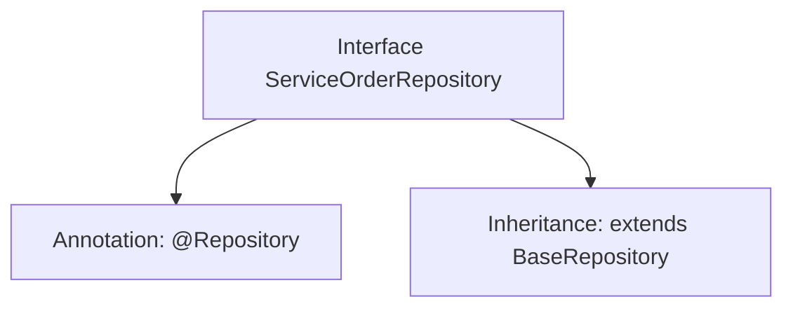

# Basic Information

|      |      |
|------|------|
| Name | ServiceOrderRepository |
| Language | .java |
| Code Path | WeFe/serving/serving-service/src/main/java/com/welab/wefe/serving/service/database/repository/ServiceOrderRepository.java |
| Package Name | com.welab.wefe.serving.service.database.repository |
| Dependencies | ['com.welab.wefe.serving.service.database.entity.ServiceOrderMysqlModel', 'com.welab.wefe.serving.service.database.repository.base.BaseRepository', 'org.springframework.stereotype.Repository'] |
| Brief Description | This is a Spring Repository interface that extends BaseRepository, designed to operate on ServiceOrderMysqlModel type data with String as the primary key type. |

# Description

This is a Spring Data repository interface named ServiceOrderRepository, annotated with @Repository. It extends the BaseRepository base class, specifying the entity type as ServiceOrderMysqlModel and the primary key type as String. This interface is used for database operations but does not define additional methods, relying solely on the generic CRUD functionality provided by the base class.

# Class Summary

| Name   | Type  | Description |
|-------|------|-------------|
| ServiceOrderRepository | interface | Service Order Repository Interface, inherits from the base repository, operates on the Service Order MySQL model, with the primary key type as string. |

## Class ServiceOrderRepository

|      |      |
|------|------|
| Access Modifier | @Repository;public |
| Type | interface |
| Name | ServiceOrderRepository |
| Description | Service Order Repository Interface, inherits from the base repository, operates on the Service Order MySQL model, with the primary key type as string. |

### UML Class Diagram

This class diagram illustrates three main components: BaseRepository is a generic interface, ServiceOrderRepository is an interface that inherits from BaseRepository and uses ServiceOrderMysqlModel as its generic type parameter. The BaseRepository interface defines basic repository operations, while ServiceOrderRepository is specifically designed for handling data persistence of the ServiceOrderMysqlModel type. This design follows Spring Data's repository pattern, achieving type-safe database operation interfaces through generics.

### Internal Method Call Graph

This code defines a Spring Data JPA Repository interface, annotated with @Repository to mark it as a data access component. The interface inherits from the generic BaseRepository, specifying the entity type as ServiceOrderMysqlModel and the primary key type as String. By extending the base repository interface, it automatically acquires basic CRUD operation methods without manual implementation. This design follows Spring Data's "convention over configuration" principle, simplifying the development of the database access layer.

### Field List

| Name  | Type  | Description |
|-------|-------|------|

### Method List

| Name  | Type  | Description |
|-------|-------|------|

