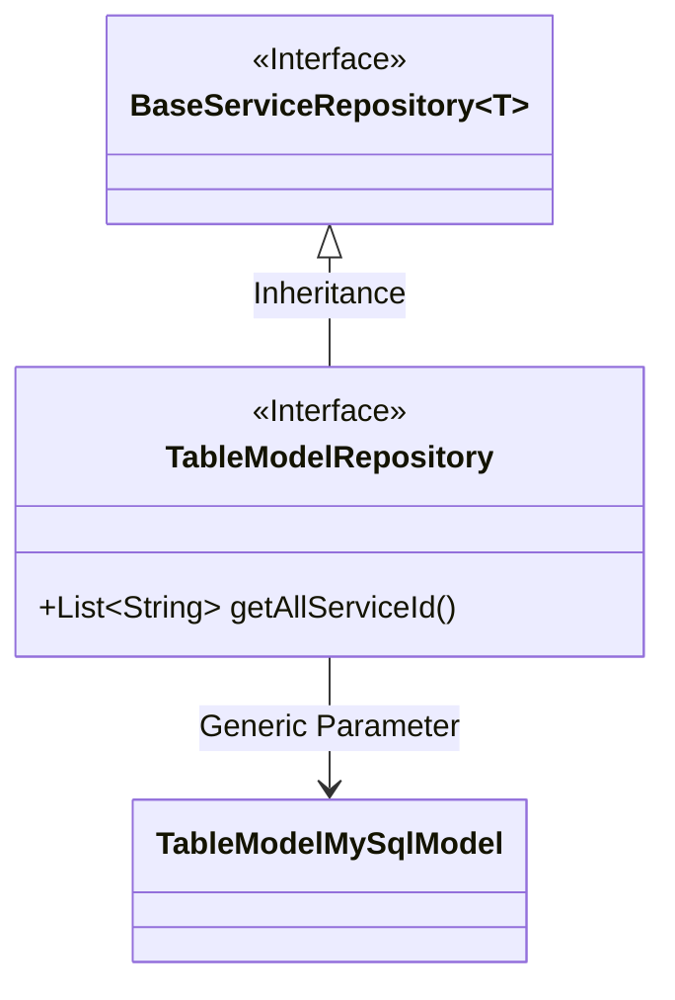
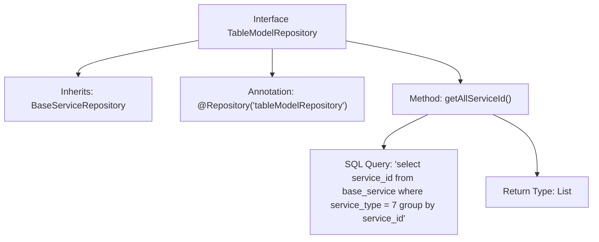

# Basic Information

|      |      |
|------|------|
| Name | TableModelRepository |
| Language | .java |
| Code Path | WeFe/serving/serving-service/src/main/java/com/welab/wefe/serving/service/database/repository/TableModelRepository.java |
| Package Name | com.welab.wefe.serving.service.database.repository |
| Dependencies | ['org.springframework.data.jpa.repository.Query', 'org.springframework.data.repository.query.Param', 'org.springframework.stereotype.Repository', 'com.welab.wefe.serving.service.database.entity.TableModelMySqlModel', 'java.util.List'] |
| Brief Description | This is a Spring Data JPA repository interface that extends the base service repository for operating table model data. It contains a native SQL query method to retrieve a list of all service IDs with service type 7. |

# Description

This is a Spring Data repository interface named TableModelRepository, marked with the @Repository annotation and assigned the name "tableModelRepository." The interface extends BaseServiceRepository with the generic type TableModelMySqlModel. It defines a method named getAllServiceId, annotated with @Query to specify a native SQL query. The query retrieves all distinct service_id values grouped by service_id from the base_service table where service_type equals 7, returning the result as a list of strings. The method's functional description comment indicates its purpose is to fetch all member IDs. The entire interface is designed concisely and clearly, focusing on specific query operations at the data access layer.

# Class Summary

| Name   | Type  | Description |
|-------|------|-------------|
| TableModelRepository | interface | This is a Spring Data JPA repository interface that extends the base service repository and includes a native SQL query method for retrieving a list of all service IDs where the service type is 7. |

## Class TableModelRepository

|      |      |
|------|------|
| Access Modifier | @Repository("tableModelRepository");public |
| Type | interface |
| Name | TableModelRepository |
| Description | This is a Spring Data JPA repository interface that extends the base service repository and includes a native SQL query method for retrieving a list of all service IDs where the service type is 7. |

### UML Class Diagram

Class Diagram Description: This diagram illustrates the inheritance relationship of a Spring Data JPA repository interface. The TableModelRepository interface inherits from the generic BaseServiceRepository interface, with the generic parameter specified as TableModelMySqlModel. The interface defines a native SQL query method getAllServiceId() to retrieve a list of service IDs of a specific type. Annotated with @Repository, it identifies this as a data access component, reflecting the design of the JPA repository pattern.

### Internal Method Call Graph

This flowchart illustrates the structure of the Spring Data JPA interface TableModelRepository, highlighting its inheritance relationship, annotation configuration, and core query method. The interface is declared as a repository component via the @Repository annotation, inherits a base repository interface, and defines a native SQL query method to retrieve a list of service IDs of a specific type. The process clearly presents the logical chain from interface definition to SQL statement execution.

### Field List

| Name  | Type  | Description |
|-------|-------|------|

### Method List

| Name  | Type  | Description |
|-------|-------|------|
| getAllServiceId | List<String> | Query all service IDs with type 7 and group them by service ID. |

