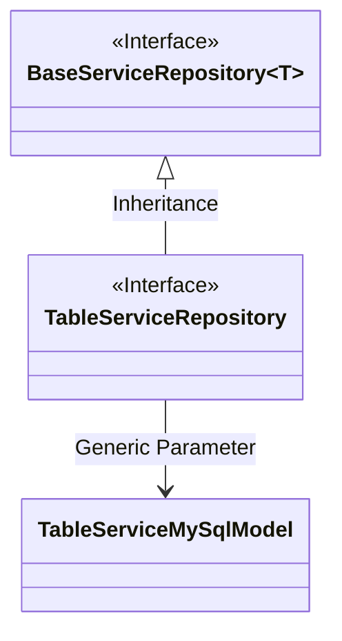
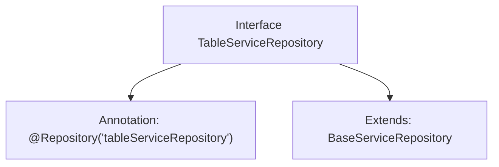

# Basic Information

|      |      |
|------|------|
| Name | TableServiceRepository |
| Language | .java |
| Code Path | WeFe/serving/serving-service/src/main/java/com/welab/wefe/serving/service/database/repository/TableServiceRepository.java |
| Package Name | com.welab.wefe.serving.service.database.repository |
| Dependencies | ['org.springframework.stereotype.Repository', 'com.welab.wefe.serving.service.database.entity.TableServiceMySqlModel'] |
| Brief Description | The interface TableServiceRepository extends BaseServiceRepository and is marked as a table service repository with the @Repository annotation. |

# Description

The content defines a Java interface named TableServiceRepository, marked with the @Repository annotation as a Spring framework repository component and assigned the bean name "tableServiceRepository". This interface extends the generic BaseServiceRepository interface, with the generic type parameter specified as TableServiceMySqlModel, indicating that this repository specifically handles data entities of type TableServiceMySqlModel. This is a typical Spring Data repository interface definition used for database operations.

# Class Summary

| Name   | Type  | Description |
|-------|------|-------------|
| TableServiceRepository | interface | The interface TableServiceRepository extends BaseServiceRepository, annotated with @Repository and named as tableServiceRepository, with the generic type TableServiceMySqlModel. |

## Class TableServiceRepository

|      |      |
|------|------|
| Access Modifier | @Repository("tableServiceRepository");public |
| Type | interface |
| Name | TableServiceRepository |
| Description | The interface TableServiceRepository extends BaseServiceRepository, annotated with @Repository and named as tableServiceRepository, with the generic type TableServiceMySqlModel. |

### UML Class Diagram

This class diagram illustrates that the TableServiceRepository interface inherits from the generic BaseServiceRepository interface, with the generic parameter specified as TableServiceMySqlModel. BaseServiceRepository is a generic interface (denoted by ~T~), and TableServiceRepository achieves specialization through inheritance with a concrete type parameter. The overall structure reflects the common Repository pattern design in the Spring framework, where the interface layer is decoupled from concrete model classes, adhering to the Dependency Inversion Principle.

### Internal Method Call Graph

This code defines a Spring Data repository interface named TableServiceRepository, which is marked as a Spring component via the @Repository annotation with the bean name "tableServiceRepository". The interface extends the generic base class BaseServiceRepository with the generic type TableServiceMySqlModel, indicating this repository is specifically designed for handling TableServiceMySqlModel data entities. The entire structure exemplifies a typical Spring Data JPA repository interface definition pattern, providing basic CRUD operations for the specified model.

### Field List

| Name  | Type  | Description |
|-------|-------|------|

### Method List

| Name  | Type  | Description |
|-------|-------|------|

