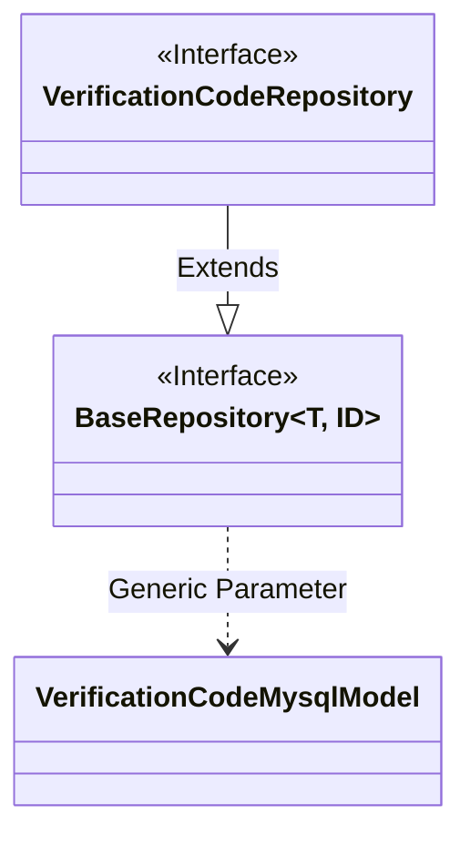
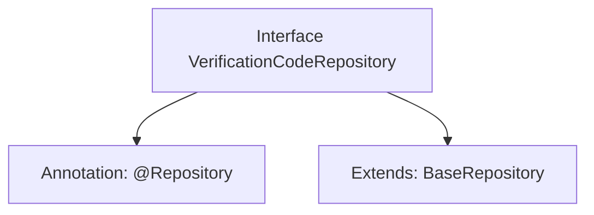

# Basic Information

|      |      |
|------|------|
| Name | VerificationCodeRepository |
| Language | .java |
| Code Path | WeFe/serving/serving-service/src/main/java/com/welab/wefe/serving/service/database/repository/VerificationCodeRepository.java |
| Package Name | com.welab.wefe.serving.service.database.repository |
| Dependencies | ['org.springframework.stereotype.Repository', 'com.welab.wefe.serving.service.database.entity.VerificationCodeMysqlModel', 'com.welab.wefe.serving.service.database.repository.base.BaseRepository'] |
| Brief Description | The interface VerificationCodeRepository extends BaseRepository and is used to operate VerificationCodeMysqlModel data, with the primary key type being String. |

# Description

The content defines a Spring Data repository interface named VerificationCodeRepository, identified by the @Repository annotation. This interface extends BaseRepository, specifying the entity type as VerificationCodeMysqlModel and the primary key type as String. This indicates that the repository is used to operate on a MySQL database table related to verification codes, providing basic CRUD operation functionalities.

# Class Summary

| Name   | Type  | Description |
|-------|------|-------------|
| VerificationCodeRepository | interface | This is a verification code repository interface that inherits from the base repository and is used to operate MySQL model data for verification codes. |

## Class VerificationCodeRepository

|      |      |
|------|------|
| Access Modifier | @Repository;public |
| Type | interface |
| Name | VerificationCodeRepository |
| Description | This is a verification code repository interface that inherits from the base repository and is used to operate MySQL model data for verification codes. |

### UML Class Diagram

This class diagram illustrates the relationship where the VerificationCodeRepository interface extends the generic BaseRepository interface. BaseRepository is a generic interface accepting two type parameters T and ID, with T being concretized as the VerificationCodeMysqlModel entity class and ID as String type. As a data access layer interface, VerificationCodeRepository inherits basic CRUD operation capabilities from BaseRepository, specifically designed for persisting VerificationCodeMysqlModel type data. This design follows Spring Data JPA's Repository pattern, achieving abstraction and decoupling of the data access layer.

### Internal Method Call Graph

This code defines a Spring Data JPA repository interface VerificationCodeRepository, marked as a persistence layer component with the @Repository annotation. The interface extends the generic base class BaseRepository, specifying the entity type as VerificationCodeMysqlModel and the primary key type as String. The flowchart illustrates the core structure of the interface: annotation marking and parent class inheritance, which is a typical design pattern for Spring Data JPA's automated CRUD operations. By extending predefined generic repository interfaces, basic database operation methods are readily obtained.

### Field List

| Name  | Type  | Description |
|-------|-------|------|

### Method List

| Name  | Type  | Description |
|-------|-------|------|

