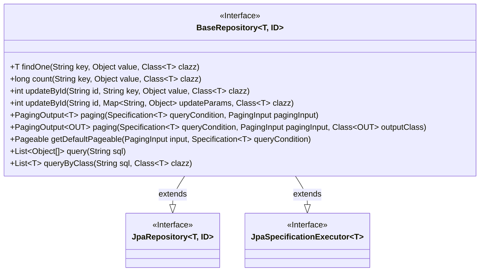

# Basic Information

|      |      |
|------|------|
| Name | BaseRepository |
| Language | .java |
| Code Path | WeFe/serving/serving-service/src/main/java/com/welab/wefe/serving/service/database/repository/base/BaseRepository.java |
| Package Name | com.welab.wefe.serving.service.database.repository.base |
| Dependencies | ['com.welab.wefe.common.data.mysql.MySpecification', 'com.welab.wefe.serving.service.dto.PagingInput', 'com.welab.wefe.serving.service.dto.PagingOutput', 'org.springframework.data.domain.PageRequest', 'org.springframework.data.domain.Pageable', 'org.springframework.data.domain.Sort', 'org.springframework.data.jpa.domain.Specification', 'org.springframework.data.jpa.repository.JpaRepository', 'org.springframework.data.jpa.repository.JpaSpecificationExecutor', 'org.springframework.data.repository.NoRepositoryBean', 'org.springframework.lang.Nullable', 'org.springframework.transaction.annotation.Transactional', 'java.io.Serializable', 'java.util.List', 'java.util.Map'] |
| Brief Description | The BaseRepository interface extends JPA functionality, providing methods for field-based querying, counting, updating, pagination, and native SQL queries, with support for transaction rollback and default sorting. |

# Description

This is a base repository interface labeled as `NoRepositoryBean` called `BaseRepository`, which extends `JpaRepository` and `JpaSpecificationExecutor`. It provides various data operation methods: querying single records or counting by specified fields, updating single or multiple fields by ID, supporting paginated queries with DTO conversion, including default pagination logic, and native SQL query capabilities. All update operations are annotated with transactional guarantees for exception rollback.

# Class Summary

| Name   | Type  | Description |
|-------|------|-------------|
| BaseRepository | interface | The BaseRepository interface extends JPA functionality, providing methods for field-based querying, counting, updating, pagination, and native SQL queries, with support for transactions and default sorting. |

## Class BaseRepository

|      |      |
|------|------|
| Access Modifier | @NoRepositoryBean;public |
| Type | interface |
| Name | BaseRepository |
| Description | The BaseRepository interface extends JPA functionality, providing methods for field-based querying, counting, updating, pagination, and native SQL queries, with support for transactions and default sorting. |

### UML Class Diagram

This code defines a generic interface `BaseRepository` that extends Spring Data JPA's `JpaRepository` and `JpaSpecificationExecutor` interfaces, providing rich custom data access methods. The interface includes functionalities such as single-record query, counting, updating, paginated queries, and native SQL queries. Paginated queries support result type conversion, and update operations are annotated with transactional annotations. The interface uses generic type T to represent the entity type and ID for the primary key type. It implements default pagination logic through default methods, sorting by createdTime in descending order when no sort field is specified.

### Internal Method Call Graph

```mermaid
graph TD
    A["Interface BaseRepository<T, ID>"]
    B["Extends: JpaRepository<T, ID>"]
    C["Extends: JpaSpecificationExecutor<T>"]
    D["Method: T findOne(key, value, clazz)"]
    E["Method: long count(key, value, clazz)"]
    F["Method: int updateById(id, key, value, clazz)"]
    G["Method: int updateById(id, updateParams, clazz)"]
    H["Method: PagingOutput<T> paging(queryCondition, pagingInput)"]
    I["Method: <OUT> PagingOutput<OUT> paging(queryCondition, pagingInput, outputClass)"]
    J["Default Method: Pageable getDefaultPageable(input, queryCondition)"]
    K["Method: List<Object[]> query(sql)"]
    L["Method: List<T> queryByClass(sql, clazz)"]

    A --> B
    A --> C
    A --> D
    A --> E
    A --> F
    A --> G
    A --> H
    A --> I
    A --> J
    A --> K
    A --> L
```

This flowchart illustrates the structure of the BaseRepository interface and its method relationships. As an extension interface of Spring Data JPA, it inherits core functionalities from both JpaRepository and JpaSpecificationExecutor while adding 12 custom methods, including field-based queries (findOne/count), ID-based updates (updateById), paginated queries (paging), and native SQL queries (query/queryByClass). Notably, the getDefaultPageable default method implements pagination parameter construction with sorting logic, demonstrating its generic handling capability for paginated queries. All methods revolve around the generic entity type T and ID type, forming a unified JPA extension specification.

### Field List

| Name  | Type  | Description |
|-------|-------|------|

### Method List

| Name  | Type  | Description |
|-------|-------|------|
| getDefaultPageable | Pageable | This method generates a paginable object based on input parameters and query conditions. If the query conditions include sorting rules, they will be applied; otherwise, the default sorting is by createdTime in descending order. It returns a pagination request containing the page number, page size, and sorting rules. |
| count | long | The method `long count` counts the number of key-value pairs, with parameters being the key `key`, the value `value`, and the type `clazz`, and returns a long integer result. |
| paging | PagingOutput<OUT> | Pagination query method, which accepts query conditions, pagination parameters, and output class, and returns paginated results. |
| updateById | int | Update object properties by ID using transactional annotation, with rollback on exception. |
| queryByClass | List<T> | This method queries the database via SQL and returns a list of objects of the specified class type. The parameters are the SQL statement and the target class object. |
| paging | PagingOutput<T> | Pagination query method, which accepts query conditions and pagination parameters, and returns paginated results. |
| findOne | T | Find a single object of the specified type based on key-value pairs. |
| query | List<Object[]> | Execute SQL queries and return an array list of objects. |
| updateById | int | Transactional update-by-ID method with rollback on exception, parameters include ID, key, value, and class type. |

