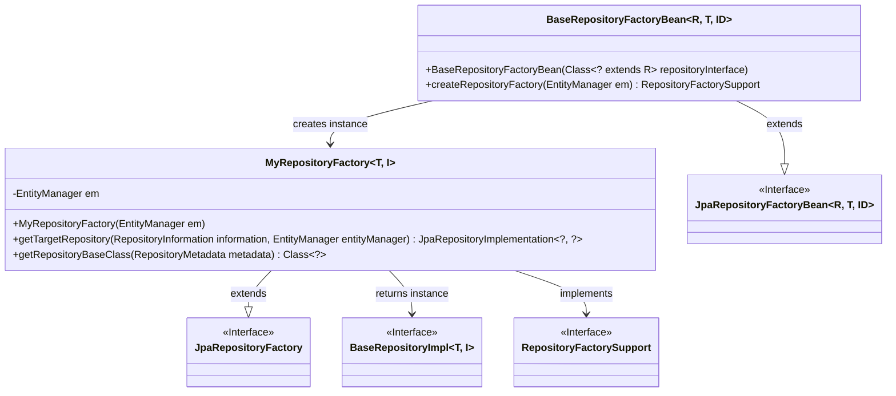
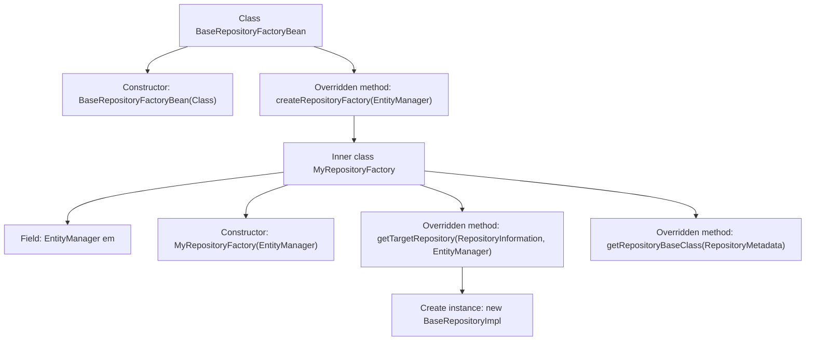

# Basic Information

|      |      |
|------|------|
| Name | BaseRepositoryFactoryBean |
| Language | .java |
| Code Path | WeFe/serving/serving-service/src/main/java/com/welab/wefe/serving/service/database/repository/base/BaseRepositoryFactoryBean.java |
| Package Name | com.welab.wefe.serving.service.database.repository.base |
| Dependencies | ['org.springframework.data.jpa.repository.JpaRepository', 'org.springframework.data.jpa.repository.support.JpaRepositoryFactory', 'org.springframework.data.jpa.repository.support.JpaRepositoryFactoryBean', 'org.springframework.data.jpa.repository.support.JpaRepositoryImplementation', 'org.springframework.data.repository.core.RepositoryInformation', 'org.springframework.data.repository.core.RepositoryMetadata', 'org.springframework.data.repository.core.support.RepositoryFactorySupport', 'javax.persistence.EntityManager', 'java.io.Serializable'] |
| Brief Description | Customize the JPA repository factory bean, extend JpaRepositoryFactoryBean, override the factory creation logic, and return a custom BaseRepositoryImpl implementation class. |

# Description

This is a custom implementation of a Spring Data JPA repository factory bean. It extends `JpaRepositoryFactoryBean` and is used to create custom repository instances. Key functionalities include: receiving the repository interface type via the constructor, overriding the `createRepositoryFactory` method to return a custom `MyRepositoryFactory`. The inner class `MyRepositoryFactory` inherits from `JpaRepositoryFactory`, overrides the `getTargetRepository` method to return a `BaseRepositoryImpl` instance, and designates `BaseRepositoryImpl` as the base class for repositories. The entire implementation revolves around custom repository creation logic and is tightly integrated with the `EntityManager`.

# Class Summary

| Name   | Type  | Description |
|-------|------|-------------|
| BaseRepositoryFactoryBean | class | Customize the JPA repository factory bean by extending JpaRepositoryFactoryBean, override the factory creation logic, and return the custom implementation class BaseRepositoryImpl. |

## Class BaseRepositoryFactoryBean

|      |      |
|------|------|
| Access Modifier | public |
| Type | class |
| Name | BaseRepositoryFactoryBean |
| Description | Customize the JPA repository factory bean by extending JpaRepositoryFactoryBean, override the factory creation logic, and return the custom implementation class BaseRepositoryImpl. |

### UML Class Diagram

This code demonstrates a Spring Data JPA factory pattern implementation, where BaseRepositoryFactoryBean serves as the base repository factory bean, creating custom JPA repository implementations through the inner class MyRepositoryFactory. The class diagram clearly illustrates generic parameter passing (R/T/ID and T/I), inheritance relationships (JpaRepositoryFactoryBean/JpaRepositoryFactory), and the factory method's process of creating BaseRepositoryImpl, reflecting Spring Data's dynamic proxy mechanism for JPA repositories.

### Internal Method Call Graph

This flowchart illustrates the implementation structure of a custom repository factory bean in Spring Data JPA. BaseRepositoryFactoryBean extends JpaRepositoryFactoryBean and creates the custom inner factory class MyRepositoryFactory by overriding the createRepositoryFactory method. This factory class further overrides getTargetRepository and getRepositoryBaseClass methods to generate BaseRepositoryImpl instances and return base repository class types, achieving extended customization of JPA repositories.

### Field List

| Name  | Type  | Description |
|-------|-------|------|

### Method List

| Name  | Type  | Description |
|-------|-------|------|
| createRepositoryFactory | RepositoryFactorySupport | Rewriting the parent class method to create a custom repository factory instance based on EntityManager. |

