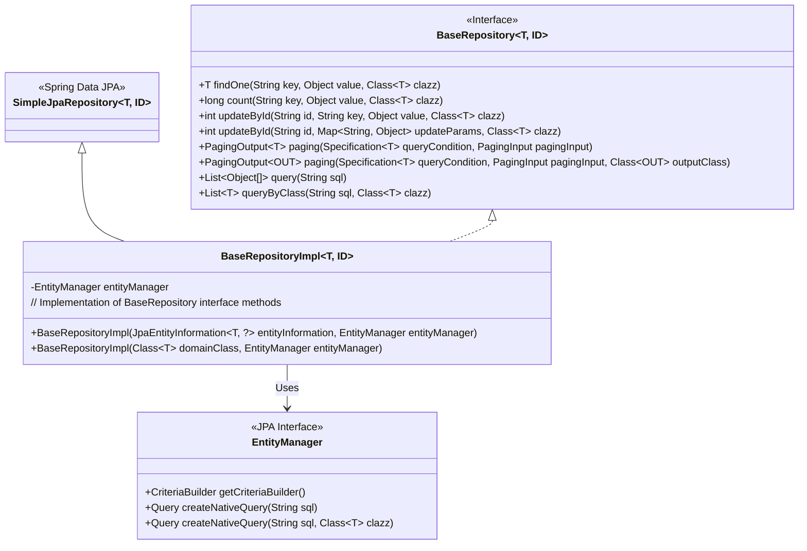

# Basic Information

|      |      |
|------|------|
| Name | BaseRepositoryImpl |
| Language | .java |
| Code Path | WeFe/serving/serving-service/src/main/java/com/welab/wefe/serving/service/database/repository/base/BaseRepositoryImpl.java |
| Package Name | com.welab.wefe.serving.service.database.repository.base |
| Dependencies | ['com.welab.wefe.common.web.util.CurrentAccountUtil', 'com.welab.wefe.serving.service.dto.PagingInput', 'com.welab.wefe.serving.service.dto.PagingOutput', 'org.apache.commons.collections4.CollectionUtils', 'org.springframework.data.domain.Page', 'org.springframework.data.jpa.domain.Specification', 'org.springframework.data.jpa.repository.support.JpaEntityInformation', 'org.springframework.data.jpa.repository.support.SimpleJpaRepository', 'org.springframework.lang.Nullable', 'javax.persistence.EntityManager', 'javax.persistence.Query', 'javax.persistence.criteria.CriteriaBuilder', 'javax.persistence.criteria.CriteriaQuery', 'javax.persistence.criteria.CriteriaUpdate', 'javax.persistence.criteria.Root', 'java.io.Serializable', 'java.util.Date', 'java.util.List', 'java.util.Map'] |
| Brief Description | BaseRepositoryImpl is a JPA repository implementation class that provides common CRUD operations, including conditional queries, pagination, updates, and native SQL execution capabilities. |

# Description

BaseRepositoryImpl is a generic JPA repository implementation class that extends SimpleJpaRepository and implements the BaseRepository interface. It provides extended CRUD operations through EntityManager, including querying a single entity by field, counting records, updating fields by ID (supporting single-field and batch updates), paginated queries (supporting primitive types and DTO conversion), and executing native SQL queries (returning arrays or mapped entities). All update operations automatically set modification timestamps and operator IDs, while paginated queries support conditional filtering and custom pagination parameters.

# Class Summary

| Name   | Type  | Description |
|-------|------|-------------|
| BaseRepositoryImpl | class | BaseRepositoryImpl is a generic JPA repository implementation class that provides CRUD operations, paginated queries, dynamic updates, and native SQL query capabilities. It includes methods for conditional queries, counting, ID-based updates, paginated output, and multi-type conversion, leveraging EntityManager and CriteriaBuilder to enable flexible operations. |

## Class BaseRepositoryImpl

|      |      |
|------|------|
| Access Modifier | public |
| Type | class |
| Name | BaseRepositoryImpl |
| Description | BaseRepositoryImpl is a generic JPA repository implementation class that provides CRUD operations, paginated queries, dynamic updates, and native SQL query capabilities. It includes methods for conditional queries, counting, ID-based updates, paginated output, and multi-type conversion, leveraging EntityManager and CriteriaBuilder to enable flexible operations. |

### UML Class Diagram

Class Diagram Description:
BaseRepositoryImpl is a generic JPA repository implementation class that extends Spring Data JPA's SimpleJpaRepository and implements the custom BaseRepository interface. It performs various database operations through EntityManager, including conditional queries, paginated queries, native SQL queries, and update operations. The class diagram clearly illustrates the inheritance relationship (SimpleJpaRepository), interface implementation relationship (BaseRepository), and dependency relationship (EntityManager), demonstrating this implementation class's encapsulation and extension capabilities over the standard JPA API.

### Internal Method Call Graph

```mermaid
graph TD
    A["Class BaseRepositoryImpl<T, ID>"]
    B["Property: EntityManager entityManager"]
    C["Constructor 1: BaseRepositoryImpl(JpaEntityInformation<T, ?>, EntityManager)"]
    D["Constructor 2: BaseRepositoryImpl(Class<T>, EntityManager)"]
    E["Method: T findOne(String key, Object value, Class<T> clazz)"]
    F["Method: long count(String key, Object value, Class<T> clazz)"]
    G["Method: int updateById(String id, String key, Object value, Class<T> clazz)"]
    H["Method: int updateById(String id, Map<String, Object> updateParams, Class<T> clazz)"]
    I["Method: PagingOutput<T> paging(Specification<T>, PagingInput)"]
    J["Method: PagingOutput<OUT> paging(Specification<T>, PagingInput, Class<OUT>)"]
    K["Method: List<Object[]> query(String sql)"]
    L["Method: List<T> queryByClass(String sql, Class<T> clazz)"]

    A --> B
    A --> C
    A --> D
    A --> E
    A --> F
    A --> G
    A --> H
    A --> I
    A --> J
    A --> K
    A --> L
```

This flowchart illustrates the structure and key methods of the BaseRepositoryImpl class. Inheriting from SimpleJpaRepository and implementing the BaseRepository interface, this class contains two constructors and multiple data operation methods. Core functionalities include retrieving a single entity by criteria (findOne), counting records (count), updating fields by ID (updateById), paginated queries (paging), and executing native SQL queries (query/queryByClass). All operations leverage EntityManager to achieve JPA-compliant data access, supporting generics and dynamic criteria construction.

### Field List

| Name  | Type  | Description |
|-------|-------|------|
| entityManager | EntityManager | A private immutable EntityManager instance. |

### Method List

| Name  | Type  | Description |
|-------|-------|------|
| findOne | T | This method queries the database using the JPA Criteria API and returns the first entity object matching the specified field and value, or null if no result is found. |
| queryByClass | List<T> | This method queries the database using native SQL and returns a list of entities of the specified class type. |
| paging | PagingOutput<OUT> | Pagination query method, which queries data based on conditions and returns results in pages, including the total count and the converted result list. |
| updateById | int | This method updates an entity by ID, constructs the update operation using CriteriaBuilder, iterates through parameters to set field values, automatically updates the timestamp and operator, and finally executes the update while returning the number of affected rows. |
| count | long | This method uses the JPA Criteria API to count the number of records in the database where the value of a specified field equals a given value, and returns the statistical result. |
| paging | PagingOutput<T> | Pagination query method, which retrieves data based on conditions and returns paginated results, including total count and content list. |
| query | List<Object[]> | This method executes a native SQL query and returns a result list. The input is an SQL string, and the output is an ArrayList of Object arrays. |
| updateById | int | The method updates entity attributes by ID while setting the update time and operator, returning the number of affected rows. |

