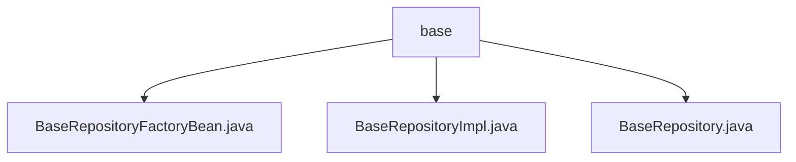

# Basic Information

|      |      |
|------|------|
| Name | base |
| Language | .java |
| Code Path | WeFe/serving/serving-service/src/main/java/com/welab/wefe/serving/service/database/repository/base |
| Package Name | docs.serving.serving-service.src.main.java.com.welab.wefe.serving.service.database.repository.base |
| Brief Description | Implement a custom Spring Data JPA repository factory bean by extending JpaRepositoryFactoryBean to create custom repository instances. BaseRepositoryImpl provides extended CRUD functionalities, supporting field queries, batch updates, pagination, and native SQL. The BaseRepository interface is marked as NoRepositoryBean, extending JPA capabilities with transactional annotations. |

# Description

## Overview  
This module is a custom extension implementation of Spring Data JPA, with its core responsibility being to provide enhanced generalized repository operation capabilities. Through the BaseRepositoryFactoryBean factory, it dynamically creates repository instances with audit trail functionality (e.g., automatically recording modification time) and extended CRUD operations, similar to the JPA template pattern. Key data structures include the generic base class BaseRepositoryImpl and the marker interface BaseRepository, which rely on the Spring Data JPA core library and EntityManager. For example, BaseRepositoryImpl supports native SQL-to-DTO paginated queries, while BaseRepository defines specifications for batch field updates.

## Primary Business Scenarios  
Typically applied in JPA persistence layer scenarios requiring unified management of audit fields (e.g., operator ID), it automatically assembles enhanced repositories via the factory pattern. The interaction flow is as follows: the factory Bean resolves the interface type → constructs a custom RepositoryFactory → generates a BaseRepositoryImpl instance integrated with audit functionality. For instance, during paginated queries based on field conditions, it automatically injects modification time and supports native SQL/DTO conversion. The complete feature set covers basic CRUD, dynamic field updates, pagination encapsulation, and native queries, making it suitable for business modules requiring extended JPA default behavior.

### Package Internal Structure View

This flowchart illustrates three Java files under the base directory in the WeFe project: BaseRepositoryFactoryBean.java, BaseRepositoryImpl.java, and BaseRepository.java. All three files are directly subordinate to the base directory with no deeper nesting relationships, belonging to the same level of code files. Together, they form the implementation structure of the foundational repository layer.

# File List

| Name   | Type  | Description |
|-------|------|-------------|
| [BaseRepositoryFactoryBean.java](BaseRepositoryFactoryBean.md) | file | Customize the JPA repository factory bean, extend JpaRepositoryFactoryBean, override the factory creation logic, and return a custom BaseRepositoryImpl implementation class. |
| [BaseRepositoryImpl.java](BaseRepositoryImpl.md) | file | BaseRepositoryImpl is a JPA repository implementation class that provides common CRUD operations, including conditional queries, pagination, updates, and native SQL execution capabilities. |
| [BaseRepository.java](BaseRepository.md) | file | The BaseRepository interface extends JPA functionality, providing methods for field-based querying, counting, updating, pagination, and native SQL queries, with support for transaction rollback and default sorting. |

