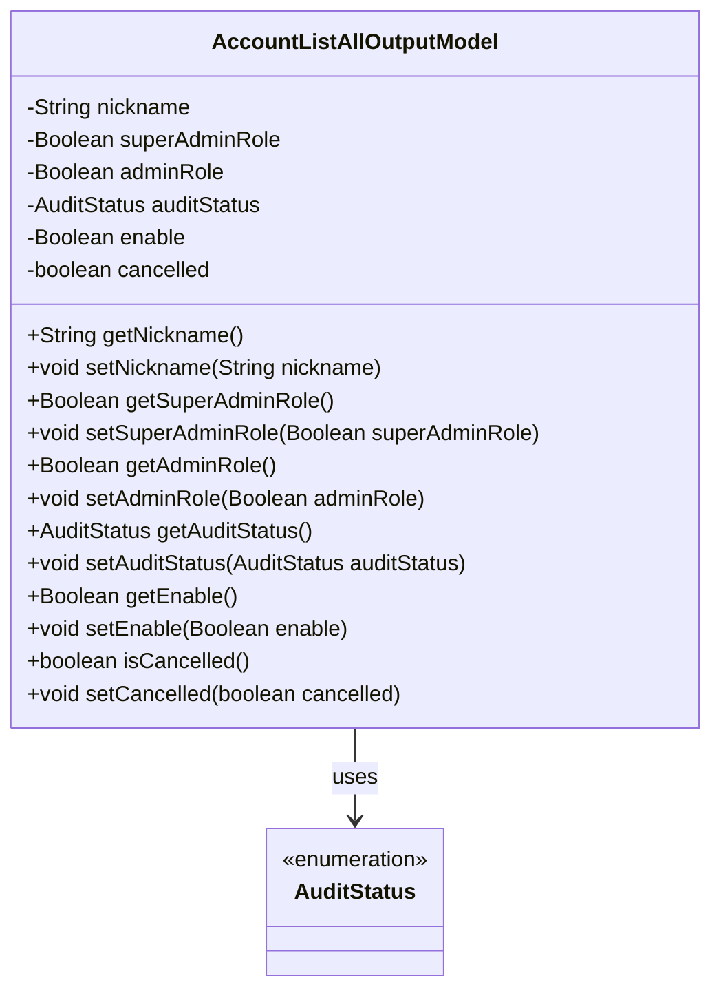

# Basic Information

|      |      |
|------|------|
| Name | AccountListAllOutputModel |
| Language | .java |
| Code Path | WeFe/serving/serving-service/src/main/java/com/welab/wefe/serving/service/dto/AccountListAllOutputModel.java |
| Package Name | com.welab.wefe.serving.service.dto |
| Dependencies | ['com.welab.wefe.common.fieldvalidate.annotation.Check', 'com.welab.wefe.common.wefe.enums.AuditStatus'] |
| Brief Description | The AccountListAllOutputModel class includes attributes such as nickname, super administrator, administrator, review status, availability, and cancellation status, along with their corresponding getter/setter methods. |

# Description

The `AccountListAllOutputModel` class defines the data model for account list output, including fields such as nickname, super administrator flag, administrator flag, review status, availability status, and cancellation status. The super administrator is typically the creator initialized by the system, while administrators possess additional permissions such as setting member visibility. Each field has corresponding getter and setter methods for data access.

# Class Summary

| Name   | Type  | Description |
|-------|------|-------------|
| AccountListAllOutputModel | class | Account list output model class, including nickname, super administrator flag, administrator flag, review status, availability status, cancellation status fields and their getter/setter methods. |

## Class AccountListAllOutputModel

|      |      |
|------|------|
| Access Modifier | public |
| Type | class |
| Name | AccountListAllOutputModel |
| Description | Account list output model class, including nickname, super administrator flag, administrator flag, review status, availability status, cancellation status fields and their getter/setter methods. |

### UML Class Diagram

This code defines a class named AccountListAllOutputModel, which represents the output model for an account list. The class contains multiple private fields such as nickname, super administrator role flag, administrator role flag, audit status, enable flag, and cancellation flag, along with corresponding getter and setter methods for these fields. The auditStatus field uses the enumeration type AuditStatus. This class is primarily used to encapsulate account information, facilitating the transfer and processing of account data within the system.

### Internal Method Call Graph

```mermaid
graph TD
    A["Class AccountListAllOutputModel"]
    B["Property: String nickname"]
    C["Property: Boolean superAdminRole"]
    D["Property: Boolean adminRole"]
    E["Property: AuditStatus auditStatus"]
    F["Property: Boolean enable"]
    G["Property: boolean cancelled"]
    H["Method: getNickname()/setNickname()"]
    I["Method: getSuperAdminRole()/setSuperAdminRole()"]
    J["Method: getAdminRole()/setAdminRole()"]
    K["Method: getAuditStatus()/setAuditStatus()"]
    L["Method: getEnable()/setEnable()"]
    M["Method: isCancelled()/setCancelled()"]

    A --> B
    A --> C
    A --> D
    A --> E
    A --> F
    A --> G
    A --> H
    A --> I
    A --> J
    A --> K
    A --> L
    A --> M
```

This flowchart illustrates the complete structure of the AccountListAllOutputModel class, comprising 6 properties and corresponding 12 getter/setter methods. All properties are annotated with @Check or comments, where nickname, superAdminRole, etc. (5 properties) use wrapper types, while cancelled uses the primitive type boolean. Each property strictly adheres to JavaBean specifications, accessing private fields via get/set methods, with auditStatus utilizing the custom enum type AuditStatus. The flowchart clearly demonstrates the hierarchical relationship between class members and methods.

### Field List

| Name  | Type  | Description |
|-------|-------|------|
| adminRole | Boolean | Check administrator permissions, control member visibility, and other advanced features. |
| superAdminRole | Boolean | Check if it is the super administrator, i.e., the initial creator of the system. |
| nickname | String | Java Field Annotation: Checking the string-type private variable for nickname. |
| cancelled | boolean | The boolean variable `cancelled` indicates the cancellation status. |
| enable | Boolean | Define a private boolean variable enable, and mark it with the @Check annotation as "Whether it is available". |
| auditStatus | AuditStatus | The class member variable auditStatus, labeled as audit status check, is of type AuditStatus. |

### Method List

| Name  | Type  | Description |
|-------|-------|------|
| setAuditStatus | void | The method to set the audit status assigns the incoming auditStatus to the auditStatus field of the current object. |
| setAdminRole | void | Define the method setAdminRole, which accepts a boolean parameter adminRole to set the value of the adminRole property of the class. |
| getNickname | String | This is a Java method that returns the value of a nickname variable of type String. |
| setSuperAdminRole | void | Method to set whether a user has the super administrator role. |
| getAuditStatus | AuditStatus | Method to obtain the current audit status, returns the value of the auditStatus property. |
| getAdminRole | Boolean | The method returns a boolean value indicating the administrator role status. |
| getSuperAdminRole | Boolean | Methods to obtain the super administrator role status, returning a boolean value. |
| setNickname | void | This is a Java method used to set the nickname property of an object. The method accepts a string parameter named `nickname` and assigns it to the member variable of the same name in the object. |
| getEnable | Boolean | The method getEnable returns the boolean value enable. |
| setEnable | void | Defined a public method setEnable for setting the boolean value of the enable property. |
| isCancelled | boolean | Check if cancelled, return the boolean state of `cancelled`. |
| setCancelled | void | Public method to set cancellation status, accepting a boolean parameter `cancelled` for updating internal state. |

