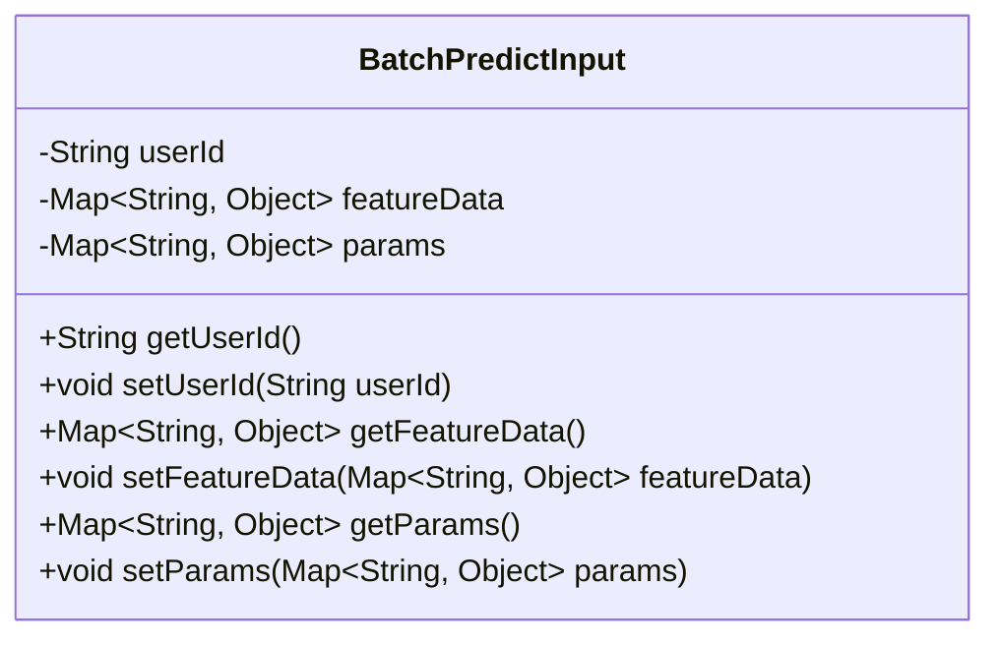
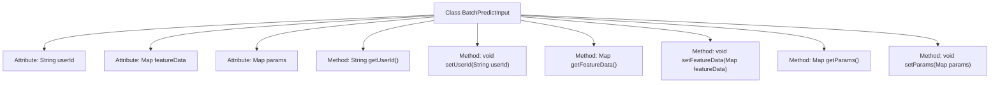

# Basic Information

|      |      |
|------|------|
| Name | BatchPredictInput |
| Language | .java |
| Code Path | WeFe/serving/serving-service/src/main/java/com/welab/wefe/serving/service/dto/BatchPredictInput.java |
| Package Name | com.welab.wefe.serving.service.dto |
| Dependencies | ['java.util.Map'] |
| Brief Description | The BatchPredictInput class includes fields such as userId, featureData, and params, and provides getter and setter methods. |

# Description

BatchPredictInput is a Java class designed to encapsulate input data for batch predictions. This class contains three main fields: `userId` represents the user identifier, `featureData` stores key-value pairs of feature data, and `params` holds key-value pairs of prediction parameters. Each field has corresponding getter and setter methods for accessing and modifying these properties.

# Class Summary

| Name   | Type  | Description |
|-------|------|-------------|
| BatchPredictInput | class | The BatchPredictInput class contains three attributes: userId, featureData, and params, with corresponding getter and setter methods provided. |

## Class BatchPredictInput

|      |      |
|------|------|
| Access Modifier | public |
| Type | class |
| Name | BatchPredictInput |
| Description | The BatchPredictInput class contains three attributes: userId, featureData, and params, with corresponding getter and setter methods provided. |

### UML Class Diagram

This code defines a class named BatchPredictInput, which is used to encapsulate input data for batch prediction. The class contains three private member variables: userId (user ID), featureData (feature data), and params (parameters), each accessed and modified through getter and setter methods. Both featureData and params are of Map type, with String keys and Object values, allowing for flexible data structures. This class is primarily used for data transfer and encapsulation, facilitating the management and manipulation of input data during the batch prediction process.

### Internal Method Call Graph

This flowchart illustrates the complete structure of the BatchPredictInput class, which includes three core attributes (userId, featureData, and params) along with their corresponding getter/setter methods. It represents a typical Data Transfer Object (DTO) design used to encapsulate input data required for batch prediction, where featureData stores feature data, params stores prediction parameters, and userId identifies the user. All attributes are exposed through public methods, complying with JavaBean specifications, which facilitates serialization and deserialization operations.

### Field List

| Name  | Type  | Description |
|-------|-------|------|
| featureData | Map<String, Object> | The private member variable featureData is of type Map, with String as the key and Object as the value. |
| params | Map<String, Object> | Declare a private Map variable named params with String keys and Object values. |
| userId | String | Declare a private string variable userId. |

### Method List

| Name  | Type  | Description |
|-------|-------|------|
| setParams | void | Method for setting parameters, which accepts a Map-type parameter and assigns it to the class member variable params. |
| getUserId | String | Methods to obtain the user ID, returns a string-type userId. |
| setUserId | void | Methods for setting the user ID: Assign the parameter userId to the userId property of the current object. |
| getFeatureData | Map<String, Object> | Public method to obtain featureData, returns data of Map type. |
| getParams | Map<String, Object> | Methods for obtaining parameter mappings, returning a collection of key-value pairs. |
| setFeatureData | void | Methods for setting feature data, which accept parameters mapping strings to objects and assign them to the class member variable featureData. |

