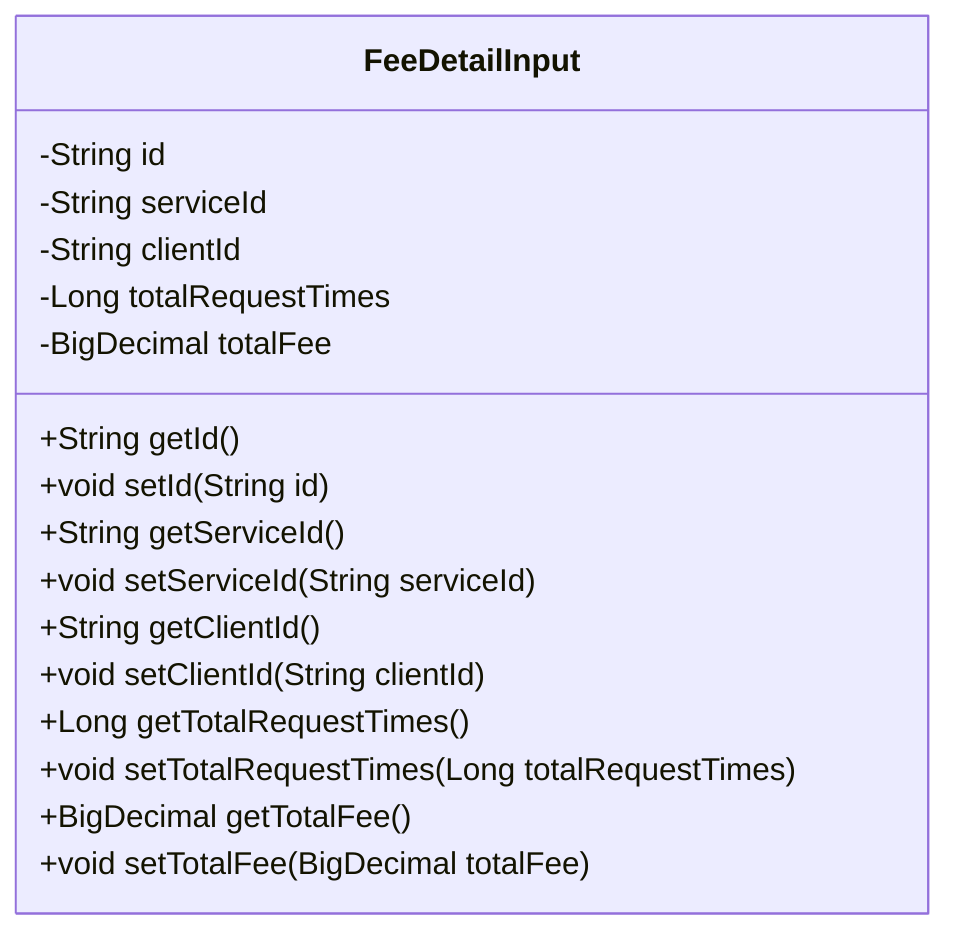

# Basic Information

|      |      |
|------|------|
| Name | FeeDetailInput |
| Language | .java |
| Code Path | WeFe/serving/serving-service/src/main/java/com/welab/wefe/serving/service/dto/FeeDetailInput.java |
| Package Name | com.welab.wefe.serving.service.dto |
| Dependencies | ['java.math.BigDecimal', 'java.util.UUID'] |
| Brief Description | The FeeDetailInput class includes fields for ID, service ID, customer ID, total request count, and total fee, providing getter and setter methods. |

# Description

The `FeeDetailInput` class is a Java class used to store input data for fee details. It contains five private attributes: `id` (an auto-generated UUID string with hyphens removed), `serviceId` (service ID), `clientId` (client ID), `totalRequestTimes` (total request count), and `totalFee` (total fee). Each attribute has corresponding getter and setter methods for accessing and modifying its value.

# Class Summary

| Name   | Type  | Description |
|-------|------|-------------|
| FeeDetailInput | class | The FeeDetailInput class includes fields for ID, service ID, client ID, total request count, and total fee, providing getter and setter methods for each attribute. |

## Class FeeDetailInput

|      |      |
|------|------|
| Access Modifier | public |
| Type | class |
| Name | FeeDetailInput |
| Description | The FeeDetailInput class includes fields for ID, service ID, client ID, total request count, and total fee, providing getter and setter methods for each attribute. |

### UML Class Diagram

This code defines a class named FeeDetailInput, which is used to store input data for fee details. The class contains five private fields: id (auto-generated UUID), serviceId (service ID), clientId (client ID), totalRequestTimes (total number of requests), and totalFee (total fee), along with their corresponding getter and setter methods. This class is primarily used to encapsulate fee-related data, facilitating its transfer and processing within the system.

### Internal Method Call Graph

```mermaid
graph TD
    A["Class FeeDetailInput"]
    B["Attribute: String id = UUID.randomUUID().toString().replaceAll('-', '')"]
    C["Attribute: String serviceId"]
    D["Attribute: String clientId"]
    E["Attribute: Long totalRequestTimes"]
    F["Attribute: BigDecimal totalFee"]
    G["Method: String getId()"]
    H["Method: void setId(String id)"]
    I["Method: String getServiceId()"]
    J["Method: void setServiceId(String serviceId)"]
    K["Method: String getClientId()"]
    L["Method: void setClientId(String clientId)"]
    M["Method: Long getTotalRequestTimes()"]
    N["Method: void setTotalRequestTimes(Long totalRequestTimes)"]
    O["Method: BigDecimal getTotalFee()"]
    P["Method: void setTotalFee(BigDecimal totalFee)"]

    A --> B
    A --> C
    A --> D
    A --> E
    A --> F
    A --> G
    A --> H
    A --> I
    A --> J
    A --> K
    A --> L
    A --> M
    A --> N
    A --> O
    A --> P
```

This flowchart illustrates the complete structure of the FeeDetailInput class, containing 5 private attributes and their corresponding getter/setter methods. Notably, the id attribute generates a unique identifier via UUID and removes hyphens during initialization, while other attributes remain nullable. All methods adhere to standard JavaBean specifications, providing read-write control for attributes. The class is primarily designed to encapsulate fee detail data, including core fields such as service ID, client ID, request count, and total fee.

### Field List

| Name  | Type  | Description |
|-------|-------|------|
| totalFee | BigDecimal | A private BigDecimal variable named totalFee, used to store the total fee. |
| totalRequestTimes | Long | Private long integer variable, recording the total number of requests. |
| clientId | String | private String clientId |
| serviceId | String | The private string variable serviceId is used to store the service identifier. |
| id = UUID.randomUUID().toString().replaceAll("-", "") | String | Generate a random UUID and assign the string with hyphens removed to the id variable. |

### Method List

| Name  | Type  | Description |
|-------|-------|------|
| getTotalFee | BigDecimal | The method to obtain the total fee, returns the totalFee value of type BigDecimal. |
| setTotalRequestTimes | void | This is a Java method used to set the property value for the total number of requests. |
| setClientId | void | The method to set the client ID assigns the parameter `clientId` to the `clientId` property of the current object. |
| getServiceId | String | Methods to obtain the serviceId, directly returning the serviceId string. |
| setId | void | Methods for setting the object ID: Assign the parameter id to the id property of the current object. |
| getId | String | The method getId returns an id of type string. |
| getClientId | String | This is a Java method that returns the value of the clientId variable of type String. |
| getTotalRequestTimes | Long | Methods to obtain the total number of requests, with a return value of type long. |
| setServiceId | void | Method for setting the service ID: Assign the input parameter to the serviceId member variable of the class. |
| setTotalFee | void | This is a Java method used to set the totalFee property of a class, with the parameter type being BigDecimal. |

