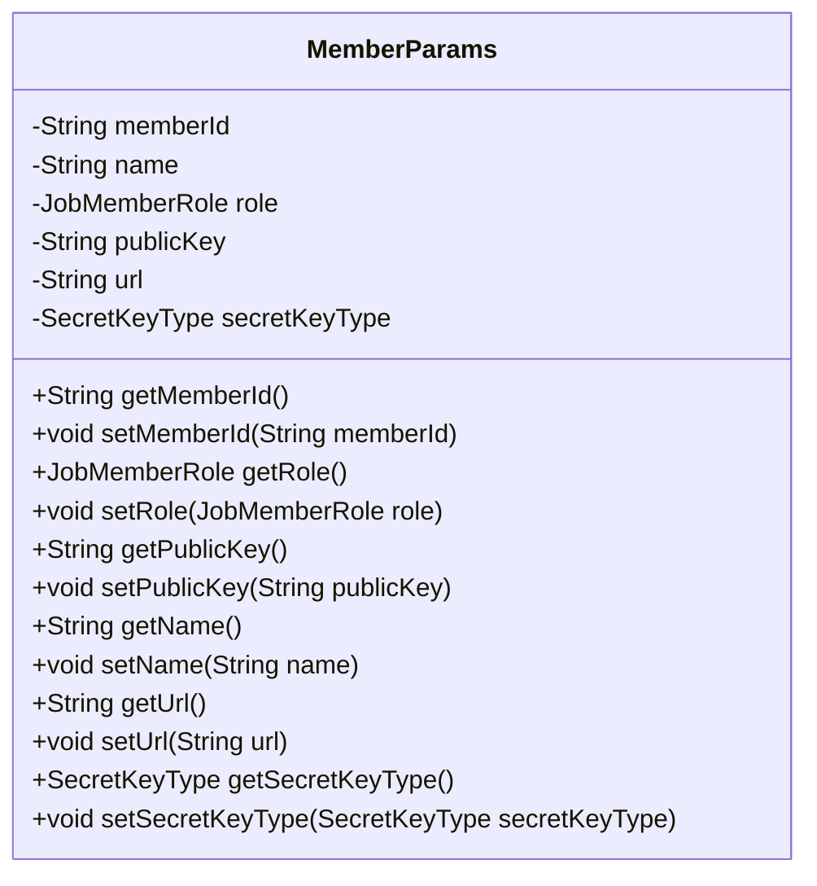

# Basic Information

|      |      |
|------|------|
| Name | MemberParams |
| Language | .java |
| Code Path | WeFe/serving/serving-service/src/main/java/com/welab/wefe/serving/service/dto/MemberParams.java |
| Package Name | com.welab.wefe.serving.service.dto |
| Dependencies | ['com.welab.wefe.common.constant.SecretKeyType', 'com.welab.wefe.common.wefe.enums.JobMemberRole'] |
| Brief Description | The MemberParams class includes attributes such as member ID, name, role, public key, URL, and key type, providing getter and setter methods for each attribute. |

# Description

The MemberParams class defines the data structure for member parameters, including attributes such as member ID, name, role, public key, URL, and key type. Each attribute has corresponding getter and setter methods for retrieving and setting attribute values. This class is used to encapsulate and manage member-related information.

# Class Summary

| Name   | Type  | Description |
|-------|------|-------------|
| MemberParams | class | The MemberParams class includes attributes such as member ID, name, role, public key, URL, and key type, and provides getter and setter methods for each attribute. |

## Class MemberParams

|      |      |
|------|------|
| Access Modifier | public |
| Type | class |
| Name | MemberParams |
| Description | The MemberParams class includes attributes such as member ID, name, role, public key, URL, and key type, and provides getter and setter methods for each attribute. |

### UML Class Diagram

This code defines a class named MemberParams, which encapsulates member parameter information. The class includes six private fields: memberId, name, role, publicKey, url, and secretKeyType, representing the member ID, name, role, public key, URL, and secret key type respectively. Each field has corresponding getter and setter methods for retrieving and setting field values. This class is primarily used to store and transmit member-related configuration or attribute data, suitable for scenarios requiring management of multiple member information.

### Internal Method Call Graph

```mermaid
graph TD
    A["Class MemberParams"]
    B["Property: String memberId"]
    C["Property: String name"]
    D["Property: JobMemberRole role"]
    E["Property: String publicKey"]
    F["Property: String url"]
    G["Property: SecretKeyType secretKeyType"]
    H["Method: getMemberId()"]
    I["Method: setMemberId(String)"]
    J["Method: getRole()"]
    K["Method: setRole(JobMemberRole)"]
    L["Method: getPublicKey()"]
    M["Method: setPublicKey(String)"]
    N["Method: getName()"]
    O["Method: setName(String)"]
    P["Method: getUrl()"]
    Q["Method: setUrl(String)"]
    R["Method: getSecretKeyType()"]
    S["Method: setSecretKeyType(SecretKeyType)"]

    A --> B
    A --> C
    A --> D
    A --> E
    A --> F
    A --> G
    A --> H
    A --> I
    A --> J
    A --> K
    A --> L
    A --> M
    A --> N
    A --> O
    A --> P
    A --> Q
    A --> R
    A --> S
```

This code defines a class named MemberParams, which includes 6 private properties and their corresponding getter/setter methods. The properties consist of memberId, name, role, publicKey, url, and secretKeyType, used to store member ID, name, role, public key, URL, and secret key type respectively. Each property has corresponding get and set methods, providing interfaces to access and modify these properties. This is a typical Data Transfer Object (DTO) design for encapsulating and transmitting member-related parameter information.

### Field List

| Name  | Type  | Description |
|-------|-------|------|
| secretKeyType | SecretKeyType | The private key type variable secretKeyType. |
| role | JobMemberRole | The private member variable `role`, of type `JobMemberRole`. |
| memberId | String | Define a private string type variable memberId. |
| url | String | Declare a private string variable url. |
| publicKey | String | The private string variable publicKey is used to store the public key. |
| name | String | The private string-type variable name. |

### Method List

| Name  | Type  | Description |
|-------|-------|------|
| setPublicKey | void | The method to set the public key assigns the input string to the publicKey member variable of the class. |
| getMemberId | String | The method returns the member ID string. |
| getRole | JobMemberRole | Get the role information of the current object. |
| getName | String | This is a Java method that returns the value of the private variable name. |
| setName | void | This is a Java method used to set the name property of an object. The method accepts a string parameter name and assigns it to the name field of the current object. |
| getPublicKey | String | Methods to obtain the public key, returning the value of the publicKey variable. |
| setMemberId | void | The method to set the member ID assigns the input parameter to the class's member variable memberId. |
| setRole | void | The method `setRole` is used to set the member role, with the parameter of type `JobMemberRole`, and assigns the value to the `role` property of the current object. |
| getUrl | String | The method returns the value of the url variable, which is of string type. |
| setUrl | void | Method to set the URL address, which assigns the passed url parameter to the url member variable of the class. |
| getSecretKeyType | SecretKeyType | Methods to obtain the key type, returns the value of the secretKeyType field. |
| setSecretKeyType | void | The method for setting the key type assigns the parameter secretKeyType to the secretKeyType property of the current object. |

