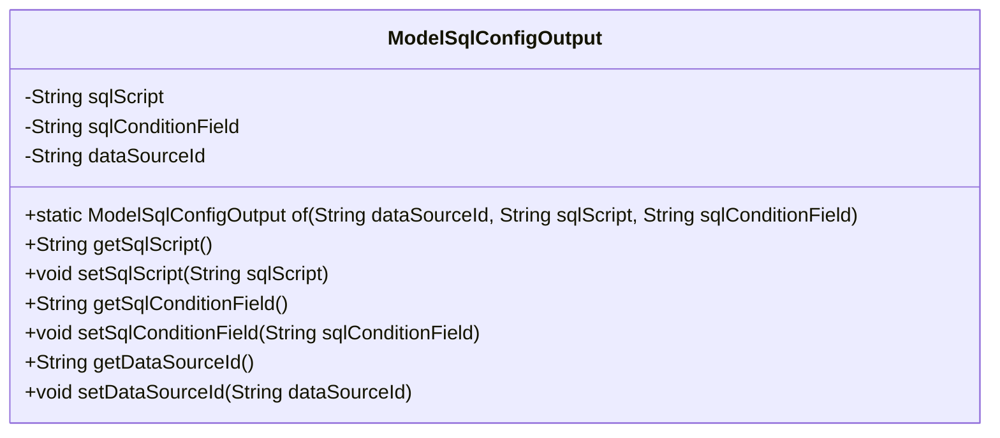
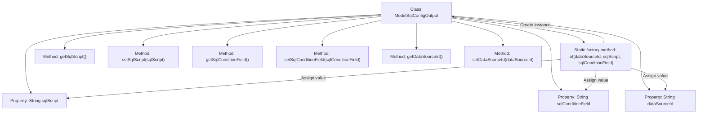

# Basic Information

|      |      |
|------|------|
| Name | ModelSqlConfigOutput |
| Language | .java |
| Code Path | WeFe/serving/serving-service/src/main/java/com/welab/wefe/serving/service/dto/ModelSqlConfigOutput.java |
| Package Name | com.welab.wefe.serving.service.dto |
| Dependencies | [] |
| Brief Description | The ModelSqlConfigOutput class contains the fields sqlScript, sqlConditionField, and dataSourceId, providing getter/setter methods and a static factory method of. |

# Description

The ModelSqlConfigOutput class is used to encapsulate SQL configuration output information, containing three private fields: sqlScript represents the SQL script, sqlConditionField represents the SQL condition field, and dataSourceId represents the data source ID. It provides a static factory method `of` for creating instances and offers getter and setter methods for each field to enable data reading and modification.

# Class Summary

| Name   | Type  | Description |
|-------|------|-------------|
| ModelSqlConfigOutput | class | The ModelSqlConfigOutput class includes the fields sqlScript, sqlConditionField, and dataSourceId, providing getter/setter methods and a static factory method named of. |

## Class ModelSqlConfigOutput

|      |      |
|------|------|
| Access Modifier | public |
| Type | class |
| Name | ModelSqlConfigOutput |
| Description | The ModelSqlConfigOutput class includes the fields sqlScript, sqlConditionField, and dataSourceId, providing getter/setter methods and a static factory method named of. |

### UML Class Diagram

This code defines a class named ModelSqlConfigOutput, which is used to store output information related to SQL configuration. The class contains three private fields: sqlScript (SQL script), sqlConditionField (SQL condition field), and dataSourceId (data source ID), along with corresponding getter and setter methods. Additionally, a static factory method `of` is defined to create and initialize a ModelSqlConfigOutput object. This class is primarily used to encapsulate data related to SQL configuration, facilitating its transfer and processing within the program.

### Internal Method Call Graph

This flowchart illustrates the complete structure of the ModelSqlConfigOutput class, containing three private properties and their corresponding getter/setter methods. The core is the static factory method of(), which performs object creation and property initialization through chained operations. All methods revolve around three core configuration items: data source ID, SQL script, and condition field, forming a standard data encapsulation pattern. The class design complies with JavaBean specifications, supporting flexible parameter setting and retrieval.

### Field List

| Name  | Type  | Description |
|-------|-------|------|
| dataSourceId | String | The private string variable dataSourceId is used to identify the data source. |
| sqlConditionField | String | The private string variable sqlConditionField is used to store SQL condition fields. |
| sqlScript | String | The private string variable sqlScript is used to store SQL scripts. |

### Method List

| Name  | Type  | Description |
|-------|-------|------|
| getDataSourceId | String | The method to obtain the data source ID returns the value of the member variable `dataSourceId`. |
| getSqlConditionField | String | The method returns a sqlConditionField string. |
| of | ModelSqlConfigOutput | Create a ModelSqlConfigOutput instance, set the data source ID, SQL script, and conditional fields, then return it. |
| setSqlScript | void | Method to set the SQL script, assigning the input parameter to the class's sqlScript variable. |
| setSqlConditionField | void | Java Method: Set SQL Condition Field Property Value. |
| getSqlScript | String | The method returns the sqlScript property value of string type. |
| setDataSourceId | void | The method to set the data source ID assigns the input parameter to the class member variable `dataSourceId`. |

